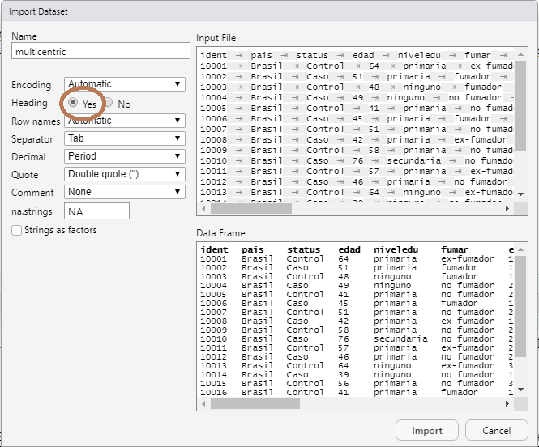

# Importar datos a R


Rstudio posee una pestaña en el Entorno (panel derecho-arriba, recordad la primera lección) y un botón que nos permite importar datasets de distintos formatos (ver figura). Esta es una forma sencilla de importar datos, pero siempre es recomendable importar archivos usando código (scripts) que nos permite compartir flujos de trabajo y análisis entre investigadores. En ese botón vemos que podemos importar datos de distintos tipos


Fijémosnos que los dos primeros menus hablan de importar ficheros de texto. También podemos importar ficheros de Excel, y de otros softwares como SPSS, SAS o Stata. 

Los ejemplos para este curso (y en general se suele hacer así) utilizará datos en formato texto. En este formato disponemos de las variables en columnas y los individuos o unidades de análisis en filas.  NOTA: Si se dispone de datos en formato  Excel o SPSS se pueden exportar de forma sencilla a texto. Este formato es muy útil ya que estamos acostumbrados a visualizar datos en formato tabular; es decir, como una tabla. 

Podemos pensar que dependiendo de como se separen las observaciones tenemos distintos tipos de datos tabulares, pero en realidad su estructura es similar: variables en columnas y las observaciones de un individuo separadas por una marca o carácter. Este carácter puede ser un espacio, un tabulador, una coma, punto y coma etc… El formato tabular mas extendido es el CSV, donde las observaciones están separadas por comas, pero en este curso usaremos datos en formato texto separados por tabuladores que también es un formato muy extendido (TSV).


## Directorio de trabajo

Para las clases y los ejercicios usaremos varios conjuntos de datos que disponemos en varios ficheros que pueden bajarse de la carpeta XXX del Moodle de la asignatura. Se recomienda crear un proyecto y crear una carpeta "datos" donde poner estos datasets que vamos a usar de ejemplo (ver video).

Si no queréis trabajar con proyectos, recordemos que tneéis que cambiar el directorio de trabajo allí donde hayáis bajado los datos de Moodle. Recordad que esto lo podéis hacer con el menu de Rstudio


O bien (recomendado) podéis hacerlo escribiendo una instrucción en el script. Como yo tengo la carpeta "datos" en el directorio **C:/Juan/cursos/R_Zaragoza/material_curso_online**) escribiría:

``` {r}
setwd("C:/Juan/cursos/R_Zaragoza/material_curso_online")
```

## Importar datos de texto 

Una vez tenemos el directorio de trabajo establecido ilustraremos como importar, por ejemplo, el fichero de datos "multicentric.txt" que recoge información sobre un estudio multicéntrico de casos y controles para estudiar factores pronóstico del cáncer de cervix. Estos serían los pasos que tendríamos que llevar a cabo

- Indicamos que queremos importar unos datos


En el navegador que se abre buscamos la carpeta "datos" y seleccionamos el archivo "multicentric.txt" [NOTA: si no hemos hecho bien el proyecto o cambiado el directorio de trabajo, podemos navegar hasta buscar la carpeta donde hayamos bajado los datos]. A continuación nos aparecerá este cuadro


Abajo a la derecha se puede ver cómo nos quedarán nuestros datos cuando se importen. Fijémonos que el nombre de las variables que estaban en la primera fila, no se han importado correctamente y que R ha puesto como nombre de las variables V1, V2, V3, .... Esto ocurre porque por defecto (parte izquierda) la opción "heading" es "No". Debemos cambiarlo a "Yes" cuando tengamos datos con los nombres de las variables en la primera fila (esto es lo habitual).





Si los datos de texto estuvieran separados por otra cosa que no fuesen tabuladores, no veríamos columnas. En ese caso debems cambiar el delimitador usando la opción "Separator". Cuando hacemos click sobre el botón "Import" los datos se cargan como un objeto de R que se llama "multicentric". Este nombre se puede cambiar en la caja "Name" que hay arriba a la izquierda. A parte de que se carge el dataset como un objeto de R, también se abren los datos como si fuese SPSS:


Ahora, una vez hemos cargado nuestros datos, podemos abrir un script de R y empezar a hacer análisis con ellos. Ahora podéis abrir un script nuevo y empezar a escribir y ejecutar las instrucciones que se detallan a continuación. Recordemos que se puede hacer mediante el menu **File > New File > R Script**. Un script, podría quedar entonces de la siguiente manera tras pedir que R importe los datos multicentric.txt


Lo primero que vemos es que tras el simbolo `#` el texto está en verde. Eso indica que esa parte no es código de R y no se ejecutará. Esto es recomendable para ir indicando qué hacen los siguientes comandos (compartir código entre investigadores). Las instrucciones que vemos en el script y que se repiten abajo, también sirven para importar datos utilizando comandos de R y no el menú como hemos visto anteriormente. Primero cambio el directorio de trabajo (si no estoy donde tengo la carpeta de datos es necesario)

```{r, eval=FALSE}
# Cambio el directorio de trabajo 
setwd("C:/Juan/cursos/R_Zaragoza/material_curso_online")
```

y luego cargo los datos

```{r}
# Importo los datos
multicentric <- read.delim("datos/multicentric.txt")
```
