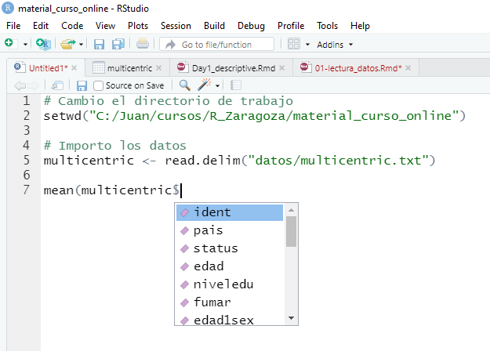

# Manejo de datos


Una vez importados los datos, ya podemos empezar con nuestros análisis estadísticos. Pero antes, mostraremos cómo crear nuevas variables ya que a menudo, antes de empezar con los análisis necesitamos crear o recodificar nuevas variables que contengan la información que queremos tratar. Seguiremos usando los datos guardados en el fichero multicentric.txt que están cargados en un objeto llamado multicentric. La idea es que en el script que habéis abierto, podéis ir escribiendo estos comandos de R y ver por la consola qué resultados obtenéis. Recordad que cuando escribáis la instrucción, la podéis ejecutar con el boton "Run" que tenéis arriba a la derecha en la ventana del scipt o bien situando el cursor en la linea de comando y clickando "Crtl + R". En este material, el primer recuadro en gris corresponde al comando que tenéis que escribir en el script (ventana superior-izquierda de RStudio) y el siguiente recuadro en gris muestra lo que veríais por la línea de comandos (ventana inferior-izquierda de R studio)

## Visualización de datos

Empezemos viendo qué datos tenemos. Para ello usaremos la función `head()`

```{r}
head(multicentric)
```
Para saber cuántos individuos y cuántas variables tenemos en nuestra base de datos podemos usar la función `dim()`. `nrow()` nos daría el número de individuos y `ncol()` el número de variables

```{r}
dim(multicentric)
nrow(multicentric)
ncol(multicentric)
```


También podemos ver qué tipo de variables tenemos y cuáles son sus categorías

```{r}
str(multicentric)
```

Finalmente, si queremos saber el nombre de las variables que tenemos en nuestra base de datos usaríamos:

```{r}
colnames(multicentric)
```


Antes de explicar cómo crear nuevas variables, veamos algunos aspectos básicos de R en cuanto al acceso de las variables. Supongamos que queremos calcular cualquier estadístico descriptivo de alguna de las variables o ver un resumen de ella. Para esta tarea podemos utilizar distintas funciones de R que normalmente se ejecutan como `funcion()`. Dentro del paréntesis debemos indicarle cuál es la variable que queremos analizar. Para ello, utilizaremos el símbolo `$` [también podría usarse `[[ ]]` pero intentaremos evitar escribir demasiado código]. Así, por ejemplo, si queremos calcular la media de la primera relación sexual (variable `edad1sex`) bastaría con ejecutar

```{r}
mean(multicentric$edad1sex, na.rm=TRUE)
```

NOTA: na.rm=TRUE debe escribirse porque si no, R devuelve NA cuando hay missings en una variable. Con esta opción se analizan casos completos. También es interesante conocer estas otras funciones.


- Descriptiva de una variable categórica. Ejemplo: cuantas mujeres hay de cada país

```{r}
table(multicentric$pais)
```

- Descriptiva de una variable continua. Ejemplo: edad de las participantes

```{r}
summary(multicentric$edad)
```


Uno de los aspectos que más cuestan al principio de usar R es familiarizarse con la escritura de código. Rstudio nos ayuda puesto que podemos autocompletar el nombre de una base de datos o de una función. Por ejemplo, basta con empezar a escribir "multi" y dar al tabulador para que en el script se autocomplete la palabra "multicentric". Una vez escrito el nombre de la base de datos, si escribimos el símbolo `$` obtenemos un desplegable que nos muestra todas las variables que hay en ese objeto y basta con seleccionar la variable que queremos resumir para que R la ponga directamente en el script tal y como muestra la siguiente figura. 




También podemos acceder a una variablae usando `[` e indicando el número de columna donde está la variable que queremos resumir o su nombre. En este caso como `edad1sex` está en la columna 7 escribiríamos

```{r}
mean(multicentric[ , 7], na.rm=TRUE)
```

o usando su nombre

```{r}
mean(multicentric[ , "edad1sex"], na.rm=TRUE)
```

pero como se ha indicado anteriormente, lo más sencillo es usar `$` ya que ayuda a evitar errores en la escritura que es uno de los principales problemas para principiantes.


## Creación de variables
Para crear una nueva variable, por ejemplo la edad de la primera relación sexual menos 18, tendríamos que escribir

```{r}
multicentric$edad1sex2 <- multicentric$edad1sex - 18
```

Donde a la izquierda de `<-` se pone el nombre de la nueva variable que queremos añadir a `multicentric` (por eso se pone el `$`) y a la derecha la operación que queremos hacer. NOTA: el símbolo `<-` es como un `=` pero este último se usa para los argumentos de una función (lo veremos más adelante).

Esta forma de escribir es muy larga y complicada, sobre todo para los nuevos usuarios de R, y puede introducir errores fácilmente. Es por ello que podemos trabajar con una serie de librerías que facilitan llevar a cabo estas operaciones. Estas liberías forman parte de los desarrolladores de RStudio y son un compendio de funciones para el análisis científico de datos (Data Science). Si queremos usar estas funciones, debemos instalar las librerías de tydiverse [https://www.tidyverse.org/] ejecutando:


```{r eval=FALSE}
install.packages(tidiverse)
```

Después debemos cargar estas librerías con

```{r}
library(tidyverse)
```

Ahora, para crear una nueva variable basta con usar la función `mutate()` que tiene el primer argumento el nombre de nuestra base datos y luego la fórmula que queremos aplicar para calcular la nueva variable. Nos fijamos que ya no es necesario el uso de `$` y la instrucción se lee de forma más intuitiva.

```{r}
multicentric <- mutate(multicentric, edad1sex2 = edad1sex - 18)
```


Si ahora damos un vistazo a las variables que hay en `multicentric` veremos que al final se ha añadido una nueva variable (`edad1sex2`) que es la que hemos creado

```{r}
str(multicentric)
```

## Recodificación de variables

En biomedicina a veces interesa recodificar nuevas variables según varios criterios. Veamos algunos ejemplos

- Recodificar una variable continua en una categórica que toma valores superiores o inferiores a un valor. Ejemplo: edad de primera relación sexual antes o despues de 18 años

```{r}
multicentric <- mutate(multicentric, edad1sex3 = ifelse(edad1sex <=18, 0 , 1))
table(multicentric$edad1sex3)
```

- Recodificar una variable continua en cuartiles. Ejemplo: edad de primera relación sexual en cuartiles


```{r}
multicentric <- mutate(multicentric, edad1sex4 = cut(edad1sex, quantile(edad1sex, na.rm=TRUE)))
table(multicentric$edad1sex4)
```

- Recodificar una variable según unos puntos de corte y ponerles una etiqueta. Ejemplo: edad de primera relación sexual antes de los 14, entre los 15 y 18 (ambos incluidos) y más de los 18 (19 o más)

```{r}
multicentric <- mutate(multicentric, edad1sex5 = cut(edad1sex, c(-Inf, 14, 18, Inf),
                                                     labels=c("<14", "15-18", "19+")))
table(multicentric$edad1sex5)
```

## Filtrado de datos
También podemos filtrar una base de datos para hacer unos análisis específicos en un subgrupo de individuos. Supongamos que queremos describir nuestros controles. Para ello utilizaremos la función `filter()`. Sabemos que el estado Caso/Control se encuentra en la variable `status` por eso escribimos

```{r}
controles <- filter(multicentric, status=="Control")
dim(controles)
```

Usamos `==` para poner una condición de igualdad. Para otras condiciones deberemos usar


Por ejemplo, si queremos seleccionar a los casos que hayan tenido una infección por VPH (variable `vph)` deberíamos escribir

```{r}
casos.vph <- filter(multicentric, status=="Caso" & vph=="positivo")
dim(casos.vph)
```


