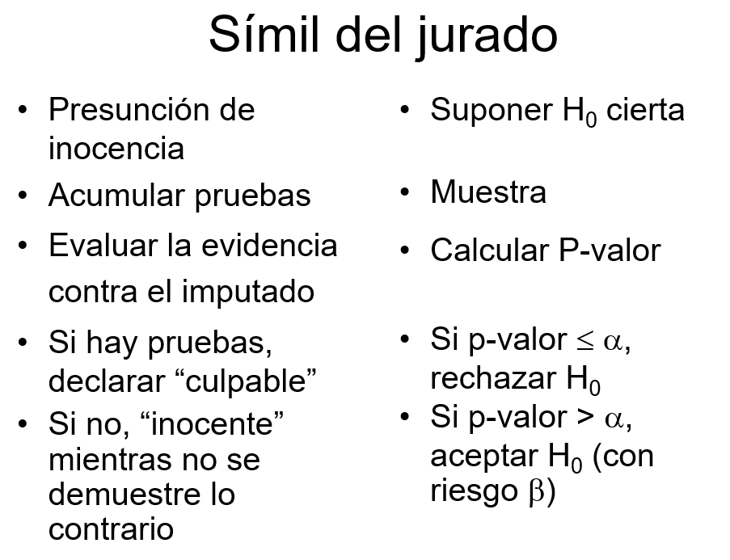

# Pruebas de Hipótesis

En la siguiente figura podemos observar un esquema general de cómo abordar un problema científico desde un punto de vista estadístico. Partimos de una pregunta científica que nos planteamos sobre nuestra población de estudio. Esta pregunta debe ser *traducida* a una pregunta estadística que nos permita saber cómo abordarla desde un punto de vista matemático o estadístico. 


{height=12cm}

Por ejemplo, imaginemos que estamos interesados en saber si el consumo de aspirina reduce el riesgo de sufrir un infarto de miocardio. Hay un método muy sencillo de saber qué problema necesitamos abordar desde un punto de vista estadístico a partir de nuestra pregunta científica y es conocer la naturaleza de nuestros datos. En este caso, nuestra variable resultado sería sufrir o no un infarto, por lo que estaríamos ante una variable binaria. Este tipo de variables se resumen con la frecuencia relativa o proporciones. De esta forma, la pregunta estadística se traduciría cómo: ¿La proporción de personas que sufren un infarto es igual en aquellas personas que toman aspirina que en las que no toma? 

Para contestar a esta pregunta, el método científico nos indica que debemos tomar una muestra aleatoria (para garantizar representatividad de nuestra problación) que describiremos con métodos descriptivos vistos en el tema anterior. También podemos realizar un experimento o diseñar un estudio que nos permita contestar a nuestra pregunta cienífica. Existen muchos tipos de diseños, que se suponen que son familiares para el alumno. 

Para nuestro ejemplo podríamos, entre otras opciones, diseñar un estudio en el que estudiáramos personas que han sufrido un infarto y otro grupo control de la misma edad y sexo a los que preguntaríamos si han tomado o no aspirina durante los últimos años (diseño caso-control). Entonces, podríamos compararla proporción de infartos entre las personas que toman y no toman aspirina. Empezaríamos por mostrar estas diferencias de forma visual con, por ejemplo, un gráfico de barras (que es como se visualizan las variables categóricas). Ahora nuestra siguiente pregunta sería saber si las diferencias que observamos son reales o son debidas al azar (es decir, por no estudiar toda la población y si una muestra aleatoria). Para demostrar que estas diferencias son reales (e.g estadísticamente significativas) debemos realizar lo que se conoce como inferencia estadística, que en este caso correspondería a una prueba de hipótesis. 

En el caso que nuestra pregunta científica esté asociada a una variable continua se abordaría de la misma forma. La única diferencia es que la prueba de hipótesis planteada sería distinta. Por ejemplo, supongamos que queremos saber si el consumo de café aumenta la tensión arterial. En ese caso, nuestra variable resultado es tensión arterial, que al ser continua se resume con la media. Así pues, nuestra pregunta estadística sería: ¿La media de tensión arterial es igual en los consumidores de café que en los que no consumen?

En consecuencia, las pruebas que nos planteamos para comparar ambos grupos (A y B) en cada ejemplo sería

$$H_0: p_A = p_B$$

y

$$H_0: \bar{x}_A = \bar{x}_B$$

respectivamente.


Una vez planteadas las pruebas de hipótesis, basta con usar un software estadístico para calcular el **p-valor** que es la medida que nos indica si las diferencias observadas en nuestra muestra son reales o son debidas al azar. En otras palabras, demostramos si las diferencias observadas son **estadísticamente significativas**. Como decimos, el proceso para determinar esta significación estadística se basa en el cálculo del p-valor, y consideraremos que las diferencias serán estadísticamente significativas si el p-valor$<0.05$ y no cuando ocurra lo contrario. 

A este valor de $0.05$ se le conoce como el nivel de significación estadística ($\alpha$) y es el valor que asumimos como riesgo a equivocarnos cuando las diferencias no son reales. En la siguiente figura podemos ver un resumen del tipo de errores que podemos cometer cuando llevamos a cabo una prueba de hipótesis


{height=8cm}
A modo de resumen podríamos decir que los pasos en un proceso de investigación serían:

- Formular hipotesis nula (y alternativa)
- Decidir el nivel de significanza estadística ($\alpha$)
- Eligir un test estadístico a utilizarse (que dependerá del tipo de variable que estudiemos)
- Calcular el p-valor con ese test y decidir si rechazamos  $H_0$ o no.


Para entender un poco mejor este procedimiento, podems compararlo con el simil de un jurado. Es importante notar que siempre partimos de la hipótesis nula y que queremos dar evidencias a partir de nuestros datos, nunca hacemos lo contrario, al igual que pasa en un juicio

{height=8cm}


A continuación explicaremos cómo llevar a cabo estas pruebas de hipótesis con R en función de nuestra variable de interés para las siguientes pruebas. 


En este capítulo se muestran las funciones que hay disponibles en R para realizar prueba de hipótesis para:

1. La media $\mu$,
2. La proporción $p$,
3. La razón de varianzas $\sigma_A^2 / \sigma_B^2$,
4. La igualdad de medias $\mu_A = \mu_B$ para muestras independientes, 
5. La igualdad de medias para más de dos grupos (ANOVA), y
6. La igualdad de proporciones $p_A = p_B$. 
7. Pruebas no-paramétricas


Para ilustrar estos cálculos usaremos la base de datos `multicentric.txt` que hemos trabajado en capítulos anteriores. Para ello, recordemos que primero debemos cargar los datos en R tal y como se ha descrito en el capítulo \@ref{importar}, o bien con el menú o bien con la siguiente instrucción.

```{r }
multicentric <- read.delim("datos/multicentric.txt")
```

NOTA: recordad que para que esta instrucción funcione debéis cambiar el directorio de trabajo a la carpeta que contenga este fichero.


## Prueba de hipótesis para la media, $\mu$, de una población normal

Este test se llevará a cabo cuando nuestra pregunta científica se interese por una variable resultado de tipo continua. Para realizar este tipo de prueba se puede usar la función `t.test` que tiene la siguiente estructura.

```{r, eval=FALSE}
t.test(x, y = NULL,
       alternative = c("two.sided", "less", "greater"),
       mu = 0, paired = FALSE, var.equal = FALSE,
       conf.level = 0.95, ...)
```

Los argumentos a definir dentro de `t.test` para hacer la prueba son:

- `x`: vector numérico con los datos.
- `alternative`: tipo de hipótesis alterna. Los valores disponibles son `"two.sided"` cuando la hipótesis alterna es $\neq$, `"less"` para el caso $<$ y `"greater"` para $>$.
- `mu`: valor de referencia de la prueba.
- `conf.level`: nivel de confianza para reportar el intervalo de confianza asociado (opcional).

### Ejemplo {-}

Supongamos que queremos saber si la edad de la primera relación sexual es superior a los 18 años. Lo primero que debemos hacer es comprobar si los datos siguene una distribución normal. Para ello usaremos una libería que tiene una batería de 10 pruebas distintas que se llama `nortest`. Para usarla, primero hay que instalarla

```{r eval=FALSE}
install.packages("nortest")
```` 

y luego podemos evaluar si la variable es normal usando cualquiera de los tests implementados, de la siguiente forma

```{r}
library(nortest)   
lillie.test(multicentric$edad1sex)
```

Nosotros hemos usado la prueba de Lilliefors (Kolmogorov-Smirnov) pero se pueden usar otras como la de Anderson-Darling (función `ad.test`) o Shapiro-Francia (función `sf.test`) entre muchas otras. 

Podemos ver que rechazamos la hipóteisis nula de normalidad ($p<0.05), por lo que necesitmos solventar este problema. Normalmente esto se hace transformando los datos usando la transformación logarítmica. Luego volvemos a testar la normalidad para ver si podemos aplicar el test para la media. Para ello crearemos primero una nueva variable que llamaremos `edad1sex2`. 

```{r}
library(tidyverse)
multicentric <- mutate(multicentric, edad1sex2 = log(edad1sex))
```

y ahora aplicamos el test a la nueva variable

```{r}
lillie.test(multicentric$edad1sex2)
```


Vemos que la variable sigue sin ser normal. También podríamos verlo de forma gráfica

```{r}
hist(multicentric$edad1sex2, xlab="log(edad primera relación sexual)", main="")
``` 

Observamos que la cola de la izquierda es más pesada que la de la derecha. Es decir, la distribución sigue sin ser simétrica que es una de las características principales de las variables normales. Ahora tenemos dos opciones:

- Buscar otro tipo de transformación que garantice la normalidad

- Usar un test no paramétrico. 

La segunda opción la veremos en capítulos más adelante y es la que recomendamos realizar ya que la primera opción tiene sus inconvenientes, sobre todo si queremos interpretar los resultados ya que la transformación a aplicar ([Yeo-Johnson](https://en.wikipedia.org/wiki/Power_transform)) puedes tener  una forma muy complicada. Si alguien quiere hacer esta transformación en R existen varias librerías que pueden hacer esta transformación como la libería [bestNormalize](https://cran.r-project.org/web/packages/bestNormalize/bestNormalize.pdf). En este trabajo asumiremos que la variable `edad1sex` es normal e ilustraremos como realizar el test que estabamos interesados:

$$H_0: \text{edad1sex = 18}$$
$$H_1: \text{edad1sex > 18}$$

Esta prueba de hipótesis se puede realizar usando la función `t.test` por medio del siguiente código.

```{r}
t.test(multicentric$edad1sex, 
       alternative="greater", mu=18)
```

Como el valor-P es <0.05 y por lo tanto menor que el nivel de significanción del 5%, tenemos evidencias para rechazar la hipótesis nula, es decir, las evidencias son suficientes para afirmar que la edad de la primera relación sexual no ocurre a los 18 años. NOTA: no es habitual hacer test unilaterales (alternativa mayor o menor) ya que está recomendado hacer bi-laterales (el valor por defecto del argumento `alternative`) pero hemos querido hacer este ejemplo para ilustrar como plantear este tipo de pruevas de hipótesis.


## Prueba de hipótesis para la proporción $p$ de una población 

Este test se llevará a cabo cuando nuestra pregunta científica se interese por una variable resultado binaria o categórica.

Existen varias pruebas para testar si la propoción $p$ de una distribución binomial (porque tenemos $n$ individuos que siguen una Bernoulli de parámetro $p$) sigue un valor predeterminado.

1. Prueba de [Wald](https://en.wikipedia.org/wiki/Wald_test),
2. Prueba $\Chi^2$ de [Pearson](https://en.wikipedia.org/wiki/Pearson%27s_chi-squared_test#Fairness_of_dice),
3. Prueba [binomial exacta](https://en.wikipedia.org/wiki/Binomial_test).

### Prueba de Wald
Esta prueba se recomienda usar cuando se tiene un tamaño de muestra $n$ suficientemente grande para poder usar la distribución normal como aproximación de la distribución binomial.

En esta prueba el estadístico está dado por

$$z=\frac{\hat{p}-p_0}{\sqrt{\frac{p_0(1-p_0)}{n}}},$$
donde $\hat{p}$ es la proporción muestral calculada como el cociente entre el número de éxitos $x$ observados en los $n$ ensayos y $p_0$ es el valor de referencia de las hipótesis. El estadístico $z$ tiene distribución $N(0, 1)$ cuando $n \to \infty$.

Para realizar esta prueba en R no hay una función y debemos escribir la líneas de código para obtener el estadístico y el valor-P de la prueba. Dado que estamos en un curso introductorio, obviaremos esta solución que aunque no es compleja, requiere escribir algo de código en R y no usar una función


### Prueba $\Chi^2$ de Pearson
Esta prueba también require de un tamaño muestral $n$ grande. Para realizar los cálculos se usa la función `prop.test` que tiene la siguiente estructura.

```{r, eval=FALSE}
prop.test(x, n, p = NULL,
          alternative = c("two.sided", "less", "greater"),
          conf.level = 0.95, correct = TRUE)
```

Los argumentos a definir dentro de `prop.test` para hacer la prueba son:

- `x`: número de éxitos en la muestra.
- `n`: número de observaciones en la muestra.
- `alternative`: tipo de hipótesis alterna. Los valores disponibles son `"two.sided"` cuando la alterna es $\neq$, `"less"` para el caso $<$ y `"greater"` para $>$.
- `p`: valor de referencia de la prueba.
- `correct`: valor lógico para indicar si se usa la corrección de Yates.
- `conf.level`: nivel de confianza para reportar el intervalo de confianza asociado (opcional).

### Ejemplo {-}

Supongamos que queremos saber si en nuestro estudio de cáncer cervical, la proporción de gente que se realiza una prueba del virus de papiloma humano (variable `pap`) es del 55% ya que ese es el porcentaje de pruebas que se realiza en España y  lo consideramos como el de referencia.

En este problema interesa probar lo siguiente:

$$H_0: p = 0.55$$
$$H_1: p \ne 0.55$$
La forma de usar la función `prop.test` para realizar la prueba se muestra a continuación.

Primero necesitamos saber cuántas mujeres se hacen o no la prueba del virus de papiloma humano y cuántas mujeres tenemos en total. Esto lo podemos saber con:

```{r}
nrow(multicentric)
table(multicentric$pap)
```

Entonces usamos la función como

```{r}
prop.test(x=1575, n=2910, p=0.55)
```

Como el p-valor es >0.05, concluimos que no tenemos evidencias para afirmar que el porcentaje de mujeres que se hacen la prueba del virus de papiloma humano sea distinta a la de España (0.55). NOTA: nunca aceptamos la hipótesis nula y decimos que nuestra proporción es del 55%. 

### Prueba binomial exacta
Esta prueba se recomienda cuando tenemos un tamaño muestral $n$ muy pequeño (menor de 30). Para realizar la prueba binomial exacta se usa la función `binom.test` que tiene la siguiente estructura.

```{r, eval=FALSE}
binom.test(x, n, p = 0.5,
           alternative = c("two.sided", "less", "greater"),
           conf.level = 0.95)
```

Los argumentos a definir dentro de `binom.test` para hacer la prueba son:

- `x`: número de éxitos en la muestra.
- `n`: número de observaciones en la muestra.
- `alternative`: tipo de hipótesis alterna. Los valores disponibles son `"two.sided"` cuando la alterna es $\neq$, `"less"` para el caso $<$ y `"greater"` para $>$.
- `p`: valor de referencia de la prueba.
- `conf.level`: nivel de confianza para reportar el intervalo de confianza asociado (opcional).

En nuestro ejemplo anterior tendríamos que escribir

```{r}
binom.test(x=1575, n=2910, p=0.55)
```

Notemos que el p-valor es muy similar al anterior, puesto que estamos con una muestra muy grande.

## Prueba de hipótesis para la razón de varianzas $\sigma_1^2 / \sigma_2^2$

Esta prueba es importante ya que para comparar dos medias (que es el tipo de prubas que más se suele hacer en investigación biomédica) a parte de comprobar que nuestra variable de interés es normal, debemos comprobar que la varianza entre los dos grupos es la misma. O en otras palabras que la razón de la varianza de cada grupo es 1:


$$H_0: \frac{\sigma_{A}^2}{\sigma_{B}^2} = 1$$
$$H_0: \frac{\sigma_{A}^2}{\sigma_{B}^2} \neq 1$$
Para realizar este tipo de prueba se puede usar la función `var.test`.


### Ejemplo {-}

Supongamos que queremos verificar si la edad de la primera relación sexual (que hemos asumido que es normal) es igual entre casos y controles (variable `status`). El p-valor correspondiente a esta prueba se calcularía mediante:

```{r}
var.test(edad1sex ~ status, data=multicentric)
```
El símbolo `~` (que se puede escribir con `AltGr + 4 y espacio`) indica que queremos comparar la varianza de la variable que hay a la izquierda en función de la variable que hay en la derecha. Notemos que hay que indicar a R donde están las variables `edad1sex` y `status`, por eso escribimos `data=multicentric`. 

Observamos que el p-valor es <0.05, por lo que tenemos evidencias para decir que la variabilidad de la edad en la primera relación sexual (`edad1sex`) es distinta entre los casos y los controles. Esto no es un problema desde un punto de vista práctico. Simplemente debemos tenerlo en cuenta a la hora de hacer un test para comparar si esta variable es un factor que se relaciona con tener cáncer o no, tal y como veremos en la siguiente sección.

## Prueba de hipótesis para la igualdad de medias $\mu_A = \mu_B$ 
En este caso, estamos interesados en conocer si la media de una variable continua es igual en dos grupos. Para realizar este tipo de prueba se puede usar la función `t.test` que implementa el test de la t de Student (t-test) y que tiene la siguiente estructura.

```{r, eval=FALSE}
t.test(x, y = NULL,
       alternative = c("two.sided", "less", "greater"),
       mu = 0, paired = FALSE, var.equal = FALSE,
       conf.level = 0.95, ...)
```

Los argumentos a definir dentro de `t.test` para hacer la prueba son:

- `x`: vector numérico con la información de la muestra 1,
- `y`: vector numérico con la información de la muestra 2,
- `alternative`: tipo de hipótesis alterna. Los valores disponibles son `"two.sided"` cuando la alterna es $\neq$, `"less"` para el caso $<$ y `"greater"` para $>$.
- `mu`: valor de referencia de la prueba (opcinal, no necesario la mayoría de veces ya que siempre queremos comparar si son iguales lo que implica que la diferencia es 0 que es el valor por defecto).
- `var.equal=TRUE`: indica que las varianzas son desconocidas pero iguales. Si no lo son, basta con poner `var.equal=FALSE`.
- `conf.level`: nivel de confianza para reportar el intervalo de confianza asociado (opcional).


### Ejemplo {-}

Siguiendo con el ejemplo anterior, investiguemos si la edad de la primera relación sexual está asociada con tener cáncer cervical. En este caso plantearíamos la prueba estadística: 

$$H_0: \mu_\text{controles} =  \mu_\text{casos}$$

$$H_1: \mu_\text{controles} \neq \mu_\text{casos}$$
Que puede llevarse a cabo mediante:

```{r}
t.test(edad1sex ~ status, data=multicentric,
       var.equal=FALSE)
```

Notemos que si en la prueba anterior de igualdad de varianzas, no hubiéramos rechazado la hipótesis nula, ahora no sería necesario poner `var.equal=FALSE` ya que por defecto ese argumento es `TRUE` que indicaría que las varianzas son iguales. Como en nuestro caso hemos rechazado dicha hipótesis, debemos cambiar este argumento de la función. El resto de la función es similar al caso anterior.


## Prueba de hipótesis para la igualdad de más de dos medias (ANOVA)

A veces, estamos interesados en comparar la media de nuestra variable de interés para más de dos grupos. En este caso, no podemos usar el t-test anteriormente descrito. La método de análisis de varianza (ANOVA) es el test que se emplea para el estudio del efecto de uno o más factores (cada uno con dos o más niveles) sobre la media de una variable continua. Es por lo tanto el test estadístico a emplear cuando se desea comparar las medias de dos o más grupos. 

La prueba estadística puede plantearse como:

$$H_0: \mu_A =  \mu_B = \cdots = \mu_K$$

$$H_1: \text{algún par de medias es distinta}$$
Estos análisis podemos llevarlos a cabo con la función `aov`

### Ejemplo {-}

Supongamos que queremos averiguar si la edad de la primera relación sexual se asocia con si la mujer es fumadora, no fumadora o ex-fumadora (variable `fumar`). En este caso, contestaríamos a la pregunta mediante

```{r}
mod <- aov(edad1sex ~ fumar, data=multicentric)
summary(mod)
```

Puesto que el p-valor asociado a esta prueba es <0.05, concluiríamos que nuestros datos aportan evidencias para rechazar la hipótesis nula. Por lo tanto, la media de la primera relación sexual es distinta para alguno de los grupos que estamos comparando. 

Ahora tendríamos que decir entre qué grupos hay diferencias, y para ello, usaríamos lo que se conoce como post-hoc tests. Existen numerosos tests en la literatura para hacer estas comparaciones a posteriori cuando hemos rechazado la hipótesis nula en un ANOVA. Nosotros usaremos `TukeyHSD` que es sencilla de usar, es uno de los métodos más robustos y no requiere ninguna otra libería. Basta con ejecutar la función sobre el objeto anterior que contiene el ANOVA

```{r}
TukeyHSD(mod)
```
Este test nos diría que hay diferencias entre los grupos de no fumadoras y las exfumadoras y fumadoras. Notemos que el resultado de los análisis muestra `p adj` que indica que es un p-valor ajustado ya que estamos haciendo muchas comparaciones estadísticas (tres) con los mismos datos y necesitamos tener esto en cuenta para tener un valor de significación global del 5%. 


## Prueba de hipótesis para la igualdad de proporciones $p_A = p_B$

Para realizar pruebas de hipótesis para comparar dos proporciones se usa la función `chisq.test`. 


### Ejemplo {-}

Supongamos que queremos investigar si dar positivo en el test del virus de papiloma humano (variable `vph`) es un factor de riesgo para desarrollar cáncer cervical. La hipótesis que se planteraria sería:

$$H_0: p_{\text{controles}}  = p_{\text{casos}}$$

$$H_0: p_{\text{controles}}  \neq p_{\text{casos}}$$


En este caso, variable de interés es categórica (binaria) y la queremos comparar entre dos grupos. En ese caso necesitamos usar un test de Chi-cuadrado que se calcula a partir de la tabla de contingencia que recordemos del capítulo anterior que se puede obtener de la siguiente forma con la librería `summarytools`:

```{r}
library(summarytools)
ctable(multicentric$vph, multicentric$status, 
        useNA="no", prop="c")
```

Vemos que la proporción de casos que dan positivo en la prueba es del 93.6%, mientras que en los controles es de tan sólo el 14.4%. Esto parece indicar que ambas variables están relacionadas, o en otras palabras, que dar positivo por este virus es un factor de riesgo para el cáncer cervical. Pero, como siempre, a estas diferencias le tenemos quedar un valor de significación estadística que podemos obtener de dos formas. Una poniendo el argumento `chisq=TRUE` en la función anterior

```{r}
ctable(multicentric$vph, multicentric$status, 
        useNA="no", prop="c", chisq=TRUE)
```

y otra, usando la función  `chisq.test`, pero que no devuelve la tabla ni los porcentajes. 


```{r}
chisq.test(multicentric$vph, multicentric$status)
```

Vemos que en ambos casos obtenemos el mismo resultado, que no es otro que tenemos suficientes evidencias en nuestros datos para rechazar la hipótesis de igualdad de proporciones ya que el p-valor es menor que 0.05, por lo que la proporción de infectadas en casos es distinta que en controles (mayor) o lo que es lo mismo, que esta variable es un factor de riesgo para el cáncer cervical. 


## Pruebas no paramétricas

En el ejemplo de la variable edad de la primera relación sexual, hemos visto que no sigue una distribución normal, por lo que los métodos anteriormente descrito no serían válidos. En realidad, no es que no lo sean, si no que no son los más potentes para encontrar diferencias cuando realmente las hay. Esto iría en contra nuestra como investigadores. Es por ello que, en estos casos, se recomienda usar tests no paramétricos que no suponen ninguna distribución para los datos. 

La alternativa al t-test es el test de Mann–Whitney–Wilcoxon, también conocido como test de la suma de rangos de Wilcoxon. Es un test no paramétrico que contrasta si dos muestras proceden de poblaciones equidistribuidas. 

Como nuestra variable `edad1sex` no seguía una distribución normal, lo ideal hubiera sido utilizar un test no paramétrico. 

Para la prueba 

$$H_0: \mu =18$$

usaríamos

```{r}
wilcox.test(multicentric$edad1sex, mu=18)
```
y para la prueba

$$H_0: \mu_\text{controles} =  \mu_\text{casos}$$

sería

```{r}
wilcox.test(edad1sex~status, data=multicentric)
```


Y en ambos casos obtendríamos la misma conclusión que con un test paramétrico. 

Para el caso de un test de ANOVA, que también requiere normalidad, deberíamos usar el test de Kruskall-Wallis que se calcula así:

```{r}
kruskal.test(edad1sex~fumar, data=multicentric)
```

De nuevo obtendríamos un valor similar al test paramétrico. Esto ocurre porque tenemos una base de datos con muchos casos, y los test paramétricos suelen funcionar bien. **IMPORANTE:** Los test no paramétricos muestras su mejor potencia cuando las bases de datos son pequeñas


Finalmente, el test de Chi-cuadrado que hemos calculado para testar

$$H_0: p_{\text{controles}}  = p_{\text{casos}}$$


también tiene su versión no paramétrica en el test de Fisher. Este test es necesario no sólo cuando hay poco tamaño muestral, si no que también cuando hay pocos casos en algunas de las celdas de la tabla de contingencia. Este test podríamos calcularlo con esta función:

```{r}
fisher.test(multicentric$vph, multicentric$status)
```

que al igual que en los casos anteriores, llegamos a la misma conclusión que con un test paramétrico. 


