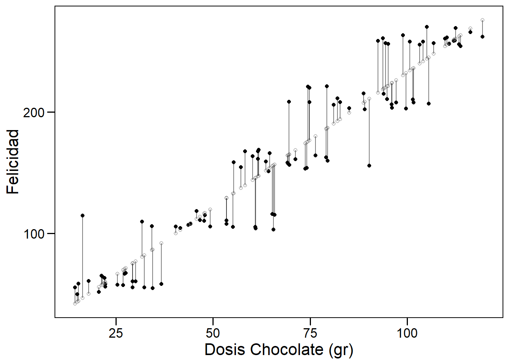

# Modelos de regresión

¿Qué son los modelos? Los modelos simplifican la realidad con fines de comprensión o predicción. Si bien pueden ser herramientas poderosas, debemos tener en cuenta que, después de todo, no son la realidad. En consecuencia, como se dice que dijo el estadístico George Box, "Todos los modelos son incorrectos, pero algunos son útiles". 

 

En términos generales, el modelado estadístico tiene estos dos objetivos a veces divergentes: 

 

1. *Descripción*: usar un modelo para describir la relación entre una variable de resultado de interés y una o más variables predictoras. 

 

2. *Predicción*: uso de un modelo para predecir instancias desconocidas de la variable de resultado de manera que se minimice el error predictivo fuera de la muestra.

 

En el modelado, es posible centrarse en la descripción e ignorar la predicción, y viceversa. Por ejemplo, muchos algoritmos de aprendizaje automático son cajas negras: crean modelos que hacen un buen trabajo de predicción, pero son difíciles, si no imposibles, de interpretar y, en consecuencia, a menudo no nos ayudan a comprender las relaciones entre variables. La regresión lineal puede no ser la técnica más sofisticada, pero si se usa correctamente, su precisión predictiva compara bien con otros algoritmos más avanzados que veremos en este curso. Además, ofrece información descriptiva, en forma de coeficientes para cada variable, que son de gran utilida. La regresión lineal y logística hacen un buen trabajo con *tanto* descripción como predicción. En este capítulo aprenderemos los usos de ambos tipos de regresión


## Regresión lineal


Esta sección presenta la regresión lineal, el método de regresión paramétrica que usamos cuando la variable de resultado o respuesta es continua. Cuando el resultado es binario, utilizamos la regresión logística, tema que veremos en la sección siguiente.


Comencemos por presentar brevemente el modelo lineal junto con algunos de los conceptos y terminología que usaremos a lo largo del curso. Un modelo lineal es *paramétrico* porque asumimos que la relación entre dos variables es lineal y puede ser definida por los *parámetros* de una recta (el *intercept* y la pendiente). Comenzaremos considerando un modelo lineal simple. En la siguiente figura podemos observar cómo existe una relación lineal entre la dosis de chocolate consumida y el nivel de felicidad reportado por una muestra de individuos seleccionados al azar en una población de Barcelona. Los puntos negros muestran los datos observados para cada individuo y los blancos representan a la felicidad que tendría cada individuo según la dosis de chocolate que reporta tomar.



### Modelo lineal simple

 

Un modelo lineal simple tiene un resultado (outcome, variable predictiva - en nuestro ejemplo la felicidad), $y$, y un predictor, $x$ (el consumo de chocolate en nuestro ejemplo). Está definido por la siguiente ecuación.

 

$$
y_i = \beta_0 + \beta_1x_i + \epsilon_i,
$$

donde $i = 1, \ldots, n.$

 
El subíndice en esta ecuación, $i$, indexa las observaciones $n$ en el conjunto de datos. (Pensemos en $i$ como un número de fila que corresponde a los datos de un individuo). La ecuación se puede leer de la siguiente manera: el valor de la $i$-ésima variable  resultado, $y_i$, está definido por una *intercept*, $\beta_0$, más una pendiente, $\beta_1$, multiplicada por la variable predictora $i$-ésima, $x_i$. Estos elementos definen la parte *sistemática* o *determinista* del modelo. Sin embargo, debido a que el mundo es incierto y contiene aleatoriedad, sabemos que el modelo será incorrecto (estará sujeto a error). Para describir completamente los datos, necesitamos un término de error, $\epsilon_i$, que también está indexado por fila. El término de error es la parte *estocástica* o *aleatoria* del modelo. $\epsilon_i$ mide la distancia entre los valores ajustados o esperados del modelo --- calculados a partir de la parte determinista del modelo --- y los valores reales. Los errores en un modelo lineal, también conocidos como residuales del modelo, son la parte de los datos que permanece sin explicar por la parte determinista del modelo. Uno de los supuestos clave de un modelo lineal es que los residuos se distribuyen normalmente con media = 0 y varianza = $\sigma^2$, que denotamos, en notación matricial, como $N (0, \sigma ^ 2)$.

 

### Regresión lineal multivariante

 

Podemos agregar predictores adicionales, $p$, a un modelo lineal simple, convirtiéndolo en un modelo lineal multivariante, que definimos de la siguiente manera:

 

$$
y_i = \beta_0 + \beta_1 x_ {i1} + \cdots + \beta_p x_ {ip} + \varepsilon_i,
$$

donde $i = 1, \ldots, n$ y $p = 1, \ldots, p.$ En esta ecuación $y_i$ es nuevamente la variable resultado $i$-ésima, $\beta_0$ es la *intercept*, $\beta_1$ es el coeficiente de la primera variable predictora, $x_{1}$, $\beta_p$ es el coeficiente de la variable predictora $p$-ésima, $x_{p}$, y $\epsilon_i$ representa la parte estocástica del modelo, los residuos, indexados por fila. La parte determinista del modelo se puede resumir como $X \beta$, una matriz $p$ x $n$, que llamaremos el "predictor lineal".


### Ajuste de un modelo lineal

Para ajustar un modelo lineal usamos la función `lm()`. (La función `glm()` también se ajusta a un modelo lineal por defecto, definido por `family = gaussian`. Usaremos`glm()` para ajustar una regresión logística, con` family = binomial`). 


Por ejemplo, usemos el conjunto de datos `mtcars` que está por defecto en R, para averiguar si el consumo de combustible (mpg) está correlacionado con el peso del coche (wt). En R deberíamos ejecutar:


```{r}
data(mtcars)
simple_model <- lm(mpg ~ wt, data = mtcars)
summary(simple_model)
```
 

La ecuación del modelo es: $\widehat {mpg} = 37.285 - 5.344wt$. Notemos que el ajuste del modelo viene dado por el Adjusted R-squared (versión ajustada del R-cuadrado, $R^2$, que tiene en cuenta el número de variables y que nos servirá para comparar modelos con distinto número de variables). En este caso el modelo tiene un $R^2$ de 0.74, lo que nos indica que la variable `wt` (ó `wt_centered`) explica un 74% de la variabilidad de `mpg`. 

 
El modelo se puede utilizar para calcular valores ajustados para coches individuales en el conjunto de datos. Por ejemplo, el valor ajustado para el Mazda RX4, $\widehat {mpg_1}$, se puede derivar de la ecuación del modelo, $\beta_0 + \beta_1 x_ {i1}$: 37.29 - 5.34 x 2.62 = `r round(37.285 - 5.344 * 2.62, 2) `. (El valor *real* del Mazda RX4, calculado a partir del modelo, sería: 37.29 - 5.34 x 2.62 + 2.28 = `r round(37.285 - 5.344 * 2.62 - 2.2826106, 2)`). El modelo también se puede utilizar para la predicción. ¿Cuál sería el mpg para un coche que pesa 5000 libras?  Según el modelo: 37,29 - 5,34 x 5 = `r round(37.285 - 5.344 * 5, 2)`. 


### Interpretación de coeficientes

 

¿Cómo interpretamos la salida de la función `lm()`? Comencemos con el modelo simple de mpg.

 

- *intercept*: 37.29 representa el valor predicho de mpg cuando wt es 0. Dado que wt no puede ser igual a 0. El *intercept* no es interpretable en este modelo. Para hacerlo interpretable, necesitamos centrar la variable wt en 0, lo que podemos hacer fácilmente restando la media de wt de cada observación ($x_ {centrado} = x - \ bar {x}$). Esta es una transformación lineal que cambiará la escala del predictor y, por lo tanto, $\beta_0$ también, pero no el ajuste del modelo: $\beta_1$ permanecerá igual (-5,34) al igual que RSS (278,32). Después de la transformación, el peso promedio del coche es 0 y el *intercept* representa las millas por galón pronosticadas para coches de peso promedio.

 

```{r}
mtcars <- mutate(mtcars, wt_centered = wt - mean(wt))
simple_model <- lm(mpg ~ wt_centered, data = mtcars)
summary(simple_model)
```

Ahora el *intercept*, 20.09, es significativa y representa el valor predicho de mpg cuando wt_centered es 0 --- es decir, cuando wt es promedio.


 

Hay dos formas de interpretar los coeficientes de las variables en un modelo lineal:

 

1. *Contrafactual*: el coeficiente representa el cambio predicho en el resultado asociado con un aumento de 1 unidad en el predictor, mientras se mantienen constantes los demás predictores (en el caso multivariable).

 

2. *Predictivo*: el coeficiente representa la diferencia pronosticada en el resultado entre dos grupos que difieren en 1 unidad en el predictor, mientras se mantienen constantes los otros predictores.

 

Normalmente los coeficientes del modelo se suelen interpretar de acuerdo con el paradigma contrafáctico. Por lo tanto,

 

- *wt_centered*: -5.34 representa el cambio previsto en el resultado, mpg, asociado con un aumento de 1 unidad en wt_centered. 

 

Agreguemos un segundo predictor al modelo, una versión binaria de caballos de fuerza (hp_bin), que definiremos como 0 para valores de hp que están por debajo del promedio y 1 para valores mayores o iguales que el promedio.

 

```{r}
mtcars <- mutate(mtcars, hp_bin = ifelse(hp < mean(hp), 0, 1))

multivariable_model <- lm(mpg ~ wt_centered + hp_bin , data = mtcars)

summary(multivariable_model)
```


 
Este modelo multivariante es una mejora con respecto al modelo simple ya que tiene un $R^2$ ajustado de 0.78 que es mayor que el del modelo simple.

 

- *intercept*: 21,65 representa el mpg predicho cuando los predictores continuos o binarios son iguales a 0 o (no aplicable en este caso) cuando las variables de los factores están en su nivel de referencia. El *intercept* es el mpg pronosticado por el modelo para autos de peso promedio que tienen caballos de fuerza por debajo del promedio.

 

- *wt_centered*: -4,17 representa el cambio previsto en mpg asociado con un aumento de 1 unidad en wt_centered (digamos, de 1 a 2) mientras se mantiene constante el otro predictor, hp_bin. *Los coeficientes de regresión multivariable capturan cómo el resultado varía de manera única con un predictor dado, después de tener en cuenta los efectos de todos los demás predictores.* En la práctica, esto significa que el coeficiente que describe la relación entre mpg y wt_centrado se ha promediado en los niveles hp_bin, por lo que es igual en cada nivel de hp_bin.

 
- *hp_bin*: -3.32 representa el cambio previsto en mpg asociado con un aumento de 1 unidad en hp_bin (de 0 a 1) mientras se mantiene constante el otro predictor, wt_centered.


### Inferencia en el contexto de regresión

Además de las estimaciones de coeficientes para cada variable predictora (incluido el *intercept*), la salida de `lm ()` (usando `summary ()`) contiene la siguiente información: "Error estándar", "valor t" y "Pr (> | t |)" (el valor p). Repasemos estos conceptos.

 

Recordemos que la inferencia estadística nos permite estimar las características de la población a partir de las propiedades de una muestra. Por lo general, queremos saber si una diferencia o una relación que observamos en una muestra es verdadera en la población --- es "estadísticamente significativa" --- o es probable que se deba al azar. En el contexto de la regresión, queremos saber específicamente si la pendiente de la recta de regresión, $\beta$, que resume la relación de una variable con el resultado es diferente de 0. ¿Existe una relación positiva o negativa? En el paradigma frecuentista, respondemos a esta pregunta utilizando pruebas estadísticas basadas en test de hipótesis.

 

De otros cursos sabemos que una prueba de hipótesis se basa en plantear una "hipótesis nula", $H_0$. En la regresión, $H_0$ corresponde a que la pendiente de la recta de regresión, $\beta$, es 0. Una pendiente de 0 significa que un predictor no tiene efecto o no tiene relación con el resultado. `R` calcula automáticamente una prueba de hipótesis para $\beta$ usando el estadístico t, definido como: 

$$
t = \frac {\beta - 0} {SE (\beta)}
$$

El estadístico $t$ para una muestra sigue la distribución $t$ de Student con n - 2 grados de libertad. Para la regresión lineal multivariante, el estadístico $t$sigue la distribución $t$ de Student con $n - k - 1 $ grados de libertad, donde $k$ representa el número de predictores en el modelo. Se utiliza la distribución $t$ porque es más conservadora que una distribución normal cuando $n$ es pequeño ya que en ese caso no podemos asumir el teorema central del límite que nos permitiría determinar que la distribución del estadístico sigue una distribución normal. La distribución $t$ de Student tiene una cola más pesada pero converge a la normal cuando $n$ aumenta (por encima de aproximadamente $n$= 30). 

En nuestro ejemplo podemos ver que el p-valor asociado tanto a la variable `wt_centered` y `hp_bin` son <0.05, por lo que podríamos concluir que ambas variables son estadísticamente significativas y son necesarias incluirlas en el modelo para explicar el consumo del coche (variable `mpg`)


### Asunciones de un modelo de regresión

Los resultados de la regresión solo son precisos si se dan un conjunto de supuestos (en orden de importancia):^[De Gelman y Hill (2007). *Análisis de datos mediante regresión y modelos jerárquicos / multinivel*. Cambridge: Cambridge UP.]

 

1. *Validez de los datos* para responder a la pregunta de investigación.

 

2. *Linealidad de la relación* entre el resultado y las variables predictoras.

 

3. *Independencia de los errores* (en particular, sin correlación entre errores consecutivos como en el caso de los datos de series de tiempo).

 

4. *Varianza igual de errores* (homocedasticidad).

 

5. *Normalidad de errores.*

 

La mayoría de estos problemas no son fatales y se pueden solucionar mejorando el modelo, seleccionando variables diferentes o adicionales o utilizando una distribución de modelización diferente (los conocidos como modelos lineales generalizados o GLMs). Los gráficos de residuos son la mejor herramienta para evaluar si se han cumplido los supuestos del modelo.

No entraremos demasiado en detalle en todas las pruebas que hay para comprabar estas asunciones, pero mediante el siguiente gráfico podemos determinar si podemos usar nuestro modelo o no para realizar predicciones

```{r}
par(mfrow=c(2,2))
plot(multivariable_model)
```

La instrucción `par(mfrow=c(2,2))` es necesaria para que obtengamos un panel con los cuatro gráficos que devuelve la función `plot` [Veremos este concepto más en detalle cuando hablemos de cómo realizar gráficos con R].

En el gráfico podemos observar como este modelo tiene problema con los residuos ya que el gráfico de QQ-plot nos indicaría que hay tres observaciones (17, 18 y 20) que son valores no esperados en la cola de una distribución normal. Esto coincide con el gráfico de los residuos contra los valores predichos donde estas observaciones tiene un valor de residuo por encima de 2 que se consideraría el límite superior de normalidad. Sin embaro estos puntos no se pueden considerar como puntos influyentes según el gráfico de residuos contra Leverage. Estos resultados sugerirían re-estimar el modelo haciendo una transformación de la variable respuesta (generalmente el logaritmo) que garantice la linealidad del modelo y/o la normalidad de los residuos.

## Regresión logística

Hasta ahora, nuestra variable de resultado era continua. Pero si la variable de resultado es binaria (0/1, "No"/"Sí"). La regresión logística se introduce en el contexto de la epidemiología como un modelo de regresión que extiende el modelo lineal cuando nuestra variable respuesta es binaria.

Desafortunadamente, debemos afrontar nuevas complicaciones cuando trabajamos con regresión logística, lo que hace que estos modelos sean inherentemente más difíciles de interpretar que los modelos lineales. Las complicaciones surgen del hecho de que con la regresión logística modelamos la probabilidad de que $y$ = 1, y la probabilidad siempre se escala entre 0 y 1. Pero el predictor lineal, $X \beta$, oscila entre $\pm \infty$ (donde $X$ representa un predictor del modelo). Esta diferencia de escala requiere transformar la variable de resultado, lo cual se logra con la función logit:

$$
\text{logit}(x) = \text{log}\left( \frac{x}{1-x} \right)
$$

La función logit asigna el rango del resultado (0,1) al rango del predictor lineal $(-\infty, +\infty)$. El resultado transformado, $\text{logit} (x)$, se expresa en logaritmos de probabilidades ($\frac{x}{1-x}$) se conoce como probabilidades del resultado - razón de odds en inglés - momios en castellano). Así que el modelo también se puede escribir como:

$$\text{Pr}(y_i = 1) = p_i$$ 

$$\text{logit}(p_i) =  \alpha + X_1\beta_1 + X_2\beta_2 + \ldots + X_k\beta_k$$ 
 
 
Las probabilidades logarítmicas (e.g. el log-odds) no tienen interpretación (que no sea el signo y la magnitud) y deben transformarse nuevamente en cantidades interpretables, ya sea en *probabilidades*, usando el logit inverso, o en *razones de probabilidades*, mediante el uso de la función exponencial. 

Dado que este no es un curso de estadística, asumimos que el estudiante está familiarizado con este tipo de regresión. No obstante, usaremos un ejemplo que ayude a la interpretación de resultados para aquellos alumnos que desconozca o no recuerden bien esta metodología. 

### Interpretación de los coeficientes


Mientras que en regresión lineal $\beta_1$ se corresponde con el cambio promedio en $Y$ asociado a un incremento de una unidad en $X$, en regresión logística $\beta_1$ es el valor que indica cuanto cambia el logaritmo de odds cuando $X$ se incrementa en una unidad, o equivalentemente, multiplica los odds por $e^{\beta_1}$ (donde $e$ es la función exponencial). La cantidad con la que $p_i$ cambia debido a un cambio en $X$ dependerá del valor actual de $X$, pero independientemente de ello, si $\beta_1$ es positivo, entonces aumentar $X$ provocará un aumento de p(X). El "intercept" $\beta_0$ corresponde con el resultado predicho para el nivel de referencia.

Los parámetros del modelo pueden estimarse con la función `glm` (modelo lineal generalizado) indicando que la familia que estamos modelando es la binomial. Esto es importante, ya que si no indicamos nada, esta función `glm` realizará una estimación de los parámetros asumento que nuestra variable resultado (0/1) es continua (regresión lineal). 

Veamos como estimar un modelo con nuestros datos del estudio multicéntrico para cáncer cervical. Este es un estudio de casos y controles que se debe analizar mediante regresión logística ya que nuestra variable resultado, tener cáncer, es binaria (Control/Caso). Recordemos cómo cargar los datos en R

```{r}
multicentric <- read.delim("datos/multicentric.txt")
``` 

Antes de empezar a realizar análisis debemos asegurarnos que nuestra variable binaria está codificada 0/1, o que almenos tiene las categorías en el orden que nos asegure que estamos modelando la probabilidad del evento que nos interesa, que en este caso es ser caso (tener cáncer). Podemos verlo haciendo una tabla

```{r}
table(multicentric$status)
```

Vemos que la primera categoría es `Caso` (ya que se ordena alfanuméricamente) por lo que si estimáramos un modelo de regresión logística unsando esta variable como variable dependiente, los coeficientes del modelo nos estarían cuantificando cuál es el efecto de ser control respecto a caso. Es por ello que debemos recodificar nuestra variable y es aconsejable tener dicha información como 0/1. Recodermos que esta recodificación la podemos hacer de la siguiente forma tal y como vimos en la clase de manejo de datos

```{r}
multicentric <- mutate(multicentric,
                       casocon = recode(status,
                                        "Caso" = 1,
                                        "Control" = 0))
```

Ahora nuestra variable dependiente será `casocon`. Supongamos que queremos ver si la edad de la primera relación sexual es un factor asociado a tener cáncer cervival. El modelo sería

```{r}
modelo_simple <- glm(casocon ~ edad1sex, data=multicentric, family=binomial)
summary(modelo_simple)
```

De la misma forma que para el modelo lineal tenemos un test para saber si esta variable está asociada con la variable dependiente, en la regresión logística también podemos calular un p-valor para determinar si el coeficiente es distinto de 0 o no. En este caso, el p-valor es <0.05 (columna `Pr(>|z|)`) por lo que podríamos concluir que la edad de la primera relación sexual se asocia con la probabilidad de tener cáncer cervical. En particular, el riesgo de tener cáncer cervical desciende un 10% (exp(-0.1)=0.90) por cada año que se retrasa la primera relación sexual. 

**NOTA**: debería hablarse de razón de odds (OR) y no de riesgo, pero cuando la incidencia del evento es pequeña la OR puede interpretarse como un riesgo relativo). 


Ahora podemos añadir otra variable y hacer un modelo multivariante como para el caso de la regresión lineal. Introduzcamos en el modelo la variable infección por papiloma virus (variable `vph`). En este caso el modelo sería:

```{r}
modelo_multivariable <- glm(casocon ~ edad1sex + vph, data=multicentric, family=binomial)
summary(modelo_multivariable)
``` 

En este caso, ambas variables son estadísticamente signifcativas porque el p-valor asociado es <0.05 en los dos casos. Ahora la pregunta es. ¿Cuál de estos dos modelos es mejor? Para esta pregunta no usamos el $R^2$ si no que usamos el criterio de información de Akaike (AIC) 

$$\mathrm {AIC} = - 2 \ln(L) + 2k$$

que nos cuatifica la verosimilitud ($L$) de cada modelo penalizando por el número de varibles ($k$) ya que la introducción de variables mejora el ajuste por el mero hecho de considerar más información.


El AIC menor indicaría mejor modelo. Esto lo podemos hacer con R mediante:

```{r}
AIC(modelo_simple)
AIC(modelo_multivariable)
```

Podemos ver que el modelo con dos variables ajusta mucho mejor a los datos. Ahora bien ¿qué ocurriría si introducimos más variables? ¿Cómo seleccionamos aquellas variables más relevantes? Estas preguntas tendrán respuesta en la siguiente sección


## Creación de modelos

¿Cómo sabemos qué variables (independientes) deben incluirse en un modelo? La respuesta sencilla es: a menudo no lo sabemos. Aquí hay algunas reglas generales cuando se piensa en la selección de variables:

- *Piensa en los datos*. ¿Qué variables tiene sentido incluir dada la situación? ¿Alguna literatura publicada ofrece orientación? Si estamos en modo descriptivo, es posible que solo nos interesen determinadas variables y utilicemos las demás como controles. Si estamos en modo predictivo, incluimos todas las variables que, por razones aditivas, podrían ser importantes para predecir el resultado. Sin embargo, esta es una guía muy general, ya que diferentes contextos exigen diferentes enfoques para el ajuste del modelo.

- *Incluir términos cuadráticos si hay evidencia de gráficos bivariados de una relación no lineal entre predictor y resultado.* En general, no incluimos términos polinomiales con grados superiores a 2. Para hacerlo, se corre el riesgo de sobreajuste (término del que hablaremos más tarde).

- *Buscar posibles interacciones entre variables con los efectos principales más grandes.* En general, no incluimos interacciones de orden superior (mayores que 2) a menos que tengamos una razón lógica y podamos explicarla. También hay que tener en cuenta que las interacciones son bastante difíciles de explicar.

- *Considerar combinar predictores separados en un solo predictor --- un "puntaje total" --- obtenido al sumarlos o promediarlos.*

- *Simplicidad.* Los modelos sencillos son casi siempre mejores --- son más interpretables y tienden a tener menor variación (*principio de parsimonia*).

### Selección paso a paso (stepwise)

La técnica tradicional en estadística para seleccionar variables es *selección paso a paso* (o *stepwise*  en inglés).

Con *selección hacia adelante* comenzamos con un modelo nulo (solo contiene el *intercept*) y agregamos una variable a la vez. Si la variable agregada mejora el modelo, la mantenemos y agregamos otra. Continuamos hasta que se hayan probado todas las variables como podemos ver en la siguiente figura:

{width=40%}

Con *selección hacia atrás* comenzamos con un modelo completo (todos los términos disponibles) y eliminamos variables en serie (una a una). Si el modelo es mejor después de eliminar una variable, lo dejamos fuera. Continuamos hasta que se hayan probado todas las variables  como podemos ver en la siguiente figura:

{width=40%}

*Selección hacia adelante seguida de selección hacia atrás (saltos)*. Consiste en ir realizando en cada paso una selección hacia adelante o hacia atrás en función del mejor paso que podamos hacer.

Desafortunadamente, estos procedimientos de ajuste manual son defectuosos. Dependen del orden en el que se agregan o excluyen las variables y, a menudo, no seleccionarán el mejor modelo. Además, por ejemplo, supongamos que tenemos una base de datos con $k$ = 13 variables predictoras, lo que significa que hay $2^k$ o `r 2^ 13` modelos posibles que podríamos ajustar y eso sin tener encuenta la posible introducción de interacciones o términos polinómicos. Este es un espacio extremadamente grande para buscar el mejor modelo, y la búsqueda es computacionalmente costosa y requiere mucho tiempo. Realizar tal búsqueda manualmente sería prácticamente imposible.


Se han desarrollado algoritmos para buscar en el espacio de modelos de manera eficiente el modelo óptimo. Sin embargo, desde el principio conviene tener cuidado con la selección automática de variables. *La elección de variables no debe ser un proceso mecánico.* Debemos, en cambio, buscar comprender el proceso de generación de datos. De hecho, el mayor beneficio de la selección manual por pasos consiste menos en producir un buen modelo que en la comprensión obtenida al ajustar muchos modelos y ver, mediante prueba y error, qué predictores son más reactivos con el resultado. Especialmente cuando se trata de descripción, los algoritmos de selección automática de variables son solo herramientas para explorar sus datos y pensar en modelos.

La función `step ()` en R base automatiza la selección de variables paso a paso usando AIC. Primero tenemos que definir nuestro modelo completo, es decir, el modelo con las variables que queremos usar para la selección de variables. En nuestro caso supongamos que queremos ver qué variables son importantes entre, infección por papiloma virus, edad de la primera relación sexual, ser fumador, nivel educativo, uso de contraceptivos orales y el pais de origen. El modelo sería entonces


```{r}
mod <- glm(casocon ~ vph + edad1sex + fumar + niveledu + co + pais, 
           data = multicentric, family="binomial")
```

Ahora con la función `step` podemos hacer, por ejemplo, la selección automática por el método backward de la siguiente forma:

```{r}
modF <- step(mod, trace = F, direction = "backward")
summary(modF)
```

en el objeto `modF` tenemos el modelo final. Vemos que se han seleccionado todas las variables menos uso de contraceptivos orales que si la inluyéramos en el modelo veríamos que no estadísticamente signifativa.

Para los modelos lineales, esta función sirve de la misma forma. Basta con remplazar el modelo `glm` por `lm`. 
