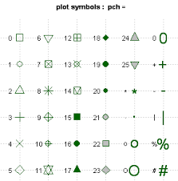

# Gráficos

R, en su versión básica, incluye funciones para crear gráficos. Dado que este es un curso introductorio a R nos basaremos en estas  herramientas que son muy útiles para llevar a cabo un análisis exploratorio. Es decir, estas funciones nos permitirán visualizar la  información recogida en nuestros datos que permita - dentro del contexto de un proceso de investigación - tomar decisiones para posteriores análisis estadísticos. 

También introduciremos algunas librerías de R que permiten crear gráficos más avanzados para análisis específicos (como comparación de medias con ANOVA) y que permiten crear gráficos más completos y útiles a la hora de publicar resultados. Idealmente, un curso de visualización debería includir el uso de `ggplot2`, que es una librería especializada en en el diseño de gráficos que permite una mejor visualización de resultados, sobre todo enfocados en el momento de divulgación de resultados de investigación. Esto podrá verse en cursos más avanzados.


## Gráficos para una variable cuantitativa

En esta sección empezaremos describiendo cómo crear gráficos para una solo variable cuantitativa

### Función `stem ()`

Esta función permite crear el gráfico llamado de tallo y hoja. Este gráfico fue propuesto por Tukey (1977) y a pesar de no ser un gráfico para presentación muy usado comunmente, se puede utilizar a la vez que el investigador recoge la información para ver rápidamente la distribución de los datos.

¿Qué muestra este gráfico?

1. El centro de la distribución.
2. La forma general de la distribución:
     - Simétrica: Si las porciones a cada lado del centro son imágenes espejos de las otras.
     - Sesgada a la izquierda: Si la cola izquierda (los valores menores) es mucho más larga que los de la derecha (los valores mayores).
     - Sesgada a la derecha: Opuesto a la sesgada a la izquierda.
3. Desviaciones marcadas de la forma global de la distribución.
   - Outliers: Observaciones individuales que caen muy por fuera del patrón general de los datos.
   - Gaps: Huecos en la distribución

Ventajas del gráfico:

1. Muy fácil de realizar y puede hacerse a mano.
2. Fácil de entender.
3. Resumen perfectamente nuestra variable y permite tomar decisiones sobre qué test usar (paramétrico o no paramétrico).

Desventajas del gráfico:

2. El gráfico es rudimentario y raras veces se usa en presentaciones y/o artículos científicos .
3. Funciona cuando el número de observaciones no es muy grande.
No permite comparar claramente diferentes poblaciones


### Ejemplo {-}
Veamos cómo hacer una gráfico de hoja y tallo para la variable edad del primer embarazo del estudio multicéntrico sobre cáncer de cervix. Este sería el código de R que deberíamos usar:


```{r}
multicentric <- read.delim("datos/multicentric.txt")
stem(multicentric$edademba)
```
En este gráfico cada individuo se representa con 0 (que es el primer decimal). Cuando hay muchos individuos para un valor se pone +XXX para indicar cuántos hay. Por ejemplo a la edad de 14 años habría que añadir 95 0's a los que ya hay. Podemos observar que la variable presenta mayor frequencia entre los 18 y 20 años y que hay un valor anómalo que tuvo su primer hijo a la edad de 52 años. 

Este es un ejemplo donde otro tipo de gráficos mejorarían la visualización, pero para estudios con pocos individuos, es una buena opción. 

### Función `boxplot ()`

La función `boxplot` sirve para crear un diagrama de cajas y bigote para una variable cuantitativa. Este gráfico nos mostrará donde se sitúan los siguientes estadísticos descriptivos: 


La estructura de la función `boxplot` con los argumentos más comunes de uso se muestran a continuación.

```{r echo=FALSE}
args(boxplot)
```

Los argumentos pueden verse con ?boxplot. Los más utilizados en la práctica son:

- `x`: vector numérico con los datos para crear el boxplot.
- `formula`: fórmula con la estructura x ~ g para indicar que las observaciones en el vector x van a ser agrupadas de acuerdo a los niveles del factor g.
- `data`: base de datos (*data frame*) con las variables.
- `range`: valor numérico que indica la extensión de los bigotes. Si es positivo, los bigotes se extenderán hasta el punto más extremo de tal manera que el bigote no supere veces el rango intercuatílico (IQ). Un valor de cero hace que los bigotes se extiendan hasta los datos extremos.
- `col`: vector con los colores a usar en el cuerpo de las cajas.
- `log`: para indicar si las coordenadas x o y o serán graficadas en escala logarítmica.

### Ejemplo 1 {-}

Veamos cómo crear un boxplot para la misma variable que en ejemplo anterior para ver las diferencias. En R, si queremos ver dos gráficas en una misma figura, podemos usar la función `par()` con el argumento `mfrow`. Por ejemplo 

```{r eval=FALSE}
par(mfrow=c(3,3))
```

permitirá organizar nuestros gráficos en un panel con 3 filas y 3 columnas. Es decir, podremos ir ejecutando gráficos y no se crearán nuevas figuras si no que se iran añadiendo en una única figura de la siguiente forma:


{width=50%}


Entonces, supongamos que queremos crear dos diagramas de cajas uno en horizontal y otro en vertical para nuestra variable de interés. El código sería:

```{r}
par(mfrow=c(1,2))
boxplot(x=multicentric$edademba, ylab='Edad primer embarazo')
boxplot(x=multicentric$edademba, xlab='Edad primer embarazo', horizontal=TRUE)
```

podemos cambiar el color usando el argumento `col` e indicando el nombre de un color de la amplia paleta de colores que hay en R y que puede verse con la función `colors()`. Aquí mostramos los 10 primeros

```{r}
head(colors(), n=10)
```


```{r}
par(mfrow=c(1,2))
boxplot(x=multicentric$edademba, ylab='Edad primer embarazo', col='blue')
boxplot(x=multicentric$edademba, xlab='Edad primer embarazo', horizontal=TRUE, col='red')
```


### Ejemplo 2 {-}

Es posible crear boxplots para comparar dos o varios grupos definidos por 1 o 2 variables cualitativas. Veamos cómo crear un boxplot para nuestra variable de interés en función de otras variables. En el primer boxplot diferenciamos por la variable status (caso, control) y en el segundo se diferencia por pais. 

Este es el código que utilizaríamos. Vemos que podemos hacer uso de la fórmula usando `~` y del argumento `data` para indicar dónde se encuentran nuestras variables. 


```{r}
par(mfrow=c(1, 2))
boxplot(edademba ~ status, data=multicentric,
        col=c('lightblue', 'pink'),
        xlab='Cáncer cervical', main='A',
        ylab='Edad primer embarazo')
boxplot(edademba ~ status*pais, data=multicentric,
        col=c('lightblue', 'pink'),
        xlab='Cáncer cervical y Pais', main='B',
        ylab='Edad primer embarazo')
```


En el panel B podemos ver que las etiquetas no se pueden leer porque no caben. Veremos cómo solucionar este problema cuando hablemos de cómo hacer gráficos usando funciones de bajo nivel más adelante. 


### Función `hist ()`

La función `hist ()` sirve para crear el histograma de una variable cuantitativa. Como argumento, esta función recibe un vector con los datos y opcionalmente podemos modificar el número de intervalos usados para crear el histograma que por defecto viene determinado por la [fórmula de Sturges](https://es.wikipedia.org/wiki/Regla_de_Sturges).


### Ejemplo {-}

Construyamos el histograma para nuestra variable edad del primer embarazo. Basta con ejecutar el siguiente código si queremos obtener el histograma en azul (NOTA: main='' es para que no ponga nada en la parte superior del gráfico):

```{r}
hist(multicentric$edademba, col='blue', main='', 
     ylab='Edad primer embarazo')
```

### Función `density ()`

La función `density ()` hace una estimación suave de la distribución de los datos (el histograma suele ser más abrupto). Para ello usa una estimación no paramétrica usando kernels, que es una metodología avanzada en estadística. Una vez estimada la densidad de nuestra variable de interés, basta con usar la función `plot ()` para crear el gráfico. Los argumentos de la función `density ()` son:

```{r echo=FALSE}
args(density)
``` 

donde:

- `x`: es el vector con los datos para los cuales se quiere la densidad.
- `bw`: ancho de banda (se usa para suavizar más o menos la gráfica).
- `kernel`: núcleo de suavización a usar, los posibles valores son gaussian, rectangular, triangular, epanechnikov, biweight, cosine o optcosine, el valor por defecto es gaussian. Esto es muy avanzado y no suele cambiarse. 
- `na.rm`: valor lógico, si es TRUE se eliminan los valores con NA para construir la densidad, el valor por defecto es FALSE.


### Ejemplo {-}

Veamos, de nuevo, cómo describir nuesrta variable de interés mediante su densidad. Como hay missings en nuestros datos, debemos decirle que los elimine (NOTA: si no añadimos `na.rm=TRUE` obtendremos un error)

```{r}
plot(density(multicentric$edademba, na.rm=TRUE))
```

El siguiente código mostraría cómo afecta el ancho de banda en la estimación:

```{r}
par(mfrow=c(2,2))
plot(density(multicentric$edademba, na.rm=TRUE), main='')
plot(density(multicentric$edademba, bw=0.2, na.rm=TRUE), main='')
plot(density(multicentric$edademba, bw=5, na.rm=TRUE), main='')
plot(density(multicentric$edademba, bw=10, na.rm=TRUE), main='')
```

Podemos observar como dar un parámetro de suavizado muy pequeño (0.2) crea una estimación muy ruidosa, mientras que usar un valor muy grande (10) puede llevar a conclusiones erróneas ya que con este valor parece que los datos sean normales cuando cláramente estan sesgados hacia la izquierda (edades jóvenes). Cabe reseñar que estos valores de suavizado dependen de la escala que tengamos en nuestra variable de interés. 

También podemos obtener la misma distribución separada para casos y controles. Para ello necesitamos crear una base de datos distinta para cada grupo (esto es una desventaja de usar funciones básicas de R, pero tampoco es tan grave). Podemos usar las funciones que ya conocemos para tratar datos. Crearemos la densidad para uno de los grupos y luego añadiremos la del otro con la función `lines ()`. Finalmente, podemos añadir una leyenda con la función `legend ()`.

```{r}
datos.casos <- subset(multicentric, status=='Caso')
datos.control <- subset(multicentric, status=='Control')

den.casos <- density(datos.casos$edademba, na.rm=TRUE)
den.control <- density(datos.control$edademba, na.rm=TRUE)

plot(den.casos, 
     main='Edad  peso corporal por estado', ylab='Densidad',
     xlab='Estado (caso/control)', lwd=4, col='blue')
lines(den.control, lwd=4, col='red')
legend('topright', legend=c('Caso', 'Control'), bty='n',
       lwd=3, col=c('blue', 'red'))
```

Podemos observar como los controles tienen su primer embarazo a edades más tardías. 

## Gráficos para dos variables cuantitativas

En esta sección veremos algunas de las funciones para crear gráficos que muestran la relación entre variables cuantitativas

### Función `plot ()`

Esta función sirve para crear gráficos de dispersión que son muy útiles porque permiten ver la relación entre dos variables cuantitativas. La estructura de la función `plot ()` con los argumentos más usuales se muestra a continuación:

```{r eval=FALSE}
plot(x, y, main, sub, xlab, ylab, ...)
```

donde:

- `x`: vector numérico con las coordenadas del eje horizontal.
- `y`: vector numérico con las coordenadas del eje vertical.
- `type`: tipo de gráfico a crear Las opciones son: 
     - 'p' para obtener puntos, esta es la opción por defecto.
     - 'l' para obtener líneas.
     - 'b' para obtener los puntos y líneas que unen los puntos.
     - 'c' para obtener sólo las líneas y dejando los espacios donde estaban los puntos obtenidos con la opción 'b'.
     - 'o' para obtener los puntos y lineas superpuestas.
     - 'h' para obtener líneas verticales desde el origen hasta el valor  $y_i$ de cada punto, similar a un histograma.
     - 's' para obtener escalones.
     - 'S' similar al anterior.
     - 'n' para que no dibuje (útil para hacer gráficos *ad hoc*).
     - `...`: otros parámetros gráficos (ver `?plot`).
- `main`: título del gráfico
- `sub`: subtítulo del gráfico
- `xlab`: etiqueta eje X
- `ylab`: etiqueta eje Y

### Ejemplos {-}

Para ilustrar cómo funciona, usaremos unos datos de ejemplo que permiten visualizaciones más sencillas que las de nuestro estudio de casos y controles para cáncer cervical. 

Empezamos cargando unos datos que están en la librería MASS. Recordemos que antes debemos installar dicha librería con la instrucción:

```{r eval=FALSE}
install.packages("MASS")
```

Tras esto, ya podemos tener acceso a los datos de ventas de coches en USA en 1993 que están recogidos una base de datos (data frame) que se llama `Cars93` y a los cuales se tiene acceso tras cargar la librería `MASS`. 

```{r}
library(MASS)
head(Cars93)
```

Vemos que tenemos información sobre distintas variables que incluyen el modelo de coche, el precio, el motor, y otras más. Se puede ver la información ejecutando `?Cars93`. 


Empezaremos haciendo un gráfico para ver cómo varía el peso de los coches en función del tamaño del motor


```{r}
plot(Cars93$Weight, Cars93$EngineSize)
```

Podemos pintar los puntos con distintos colores dependiendo de una variable categórica que en este ejemplo podría ser el tipo de coche, de la siguiente forma:

```{r}
plot(Cars93$Weight, Cars93$EngineSize, 
     col=as.numeric(Cars93$Type),
     pch=as.numeric(Cars93$Type))
```

Podemos añadir una etiqueta al eje X e Y de la siguiente forma

```{r}
plot(Cars93$Weight, Cars93$EngineSize, ylab="Engine Size",
     xlab="Weight", main="My plot")
```

**NOTA**: en R usamos de forma indistita `"` o `'` para las etiquetas. 

Y un título al gráfico (recordemos que si no queremos poner nada bastaría con usar `main=''`)

```{r}
plot(Cars93$Weight, Cars93$EngineSize, ylab="Engine Size",
     xlab="Weight", main="My plot")
```

Podemos añadir lineas al gráfico mediante las funciones `lines ()` y `abline ()`. La primera usa la misma sintaxis que `plot ()` y la segunda es para representar lineas horizontales, verticales e incluso obtenidas con modelos de regresión:

```{r}
plot(Cars93$Weight, Cars93$EngineSize, ylab="Engine Size",
     xlab="Weight", main="My plot")

lines(x=c(min(Cars93$Weight), max(Cars93$Weight)),
      y=c(min(Cars93$EngineSize),
      max(Cars93$EngineSize)), lwd=4, lty=3, col="green")
abline(h=3, lty=2)
abline(v=1999, lty=4)
```


También podemos añadir puntos al gráfico. El argumento `col` de nuevo se usa para cambiar el color del punto y `pch` indica el tipo de punto que queremos usar. En esta figura tenemos todas las posibilidades:




```{r}
plot(Cars93$Weight, Cars93$EngineSize, ylab="Engine Size",
     xlab="Weight", main="My plot")

points(x=min(Cars93$Weight), y=min(Cars93$EngineSize), 
       pch=16, col="red")
```

También podemos añadir texto con las funciones `text ()` (se añade en el gráfico) y `mtext ()` (se añade en el margen del gráfico - `side` indica 1: abajo, 2: izquierda, 3: arriba y 4: derecha). 

La función `legend ()` añade una leyenda dentro del gráfico en la posición que queramos según una de estas opciones: 


```
c("bottomright", "bottom", "bottomleft",
  "left", "topleft", "top", "topright", 
  "right", "center")
```            


```{r plotLegend, fig.show='hide'}
plot(Cars93$Weight, Cars93$EngineSize, ylab="Engine Size",
     xlab="Weight", main="My plot")

text(x=2000, y=5, "some text")

mtext(side=3, "sub-title", line=0.45)

legend("bottomright", legend=c("Data Points"), pch="o")
```

Podemos añadir la recta de regresión mediante:


```{r}
plot(Cars93$Weight, Cars93$EngineSize, ylab="Engine Size",
     xlab="Weight", main="My plot")

mod <- lm(EngineSize ~ Weight, data=Cars93)
abline(mod)
```


Si queremos aumentar el grosor de la línea de regresión podemos usar el argumento `lwd`. Cambiemos también el color de la línea con `col`


```{r}
plot(Cars93$Weight, Cars93$EngineSize, ylab="Engine Size",
     xlab="Weight", main="My plot")

mod <- lm(EngineSize ~ Weight, data=Cars93)
abline(mod, lwd=3, col="blue")
```


Si queremos visualizar relaciones no lineales, podemos usar una estimación suavizada mediante regresión local o [loess](https://es.wikipedia.org/wiki/Regresi%C3%B3n_local) de la siguiente forma:

```{r}
plot(Cars93$EngineSize ~ Cars93$Weight)
lines(loess.smooth(Cars93$Weight, Cars93$EngineSize))
```

En esta figura podemos ver como un modelo no lineal quizás ajusaría mejor a nuestros datos a que hata un peso aproximado de 3000 hay una relación lineal con una pendiende distinta a la que se observa a partir de ese valor. 

### Función `pairs ()`

Esta función crea un panel con todas los gráficos de dispersión entre todas las variables del *data frame* (base de datos) que le pasemos. 


### Ejemplo {-}

Supongamos que queremos hacer esto en nuestro caso (ejemplo coches) para las primeras 7 variables:

```{r}
pairs(Cars93[,1:7])
```

Podemos crear esta figura editando los nombres de las variables (`labels`) y haciéndolas más grandes (`cex.labels`), usando cruces (`pch`) azules (`col`) un poco más pequeñas (`cex`) en lugar de puntos, en escala logaritmica (`log`), con marcas horizontales en el eje vertical (`las`) y eliminando los diagramas de dispersión bajo la diagonal (`lower.panel`) porque son figuras redundantes. Para ello podríamos usar este código


```{r}
pairs(Cars93[,1:7], lower.panel=NULL, cex.labels=1.4, log='xy',
      main='Matriz de dispersión', las=1,
      labels=c('Fabricante', 'Modelo', 'Tipo', 'Precio \n mínimo', 'Precio' , 'Precio \n máximo', 'Ciudad'),
      pch=3, cex=0.6, col='dodgerblue2')
```

**NOTA**: `\n` sirve para hacer un salto de línea en la etiqueta


## Gráficos para variables categóricas

En esta sección veremos funciones para la creación de gráficos para variables cualitativas.

### Función `barplot ()`

Los gráficos de barras son útiles para representar las frecuencias absolutas o relativas asociadas a los niveles de una variable cualitativa. La función `barplot ()` se usa para obtener un gráfico de barras. La estructura de la función barplot con los argumentos más comunes de uso se muestra a continuación:

```{r eval=FALSE}
barplot(height, beside, horiz)
```

donde:

- `height`: vector o matriz con la información de las frecuencias absolutas o relativas.
- `beside`: valor lógico para indicar si las barras deben estar pegadas (útil cuando la información es una matriz)
- `horiz`: valor lógico para indicar si el diagrama de barras debe ser horizontal, por defecto es FALSE.
- `las`: para rotar 45º las etiquetas de las categorías y mejorar la visualización en caso de ser muy largas.

La función barplot tiene otros parámetros que pueden verse ejecutado `?barplot`.

### Ejemplo {-}

Supongamos que queremos representar cuántos individuos se han analizados en cada país en nuestro estudio de casos y controles para cáncer cervical. Para ello, antes de usar la función `barplot ()` necesitaríamos tener esta información a modo de tabla (o vector). Para ello ejecutaríamos:

```{r}
info <- prop.table(table(multicentric$pais))
barplot(info, las=2)
```

Algunas veces se acostumbra a colocar las frecuencias relativas sobre la parte superior de las barras para facilitar la lectura. Esto se puede hacer de la siguiente manera. Primero se dibuja el diagrama de barras y se almacena la información en un objeto (por ejemplo `xx`) para luego poder usar la ubicación de cada una de las barras. 

Notemos que hemos añadido `ylim=c(0, 0.45)` para aumentar el eje Y de forma que la etiqueta sobre Filipinas pueda verse. Luego se usa la función `text ()` para incluir un texto en las coordenadas `x=xx` y `y=info`, el parámetro `pos=3` coloca el texto en la parte superior de las coordenadas y el parámetro `label` sirve para indicar lo que se desea escribir en las coordenadas indicadas, en este caso son las frecuencias relativas almacenadas en `info`.

```{r}
xx <- barplot(info, col='darkblue', ylim=c(0, 0.3),
              xlab='', main='País de estudio ',
              ylab='Frecuencia relativa', las=2)

text(x=xx, y=info, pos=3, cex=0.8, col="red",
     label=round(info, 2))
```


### Ejemplo {-}

Supongamos que ahora queremos obtener la misma información añadiendo los casos y controles de cada estudio. Podemos hacerlo de la misma forma. Primero calculando la información con `table ()` y luego representándola con `barplot ()`. 


```{r}
info2 <- table(multicentric$status,
               multicentric$pais)

barplot(info2, las=2)
```

Para mejorar la visualización podemos usar el argumento `besides=TRUE` y obtener una figura más interpretable

```{r}
barplot(info2, beside=TRUE, las=2)
```

Este gráfico se puee mejorar más aún colocando una leyenda, añadiendo etiquetas y cambiando los colores (`fill`). **NOTA**: Cambiar los límites del eje y (`ylim`) es necesario para que se vea la leyebda

```{r}
barplot(info2, beside = TRUE, las=2, 
        xlab ='', ylab ='Frecuencia', 
        ylim = c(0,400), 
        main = 'Individuos por pais y estado', 
        col = c("lightblue", "mistyrose"),)
legend('topleft', legend = rownames(info2), 
       bty='n', fill=c("lightblue", "mistyrose"))

```


### La función `pie ()`

**AVISO:** A pesar que los diagramas de pastel (o 'quesitos') tienen muy buena prensa, son bastante malos para mostar información. El ojo humano es bueno para juzgar realaciones lineales, pero muy malo para juzgar áreas relativos. Por ello es preferible usar gráficos de barras o gráficos de puntos (*dot charts*) para visualizar variables categóricas. 

La estructura de la función `pie` con los dos argumentos que más se suelen utilizar es:

```{r eval=FALSE}
pie(x, labels)
```

donde:

- `x`: vector con elementos no negativos que representan las frecuencias de los niveles de la variable cualitativa.
- `labels`: vector con los nombres a visualizar en cada parte del pastel, por defecto se usan los nombres del vector x.


### Ejemplo {-}

Hagamos el mismo ejercicio que para el ejemplo anterior

```{r}
pie(info, main="Individuos por país")
```

**NOTA**: Este es un buen ejemplo donde nos cuesta visualizar si hay más caso en Marruecos o en Colombia, por lo que no es un gráfico muy recomendado tal y como hemos dicho anteriormente.


### Función `dotchart ()` 

Los gráficos de puntos son muy útiles para representar tablas de frecuencias (de 1 o 2 vías) o tablas de resumen en relación a una o dos variables. La estructura de la función `dotchart ()` se muestra a continuación.


```{r eval=FALSE}
dotchart(x, labels=NULL, groups=NULL, gdata=NULL,
         pt.cex, pch, color, lcolor, ...)
```

donde:


- `x`: vector o matriz con la información de las frecuencias o medida de resumen a representar. Si x es una matriz las columnas representarán agrupaciones.
- `labels`: vector con los nombres a usar para los puntos, por defecto toma los nombres de las filas de la matriz x.
- `groups`: vector con los nombres a usar para los grupos, por defecto toma los nombres de las columnas de la matriz x.
- `cex`: tamaño de los nombres a mostrar en los ejes.
- `pt.cex`: tamaño del punto.
- `pch`: tipo de punto a usar (igual que en points)
- `color`: tipo de color usar para los puntos.
- `lcolor`: color para la línea asociada a cada punto.
- `...`: otros parámetros gráficos que pueden ser pasados como argumentos.

### Ejemplo {-}

Supongamos que queremos reportar el número de individuos estudiados en cada país para el estudio de cáncer cervical.


```{r}
dotchart(x = info, 
         cex=1.2, xlab="Individuos del estudio por país")

```

**NOTA**: Con este gráfico si que podemos ver dónde hay más observaciones cuando comparamos Marruecos y Colombia. 


## La librería `lattice` 

Esta librería es muy potente ya que permite hacer muchos de los gráficos que hemos visto hasta ahora, de forma sencilla. Nos referimos a que no requiere escribir tanto código de R que para principiantes suele ser una de las principales limitaciones de usar este software. Podemos obtener gráficos muy complejos y listos para ser publicados mediante una llamada a una única función. 

También es muy útil para crear gráficos condicionales. Es decir, observar cómo cambia y con x en los niveles de z. Estos tipos de gráficos son útiles para analizar datos multidimensionales y, a menudo, permiten comprimir mucha información en una sola gráfica.

Antes de empezar a usar esta librería, debemos instalarla

```{r eval=FALSE}
install.packages("lattice")
```

Luego podemos cargarla como cualquier otra librería

```{r}
library(lattice)
```

Y ya estaríamos preparados para poder crear gráficos complejos de forma sencilla. Para ello usaremos de nuevo el ejemplo de los datos de coches que hemos analizado anteriormente y que están en la base de datos `Cars93`. 


### Ejemplos {-}

Empezaremos por ilustrar cómo crear un panel de figuras que nos describa la relación entre la variable `MPG.city` y `Price` separada por cada tipo de coche (`Type`). Para ello bastaria con usar la función `xyplot ()` como si fuera la función `plot ()` pero añadiendo la variable grupal (Z) tras `|`.

```{r}
library(lattice)
xyplot(MPG.city ~ EngineSize | Type, data=Cars93)
```
Vemos que crear este gráfico usando funciones de R básicas sería muy complicado (a este nivel no sabríais hacerlo) pero que con esta librería se hace de forma sencilla

Si quieremos obtener el mismo gráfico separado por tipo de coche y origen, ejecutaríamos la misma instrucción añadiendo una segunda variable de estratificación con `*`:

```{r}
xyplot(MPG.city ~ EngineSize | Type * Origin, 
       data = Cars93)
```

Si queremos obtener el mismo gráfico con la información de cada tipo superpuesta en cada panel, usamos `panel = panel.superpose` y el argumento `groups` para separar por origen

```{r}
xyplot(MPG.city ~ EngineSize|Type,
       panel=panel.superpose, groups=Origin,
       data = Cars93)
```

Podemos añadir una leyenda con 

```{r}
# Adds a key
pars <- trellis.par.get("superpose.symbol")
xyplot(MPG.city ~ EngineSize | Type,
       panel = panel.superpose, groups=Origin, 
       key = list(columns = 2, 
                  text = list(levels(Cars93$Origin)),
                               points = Rows(pars,1:2)),
       data=Cars93)
```

### Ejemplos {-}

Existen otras funciones en la librería `lattice` que hacen funciones similares para otro tipo de gráfico que se resumen aquí:

- splom( ~ data.frame) # Scatterplot matrix
- bwplot(factor ~ numeric, ...) # Boxplot
- qqmath(factor ~ numeric, ...) # Q-Q plot
- dotplot(factor ~ numeric, ...) # 1-D display
- stripplot(factor ~ numeric, ...)
- barchar(character ~ numeric, ...)
- histogram( ~ numeric, ...)
- densityplot( ~ numeric, ...) # Smoothed version of histogram


Por ejemplo, podríamos hacer un boxplot para la edad del primer embarazo según el pais y caso control para nuestro ejemplo de cáncer cervical simplemente con:

```{r}
bwplot(edademba ~ status | pais,
        data = multicentric)
```

