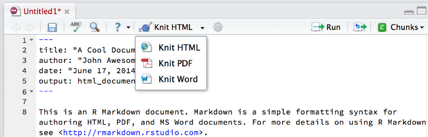
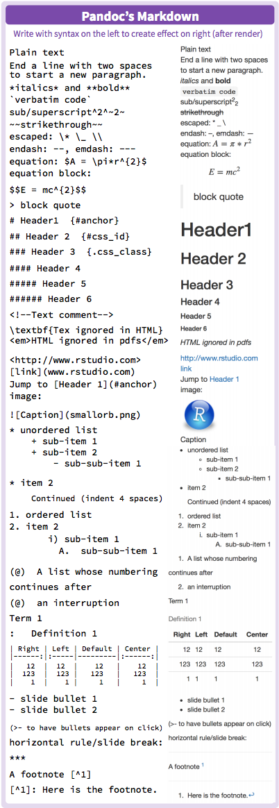
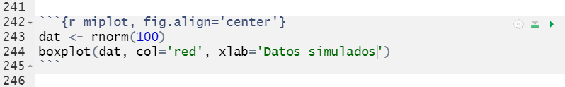

# R Markdown


## Introducción

Este documento es una adaptación del material que puede encontrarse en [este repositorio de github](https://github.com/marschmi/R Markdown_May11_2016).

[R Markdown](https://R Markdown.rstudio.com/) es una variante de Markdown que facilita la creación de documentos, presentaciones e informes dinámicos dentro de RStudio. Tiene fragmentos de código R incrustados para usar con **knitr** para facilitar la creación de **informes reproducibles** (en formato web o pdf) en el sentido de que se pueden regenerar automáticamente cuando se modifica el código o los datos de los que partimos en los análisis.

- R Markdown permite combinar Markdown con imágenes, enlaces, tablas, LaTeX y código de distintos programas. 
- RStudio facilita la creación de documentos desde R Markdown.

R Markdown procesa (renderizar, del inglés render/rendering) muchos tipos diferentes de archivos, incluidos:

- HTML
- PDF
- Markdown
- Microsoft Word
- Presentaciones
- Vignettes en HTML de paquetes de R
- Páginas web enteras!


Si bien hay muchos tipos diferentes de documentos procesados en R Markdown, nos centraremos principalmente en los archivos de salida HTML, ya que suelen ser muy útiles y flexibles para la investigación científica, crear materiales suplementarios o incluso material docente como este *bookdown*.


## ¿Por qué R Markdown?


¡Es una erramienta conveniente para crear informes dinámicos y reproducibles!

- Aunque fue creado para R, ahora acepta muchos lenguajes de programación. En este curso sólo veremos como trabajar con R
- Se puede incrustar código de R de varias formas
    - Código en línea: código breve que tiene lugar durante la parte escrita del documento. Por ejemplo, podemos decir: "El número de participantes en mi estudio es XX", y "XX" se autocompletará con el número exacto que hay en los datos que estoy analizando. Si cambio mi conjunto de datos y vuelvo a ejecutar el documento R Markdown, este número se actualizará de forma automática sin tener que volver a llevar a cabo los análisis. 
    - Fragmentos de código: partes del documento que incluyen varias líneas de código de programa o análisis. Puede representar un gráfico o una tabla, calcular estadísticas resumidas, cargar paquetes, etc.

- Es fácil:
     - Insertar imágenes.
     - Aprender la sintaxis de Markdown.
     - Incluir ecuaciones LaTeX (fórmulas).
     - Incluir tablas interactivas.
     - Usa el control de versiones con **Git**.
     - Añadir enlaces externos
     - Crear documentos con un bonito formato.

- No necesita preocuparse por los saltos de página o la ubicación de las figuras.

- Tenemos los resultados, comentario y código de R en un solo archivo:
     - Presentaciones de diapositivas, archivos PDF, documentos html, archivos de Word
     
## Flujo de trabajo

Brevemente, para hacer un informe:

- Abrir un archivo `.Rmd` (En RStudio: File -> New File -> R Markdown ...)
- Crear un encabezado YAML (en un segundo veremos qué es esto)
- Escribir el contenido con la sintaxis R Markdown.
- Insertar el código R en fragmentos de código o código en línea.
- Procesar la salida del documento.


**Descripción general de los pasos que sigue R Markdown para llegar al documento procesado/renderizado**:

1. Crear un informe `.Rmd` que incluya fragmentos de código R y texto en formato *markdown* (como se indica en los pasos anteriores).
2. Pasar el archivo `.Rmd` a la librería `knitr` para que ejecute los fragmentos de código R y cree un nuevo archivo `.md`.
     - [Knitr](https://yihui.org/knitr/) es una librería de R que permite la integración de código R en documentos de R Markdown procesados como HTML, latex, pdf, word, entre otros tipos de documentos.

3. Pasar el archivo .md a **pandoc**, que creará el documento  final (por ejemplo, html, Microsoft Word, pdf, etc.).
     - [Pandoc](https://pandoc.org/) es un conversor de documentos universal y permite la conversión de un tipo de documento (en este caso: .Rmd) a otro (en este caso: HTML)
     


Si bien esto puede parecer complicado, podemos presionar el botón "Knit" en la parte superior de RStudio como aparece en esta imagen:



o podemos ejecutar el siguiente código

```{r eval=FALSE}
R Markdown::render("nombre_fichero.Rmd", "html_document")
```

## ¿Cómo crear un fichero `.Rmd`?

1. En la barra de menú, hacer clic en **File -> New File -> R Markdown...** o simplemente hacer click en el signo más verde en la esquina superior izquierda de RStudio.


2. A continuación aparecerá la siguiente ventana emergente. Dentro de esta ventana, elija el tipo de documento que se quiere crear seleccionando los botones de opción. Nota: ¡esto se puede cambiar fácilmente más tarde!


3. Hacer click en **OK**

## Cabeceras YAML

YAML es el acrónimo de "YAML Ain’t Markup Language" y es básicamente una estructura de lista anidada que incluye la información (metadatos) del documento. Está escrito entre dos líneas de tres guiones --- y como vimos anteriormente, RStudio lo escribe automáticamente cuando se crea el documento con la barra de menus. Esto sería un ejemplo sencillo:

```
--- 
title:  "Ejemplo sencillo"  
Author:  "Juan R Gonzalez"  
date: "January 11th, 2021"  
output:  html_document
--- 
```

El ejemplo anterior creará un documento HTML. Sin embargo, las siguientes opciones también están disponibles:

- `html_document`
- `pdf_document`
- `word_document`
- `beamer_presentation` (diapositivas en pdf)
- `ioslides_presentation` (diapositivas en HTML )
- y más ...


Nos centraremos en los archivos HTML. Sin embargo, se puede jugar con la creación de documentos de Word y PDF (necesita un procesador de LaTeX). Las diapositivas de presentación adoptan una sintaxis ligeramente diferente (por ejemplo, para especificar cuándo termina una diapositiva y comienza la siguiente) y es un tema que no cubrimos en este curso.

## Sintáxis básica de Markdown

Se puede ver esta [Guia de Referencia de RMardown](https://rstudio.com/wp-content/uploads/2015/03/R Markdown-spanish.pdf) que está en castellano. 

Podemos listar los más frecuentes en esta figura. A la izquierda vemos lo que escribimos en el documento `.Rmd` y a la derecha vemos lo que aparecerá en el documento HTML.




Podemos escribir en el fichero `.Rmd` como si fuera un documento de texto (o Word) y utilizar los símbolos que hay en la figura anterior para crear secciones (`#`), subsecciones (`##`), palabras en negrita (`**`), ...


Algunos trucos que pueden ayudar a mejorar el documento son:


- Acabar la línea línea con dos espacios para comenzar un nuevo párrafo.
- Las palabras formateadas como código deben estar rodeadas por (`). 
- Para escribir un superíndice, debemos rodearlo con ^ en cada lado. Esto: Super^script^ se ha creado escribiendo `Super ^ script ^`.
- Las ecuaciones pueden ser código en línea usando `$` y se pueden escribir en un bloque centrado dentro del documento con `$$`. Por ejemplo, $E = mc^2$ está en línea, mientras que la siguiente es una ecuación en bloque:

$$E=emc^2$$

Para aquellos que no lo conozcan, la sintaxis que hay dentro de `$` es LaTeX que se usa mucho para escribir documentos con ecuaciones. Para biomedicina no es muy relevante en general. Hay muchos manuales, videos y ayudas. [Este es uno de ellos](http://nokyotsu.com/latex/curso.html).


## Insertar código de R

Hay 2 formas de incrustar código dentro de un documento R Markdown.

- Código en línea: código breve que tiene lugar durante la parte escrita del documento.

- Fragmentos de código: partes del documento que incluyen varias líneas de código de programa o análisis. Puede representar un gráfico o una tabla, calcular estadísticas resumidas, cargar paquetes, etc.

### Código de R en línea

El código en línea se crea usando una tilde inversa (`) y la letra r seguida de otra tilde inversa. 


Esto es realmente útil al redactar la sección de resultados de un artículo. Por ejemplo, es posible que hayan llevado a cabo varios análisis estadísticos para contestar a nuestras preguntas científicas. El siguiente código sería una forma de que R guarde ese valor en una  variable.

Por ejemplo: ¿El consumo de combustible de las transmisiones automáticas frente a las manuales es significativamente diferente dentro del conjunto de datos de `mtcars`?

```{r}
res <- t.test(mpg ~ am, data=mtcars)
res$p.value
```

Para extraer el p-valor hemos escrito `res$p.value`. Si queremos que salga en una línea, bastaría con escribir `` `r "\u0060r res$p.value\u0060"` `` tras "El p-valor es" y podríamos leer:

El p-valor es `r res$p.value`.

### Bloques (*chunks*) de código R

Los bloques de código R se pueden usar para incrustar la salida de resultados de R en el documento (sin necesidad de hacer copiar y pegar, garantizando la reproducibilidad) y/o para mostrar el código de R código usado para los cálculos.

La anatomía de un bloque de código R es:

Para insertar un fragmento de código R, se debe escrubur entre ` ```{r} ` y ` ``` `. También se puede presionar el botón `Insert a new code chunk` 


o usando las teclas Crtl + Alt + I (en Windows). 

Una vez hacemos esto, podemos escribir el código de R entre ambos fragmentos de código. Por ejemplo:


El bloque de código y el resultado que se vería en el documento HTML sería el siguiente:

```{r ejemplo}
n <- 10
sqrt(n)
```

Es recomendable dar un nombre al bloque de código de R para que cuando compilemos el `.Rmd`, si falla algo de R nos diga en qué bloque está el problema. En el ejemplo anterior, podríamos escribir:


## Opciones de los bloques de código R

Al presionar el tabulador cuando nos encontramos entre las llaves de ` ```{r} `, aparecerán las opciones para los bloques de código R. Estas son algunas de las que podemos usar:


Practicaremos estas opciones en un ejercicio para ver qué resultados tenemos. 

Supongamos que no queremos que se vea el código de R en nuestro documento. Entonces deberíamos usar `echo=FALSE` en todos los bloques. Esto puede ser un poco pesado de escribir, por lo que a veces se opta por usar una opción global de una opción mediante

```
knitr::opts_chunk$set(echo = FALSE)
```

Esta instrucción debe de estar en un bloque de código R para que se ejecute. Yo suelo escribir esto al inicio de mi documento `.Rmd` para que produzca un documento donde no ponga comentarios a las salidas de R y no saque los warnings de R ni los mensajes de las librerías cuando se carga. Aquí es donde se tendría que añadir `echo=FALSE` si quisieramos que no sacara el código de R de los bloques.


## Figuras

**Knitr** hace que la producción de figuras sea realmente fácil. Si se supone que el código de análisis dentro de un fragmento produce una figura, simplemente se imprimirá en el documento.

Estas son las principales opciones de knitr que debemos añadir en las opciones del bloque (*chunk*) que están relacionadas con las figuras:

- `fig.width` and `fig.height`
     - Defecto: `fig.width = 7`, `fig.height = 7`
- `fig.align`: Cómo alinear la figura
     - Las opciones incluye: `"left"`, `"right"`, and `"center"`
- `fig.path`: Directorio donde se quiere guardar la figura creada por el bloque de código de R.
     - Defecto: `'figure/'`

Por ejemplo, si queremos hacer una figura que esté centrada en el documento bastaría con ejecutar:




En el documento HTML veríamos

```{r miplot, fig.align='center'}
dat <- rnorm(100)
boxplot(dat, col='red', xlab='Datos simulados')
```


## Tablas

Escribir tablas a mano en Markdown puede resultar tedioso. En este curso no haremos esto porque lo que haremos será crear tablas a partir de resultados que podemos obtener de R (automático). Si desea obtener más información sobre las tablas de Markdown, se puede consultar [la documentación sobre tablas](https://R Markdown.rstudio.com/authoring_pandoc_markdown.html#tables) en el manual de R Markdown original.

Hay algunos tipos de tablas que se pueden crear que son muy útiles: `kable`, `pander` y `xtable`. La última es muy útil para aquellos que trabajen con LaTeX. Nos centraremos en las dos primeras.

- `kable`: Está dentro de la librería `knitr`, no tiene muchos argumentos, pero produce tablas muy visuales de forma sencilla.

- `pander`: Está dentro de la librería `pander`, tiene muchas más opciones y se puede personalizar. Es útil para poner en negrita ciertos valores (por ejemplo, valores por debajo de un umbral).


Veamos cómo hacer un análisis con nuestros datos `multicentric`. Si queremos reproducir los siguientes ejemplos, recordemos que hay que instalar la librería `knitr` (recuerda que hay que usar `install.packages ()`).

```{r eval=FALSE}
install.packages(c("knitr", "pander"))
```


Siguiendo los pasos que hemos visto en este documento para crear un fichero `.Rmd`, podemos escribir: 


## Tabla de contenidos 

Se puede agregar una tabla de contenido al documento creado usando la opción `toc` en el encabezado YAML. Las opciones más usadas son:

- `toc`: ¿Incluimos la tabla de contenidos?:
     - `toc: true`: Incluye la tabla de contenidos
     - Defecto: `toc: false`: No incluye la tabla de contenidos
- `toc_depth:`: Cuántos niveles de secciones debe incluir la tabla de contenidos. 
     - Defecto: `doc_depth: 3` incluirá secciones (cabeceras) con `###`.
     
Por ejemplo, nuestro fichero `.Rmd` podría incluir este código para añadir la tabla de contenidos donde se verían las secciones y subsecciones (**NOTA:** es necesario escribir `toc` y `toc_depth` empezando en la quinta columna).


## *Caching*

**Problema:** algunos bloques de código R tardan mucho en ejecutarse y es posible que cueste mucho tiempo crear el documento HTML. 

**Solución:** ¡Almacenamiento en caché! Si un bloque de código R no se ha modificado desde la última creación del documento, los resultados anteriores se utilizarán directamente en lugar de volver a ejecutar el bloque. Para ello poner `cache = TRUE` en el código del bloque de R que queremos que no vuelva a calcular cada vez que se cree el documento, o bien en las opciones globales para que aplique a todos los bloques de código R. 

**NOTA:** A veces, un bloque de código R almacenado en caché puede depender de objetos de otro bloque almacenado en caché. Esto puede ser un problema grave, ¡así que debemos tener cuidado y controlar las dependencias entre bloques! Es recomendable que para crear el documento definitivo borremos la carpeta donde está almacenado el caché (por defecto `"file_name_cache/"`) y volvamos a compilar de nuevo el fichero HTML para asegurar que todo está en orden. 
