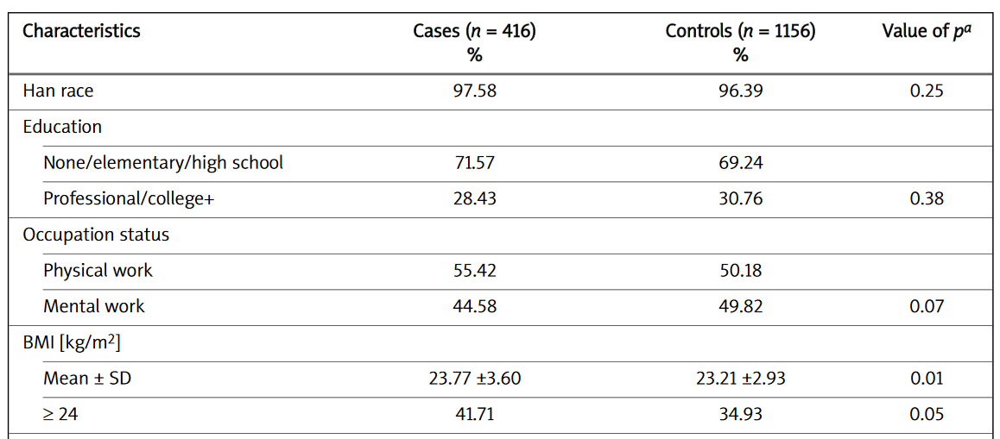

# Creación y personalización de tablas descriptivas


## Introducción

Tal y como hemos visto en este curso, en muchos estudios biomédicos necesitamos llevar a cabo análisis descriptivos y de asociación para muchas variables con la intención de crear (a mano) tablas como esta que se pueden encontrar en los artículos científicos:




Estos análisis se hacen con las mismas instrucciones de R y esto puede ser tedioso. Además copiar y pegar los resultados en una tabla puede llevar a errores. Finalmente, tener que volver a crear la tabla porque los datos han sido depurados o se han eliminado/añadido casos también puede conllevar a una pérdida de tiempo innecesaria. 

Para evitar estos problemas, podemos usar la librería 
`compareGroups` que está accesible en R y que podemos instalar mediante:

```{r eval=FALSE}
install.packages("compareGroups")
``` 

Esta librería consiste en tres funciones clave:

1. `compareGroups ()`: genera los cálculos

2. `createTable ()`: crea la tabla descriptiva creada con  `compareGroups ()`. Se puede customizar excluyendo categorías de las variables, cambiando el número de decimales, etc.

3. `export2... ()`: exporta las tablas a EXCEL, Word, LaTeX, Rmarkdown, etc.

Para ilustrar cómo realizar nuestros análisis usando `compareGroups` utilizaremos una base de datos del estudio [PREDIMED](http://www.cat.isciii.es/ISCIII/es/contenidos/fd-el-instituto/fd-comunicacion/fd-noticias/PREDIMED-2013.pdf) que es un estudio longitudinal que contiene distintas variables iniciales de los participantes, así como eventos ocurridos durante un período de seguimiento de 7 años (variables `event` y `tevent`). Cada individuo ha sido asignado a una dieta de tres intervenciones al azar (variable `group`).


Los datos están accesibles con la librería y se pueden cargar tras cargar la libería con:

```{r}
library(compareGroups)
data(predimed)
```

Las variables son:

```{r}
head(predimed)
```

## Estadísticas descriptivas y tests estadísticos

### Seleccionamos las varialbes y los métodos {-}

Calculamos todos los descriptivos y las pruebas de hipótesis de las variables seleccionadas mediante la función `compareGroups ()`.

Las variables se seleccionan haciendo uso del entorno de fórmulas estándar R. Las variables descritas se colocan en al lado derecho de `~` separadas por el signo `+`, mientras que la variable que indica los grupos se coloca en el lado izquierdo de la fórmula. Para seleccionar todas las variables podemos usar `.` y para eliminar variables, `-`.

Debemos tener en cuenta que no se permiten transformaciones en el entorno de fórmulas. Si es necesario, deben realizarse antes de llamar a la función `compareGroups ()`.

Cada variable es descrita en función del tipo (numérica o categórica). El argumento `method` fuerza a que los análisis de una variable se haga asumiendo que la variable es:

- method = 1 normalmente distribuida;
- method = 2 continua no normal; 
- method = 3 variable categórica; y 
- method = NA, lleva a cabo un test de normalidad y decide si la variable es normal o no (valor por defecto).

Así, si quisiéramos describir todas (`.`) las variables de nuestros datos menos la variable `toevent` (`- toevent`) y que el programa decidiera qué variables son normales o no (`method = NA`) excepto para la variable `wtn` y `p14` que queremos que se reporten con la mediana y los cuartiles en vez de la media y desviación estandard, ejecutaríamos

```{r}
res <- compareGroups(group ~ . - toevent, data = predimed, method = c(wtn = 2, p14 = 2))
res
```

En esta tabla vemos el número de indiviudos sin valores faltantes (missings) para cada variable, el p-valor correspondiente al test de normalidad y el tipo de variable que considera para el análisis. 


### Mostrar resultados {-}

Si queremos ver las descriptivas de cada variable, basta con usar la función `summary ()`. Veamos esta descriptiva para las dos primeras variables

```{r}
summary(res[1:2])
```

### Crear tabla descriptiva {-}

Podemos crear la tabla descriptiva aplicando la función `createTable ()` al objeto que hemos obtenido tras usar la función `compareGroups ()` (`res`). Usando `createTable ()` podemos personalizar cómo se muestran las variables categóricas (sólo por intervalo o frecuencias absolutas o ambas) mediante el argumento `type`. 

El argumento `hide.no` es útil para ocultar el nivel "no" para las variables binarias.

Si solo desea mostrar la categoría "Female", podemos usar el argumento `hide` para la variable `sex` que indicará qué categoría se oculta Este argumento también se aplica a variables categóricas con más de dos categorías.

Para especificar el número de dígitos decimales que se mostrarán, utilizamos el argumento `digits`. En el siguiente ejemplo, la variable `p14` no tendrá decimales y la variable `hormo` solo uno.

Finalmente, si desea mostrar cuántas personas tienen valores faltantes (missing) en cada variable usaremos `hide.n = TRUE`.


```{r}
restab <- createTable(res, digits = c(p14 = 0, hormo=1), type = 1, 
                      hide = c(sex = "Male"), hide.no = "no", show.n = TRUE)
restab
```

Si queremos cambiar algunas cabecereas, como por ejemplo "p-values" en vez de "p.overall" podemos usar el argumento `header.labels`


```{r}
print(restab, header.labels = c(p.overall = "p-value"))
```

También podemos crear tablas descriptivas que no estén separadas por una variable grupal. Basta con dejar el lado izquierdo de `~` vacío.

```{r}
resNoGroups <- compareGroups(~ . , predimed)
restabNoGroups <- createTable(resNoGroups, hide.no = "no")
print(restabNoGroups, header.labels = c("all" = "Entire cohort"))
```


### Visualización {-}

Finalmente, con `compareGroups` también podemos resumir los datos de forma gráfica mediante la función genérica `plot ()`. Por ejemplo, podemos visualizar las dos primeras variables con

```{r}
plot(res[1:2])
```

Los símbolos `[ ]` se utilizan para seleccionar aquellas variables que queremos visualizar. Podemos seleccionarlas con la posición `1:2` o con el nombre `c("sex", "age")`

También podemos ver la distribución según la variable grupal

```{r}
plot(res[1:2], bivar = TRUE)
```


## Modelos estadísticos (OR y HR)

### Odds ratio {-}

Para los estudios de casos y controles, puede ser interesante calcular la *odds ratio* (OR) para cada variable entre casos y controles. Aunque el estudio PREDIMED no es un caso-control, usaremos variable `event` como si fuese una variable caso-control. La forma más sencilla de obtener una tabla similar a la que hay en los artículos científicos es:

```{r}
resOR <- compareGroups(event ~ . - toevent, predimed)
restabOR <- createTable(resOR, show.ratio = TRUE,
                        show.p.overall = FALSE)
restabOR
```

Esta función se puede personalizar. Por ejemplo el argumento `fact.ratio` nos permite determinar la interpretación de la OR según el incremento de la variable independiente (` fact.ratio = c(waist=10)`). También podemos cambiar las cabeceras de la tabla como hemos explicado anteriormente. Para más posibilidades ver los argumentos en `?compareGroups`. 


```{r}
resOR <- compareGroups(event ~ . - toevent, predimed, 
                       fact.ratio = c(waist=10))
restabOR <- createTable(resOR, show.ratio = TRUE,
                        show.p.overall = FALSE, 
                        hide.no = "no", 
                        hide = c(sex = "Male"), type=1)
print(restabOR, header.labels = c(p.ratio = "p-value"))
```

### Hazard ratio {-}

Cuando analizamos estudios de cohortes, solemos estar interesados en calcular los *hazard ratio* (HR) en vez de OR ya que de esta manera tenemos en cuenta el tiempo transcurrido hasta el evento y los posibles valores censurados (análisis de supervivencia). 

Para llevar a cabo estos análisis con `compareGroups` primero debemos calcular la variable tiempo hasta el evento como una variable de supervivencia mediante la función `Surv` de la librería `survival` (que no hace falta instalar porque ya está en R). 

```{r}
library(survival)
predimed <- mutate(predimed, 
                   eventSurv = Surv(toevent, event == "Yes"))
```

Tras esto, podemos usar esta variable a lado izquierdo de `~` y usar una sintaxis similar a la que usamos para calcualr OR simplemente cambiando `event` por `eventSurv`.

```{r}
resHZ <- compareGroups(eventSurv ~ . - toevent, predimed)
restabHZ <- createTable(resOR, show.ratio = TRUE,
                        show.p.overall = FALSE)
restabHZ
```


Las tablas creadas se pueden exportar a Word (`export2word ()`), CSV (`export2csv ()`) y otros formatos (pdf, LaTeX, Mardown). Si usamos `export2md ()` lo exportaremos a Markdown y si ponemos esto en un documento de R Mardown la visualización de la tabla será mucho mejor. Por ejemplo

```{r}
export2md(restabOR)
```