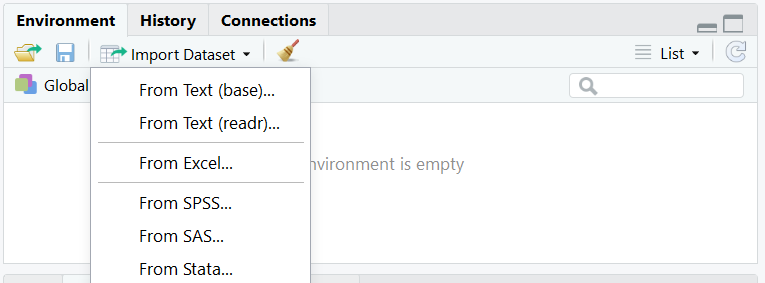
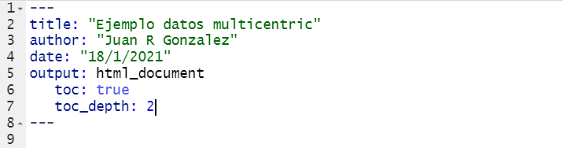

--- 
title: "Curso de R"
author: "Juan R González"
date: "`r Sys.Date()`"
site: bookdown::bookdown_site
documentclass: book
encoding: latin1
---


 
```{r include=FALSE}
knitr::opts_chunk$set(cache=T, warning=FALSE, message=FALSE, 
                      fig.path = "fig/", comment = "")
options(scipen = 0)
```


# Introducción

Este bookdown sirven como notas para el curso [Análisis descriptivo y estadística básica en estudios biomédicos con R y Rmarkdown ](https://www.iisaragon.es/event/curso-analisis-descriptivo-y-estadistica-basica-en-estudios-biomedicos-con-r-y-rmarkdown-edicion-2020-iacs/) impartido en el [Insituto Aragonés de Ciencias de la Salud](https://www.iacs.es/)


El contenido del curso tiene los siguientes temas:

- Modulo I: El entorno R y estadística descriptiva 
     + Tema 1: Introducción a R - Rstudio (2 horas)
         + Inicio R: instalando R y Rstudio
         + Lectura de datos en R
     + Tema 2: Análisis descriptivo
     
- Modulo II: Inferencia estadística y modelos
     + Tema 3: Análisis inferencial
         + Contrastes de hipótesis
         + Tests paramétricos: t-test, ANOVA, Chi-cuadrado
         + Tests no paramétricos: Wilcoxon, Kruskall-Wallis, Fisher
     + Tema 4: Modelos de regresión
         + Regresión lineal
         + Regresión logística

- Módulo III: Visualización
     + Tema 5: Tablas y Gráficos
         + Funciones Básicas de R
         + Lattice
         + ggplot2
- Módulo IV: Investigación reproducible
     + Tema 6: Knitr
     + Tema 7: R Mardown
     + Tema 8: Creación de reportes estadísticos usando librerías R


Este material está licenciado bajo una [Creative Commons Attribution 4.0 International License](https://creativecommons.org/licenses/by/4.0/).


![](data:image/png;base64,iVBORw0KGgoAAAANSUhEUgAAAFgAAAAfCAMAAABUFvrSAAAAIGNIUk0AAHolAACAgwAA+f8AAIDpAAB1MAAA6mAAADqYAAAXb5JfxUYAAAAEZ0FNQQAAsY58+1GTAAAAAXNSR0IB2cksfwAAAW5QTFRF////////////////7+/v39/f1tXV09bS0tXS0tXR0dTR0dTQ0NTQ0NPPz9PPztLOztHNzdHNzdHMz8/PzdDMzNDMzNDLzM/Ly8/Ly8/Ky87Kys3Jyc3Jyc3IyMzIyMzHx8vHxsrGxsrFxcnFxcnExMnExMjDw8jDxMfDw8fCwsfCwcXAwMXAwMW/wMS/v8S+v8O+vsO+vsK9vcK9vcK8v7+/vMG8vMG7vMC8u8C7u8C6ur+6ur+5ub65ub64uL23t7y2tru1tbq0tLqztLmzs7iysrixsrexsbewsbawsLavsLWvr7Wur7SusLOvrrStrrOtr7KvrbOsrLKrr6+vq7Gqn6OenqCdn5+flpmWk5iTkZSRkZORj4+PiYyJhIaEhIWEgoWCgICAfX98fH98eXx5cHJvcHBwYGBgXV5dUFFQUFBQQ0RDQEBAPj8+NTY1MjMxMDAwKSkpKCkoICAgGxsbEBAQDg4ODQ4NAAAAlzoSDQAAAAN0Uk5TAAoO5yEBUwAAAvhJREFUeNq1lutX2kAQxWmXFDVGYy1EIjQ2VZDiu1CsRQQURYvV+qSKj6II8rANYOT+9z0JqIASo9Y5ydkP2f2d2Ts7d2N4jRcJgwEIBwO+SbdTFGw8ZzZz1n5BdLgnfLPBcCT6fW1jY3P78QEYEA76PWMu0W5lGbrNZGrrYNg+u+ga9fgVcmxtY/NJZAOCfs+IY4Bn6eN8RdlEJX9Ed1uFIfdnfzC8uBJbv5tyqqhMLKa0wQHPiEOwMInLW4Eu9xmzfdDtmQ0uLK3cSXmvBBTS6QJQ2tMC+8YcgpnOApAzSa83mZEBZIff2odGfYFQJNqc8s4VchQhhFA5XO1pgCddAxaFKyeNpBpxGSgNmwXXxMxcWE25fkkJGUIIoExESQPsFnkmC0gUuQmjBGQZq+j2BEKR5dUGLVLIvbkGkxxSrcHO92wCkIyENJL3u+2O8Zng/FJsvR5cRF0GFIqtwaKVvoTcSxrCKOOS7hPdXwLhxUYtUFC+Z6AKQgpoDRZ6joEkaYo4cMQKril/KLLcCE4TVYmqFmkNsK0rD9lIiDdXKCSrwwEhREae6Ve0WIiuPg3M0xVlW171BBe21CGjbLbSYR0c/To3H409TQquHTggREKZ8pbjEiRqqxxXtWjjRLdvLrzUAK4Vr5qwZvEsJsCrzExWF9Tk9gIm84e74BRyRN9xeyS4vkHSmg1yK4Wxt5yUIClDayn0t3SteLWq3RQvjQrN31O87e2dEiBl0tJDJmTrykImN8dtq6AOpIw8Y3OMf2s+bvptU+hJqFrc1yCfpmZDkWYX0mv0H9WWpvS2tH6w8z27e58JJVi7c2ImuNBkQvrBOOWZc0CqsyFKtU3+97OuaQBnXGe90RuTMvCHtpziuWCcmDvPm64m+t2vlmuq/YHqqwnGCcfs1l+mCcbSmgtSe8iDGQNnPEsnrq//fZrltXS4tk3oAOPvT2tPF91uMrXTDNv340JrjQ4hbsHAxeE0z1ksHD99eKFdl0dl/P//Cl+9EPcfS+yBAoqk3eUAAAAASUVORK5CYII=)

<!--chapter:end:index.Rmd-->

# Importar datos a R {#importar}


Rstudio posee una pestaña en el Entorno (panel derecho-arriba, recordad la primera lección) y un botón que nos permite importar datasets de distintos formatos (ver figura). Esta es una forma sencilla de importar datos, pero siempre es recomendable importar archivos usando código (scripts) que nos permite compartir flujos de trabajo y análisis entre investigadores. En ese botón vemos que podemos importar datos de distintos tipos



Fijémosnos que los dos primeros menus hablan de importar ficheros de texto. También podemos importar ficheros de Excel, y de otros softwares como SPSS, SAS o Stata. 

Los ejemplos para este curso (y en general se suele hacer así) utilizará datos en formato texto. En este formato disponemos de las variables en columnas y los individuos o unidades de análisis en filas.  NOTA: Si se dispone de datos en formato  Excel o SPSS se pueden exportar de forma sencilla a texto. Este formato es muy útil ya que estamos acostumbrados a visualizar datos en formato tabular; es decir, como una tabla. 

Podemos pensar que dependiendo de como se separen las observaciones tenemos distintos tipos de datos tabulares, pero en realidad su estructura es similar: variables en columnas y las observaciones de un individuo separadas por una marca o carácter. Este carácter puede ser un espacio, un tabulador, una coma, punto y coma etc… El formato tabular mas extendido es el CSV, donde las observaciones están separadas por comas, pero en este curso usaremos datos en formato texto separados por tabuladores que también es un formato muy extendido (TSV).


## Directorio de trabajo

Para las clases y los ejercicios usaremos varios conjuntos de datos que disponemos en varios ficheros que pueden bajarse de la carpeta XXX del Moodle de la asignatura. Se recomienda crear un proyecto y crear una carpeta "datos" donde poner estos datasets que vamos a usar de ejemplo (ver video).

Si no queréis trabajar con proyectos, recordemos que tneéis que cambiar el directorio de trabajo allí donde hayáis bajado los datos de Moodle. Recordad que esto lo podéis hacer con el menu de Rstudio


O bien (recomendado) podéis hacerlo escribiendo una instrucción en el script. Como yo tengo la carpeta "datos" en el directorio **C:/Juan/cursos/R_Zaragoza/material_curso_online**) escribiría:

``` {r, eval=FALSE}
setwd("C:/Juan/cursos/R_Zaragoza/material_curso_online")
```

## Importar datos de texto 

Una vez tenemos el directorio de trabajo establecido ilustraremos como importar, por ejemplo, el fichero de datos "multicentric.txt" que recoge información sobre un estudio multicéntrico de casos y controles para estudiar factores pronóstico del cáncer de cervix. Estos serían los pasos que tendríamos que llevar a cabo

- Indicamos que queremos importar unos datos


En el navegador que se abre buscamos la carpeta "datos" y seleccionamos el archivo "multicentric.txt" [NOTA: si no hemos hecho bien el proyecto o cambiado el directorio de trabajo, podemos navegar hasta buscar la carpeta donde hayamos bajado los datos]. A continuación nos aparecerá este cuadro


Abajo a la derecha se puede ver cómo nos quedarán nuestros datos cuando se importen. Fijémonos que el nombre de las variables que estaban en la primera fila, no se han importado correctamente y que R ha puesto como nombre de las variables V1, V2, V3, .... Esto ocurre porque por defecto (parte izquierda) la opción "heading" es "No". Debemos cambiarlo a "Yes" cuando tengamos datos con los nombres de las variables en la primera fila (esto es lo habitual).


Si los datos de texto estuvieran separados por otra cosa que no fuesen tabuladores, no veríamos columnas. En ese caso debems cambiar el delimitador usando la opción "Separator". Cuando hacemos click sobre el botón "Import" los datos se cargan como un objeto de R que se llama "multicentric". Este nombre se puede cambiar en la caja "Name" que hay arriba a la izquierda. A parte de que se carge el dataset como un objeto de R, también se abren los datos como si fuese SPSS:


Ahora, una vez hemos cargado nuestros datos, podemos abrir un script de R y empezar a hacer análisis con ellos. Ahora podéis abrir un script nuevo y empezar a escribir y ejecutar las instrucciones que se detallan a continuación. Recordemos que se puede hacer mediante el menu **File > New File > R Script**. Un script, podría quedar entonces de la siguiente manera tras pedir que R importe los datos multicentric.txt


Lo primero que vemos es que tras el simbolo `#` el texto está en verde. Eso indica que esa parte no es código de R y no se ejecutará. Esto es recomendable para ir indicando qué hacen los siguientes comandos (compartir código entre investigadores). Las instrucciones que vemos en el script y que se repiten abajo, también sirven para importar datos utilizando comandos de R y no el menú como hemos visto anteriormente. Primero cambio el directorio de trabajo (si no estoy donde tengo la carpeta de datos es necesario)

```{r, eval=FALSE}
# Cambio el directorio de trabajo 
setwd("C:/Juan/cursos/R_Zaragoza/material_curso_online")
```

y luego cargo los datos

```{r}
# Importo los datos
multicentric <- read.delim("datos/multicentric.txt")
```

<!--chapter:end:01-lectura_datos.Rmd-->

# Manejo de datos


Una vez importados los datos, ya podemos empezar con nuestros análisis estadísticos. Pero antes, mostraremos cómo crear nuevas variables ya que a menudo, antes de empezar con los análisis necesitamos crear o recodificar nuevas variables que contengan la información que queremos tratar. Seguiremos usando los datos guardados en el fichero multicentric.txt que están cargados en un objeto llamado multicentric. La idea es que en el script que habéis abierto, podéis ir escribiendo estos comandos de R y ver por la consola qué resultados obtenéis. Recordad que cuando escribáis la instrucción, la podéis ejecutar con el boton "Run" que tenéis arriba a la derecha en la ventana del scipt o bien situando el cursor en la linea de comando y clickando "Crtl + R". En este material, el primer recuadro en gris corresponde al comando que tenéis que escribir en el script (ventana superior-izquierda de RStudio) y el siguiente recuadro en gris muestra lo que veríais por la línea de comandos (ventana inferior-izquierda de R studio)

## Visualización de datos

Empezemos viendo qué datos tenemos. Para ello usaremos la función `head()`

```{r}
head(multicentric)
```
Para saber cuántos individuos y cuántas variables tenemos en nuestra base de datos podemos usar la función `dim()`. `nrow()` nos daría el número de individuos y `ncol()` el número de variables

```{r}
dim(multicentric)
nrow(multicentric)
ncol(multicentric)
```


También podemos ver qué tipo de variables tenemos y cuáles son sus categorías

```{r}
str(multicentric)
```

Finalmente, si queremos saber el nombre de las variables que tenemos en nuestra base de datos usaríamos:

```{r}
colnames(multicentric)
```


Antes de explicar cómo crear nuevas variables, veamos algunos aspectos básicos de R en cuanto al acceso de las variables. Supongamos que queremos calcular cualquier estadístico descriptivo de alguna de las variables o ver un resumen de ella. Para esta tarea podemos utilizar distintas funciones de R que normalmente se ejecutan como `funcion()`. Dentro del paréntesis debemos indicarle cuál es la variable que queremos analizar. Para ello, utilizaremos el símbolo `$` [también podría usarse `[[ ]]` pero intentaremos evitar escribir demasiado código]. Así, por ejemplo, si queremos calcular la media de la primera relación sexual (variable `edad1sex`) bastaría con ejecutar

```{r}
mean(multicentric$edad1sex, na.rm=TRUE)
```

NOTA: na.rm=TRUE debe escribirse porque si no, R devuelve NA cuando hay missings en una variable. Con esta opción se analizan casos completos. También es interesante conocer estas otras funciones.


- Descriptiva de una variable categórica. Ejemplo: cuantas mujeres hay de cada país

```{r}
table(multicentric$pais)
```

- Descriptiva de una variable continua. Ejemplo: edad de las participantes

```{r}
summary(multicentric$edad)
```


Uno de los aspectos que más cuestan al principio de usar R es familiarizarse con la escritura de código. Rstudio nos ayuda puesto que podemos autocompletar el nombre de una base de datos o de una función. Por ejemplo, basta con empezar a escribir "multi" y dar al tabulador para que en el script se autocomplete la palabra "multicentric". Una vez escrito el nombre de la base de datos, si escribimos el símbolo `$` obtenemos un desplegable que nos muestra todas las variables que hay en ese objeto y basta con seleccionar la variable que queremos resumir para que R la ponga directamente en el script tal y como muestra la siguiente figura. 


También podemos acceder a una variablae usando `[` e indicando el número de columna donde está la variable que queremos resumir o su nombre. En este caso como `edad1sex` está en la columna 7 escribiríamos

```{r}
mean(multicentric[ , 7], na.rm=TRUE)
```

o usando su nombre

```{r}
mean(multicentric[ , "edad1sex"], na.rm=TRUE)
```

pero como se ha indicado anteriormente, lo más sencillo es usar `$` ya que ayuda a evitar errores en la escritura que es uno de los principales problemas para principiantes.


## Creación de variables
Para crear una nueva variable, por ejemplo la edad de la primera relación sexual menos 18, tendríamos que escribir

```{r}
multicentric$edad1sex2 <- multicentric$edad1sex - 18
```

Donde a la izquierda de `<-` se pone el nombre de la nueva variable que queremos añadir a `multicentric` (por eso se pone el `$`) y a la derecha la operación que queremos hacer. NOTA: el símbolo `<-` es como un `=` pero este último se usa para los argumentos de una función (lo veremos más adelante).

Esta forma de escribir es muy larga y complicada, sobre todo para los nuevos usuarios de R, y puede introducir errores fácilmente. Es por ello que podemos trabajar con una serie de librerías que facilitan llevar a cabo estas operaciones. Estas liberías forman parte de los desarrolladores de RStudio y son un compendio de funciones para el análisis científico de datos (Data Science). Si queremos usar estas funciones, debemos instalar las librerías de tydiverse [https://www.tidyverse.org/] ejecutando:


```{r eval=FALSE}
install.packages(tidyverse)
```

Después debemos cargar estas librerías con

```{r}
library(tidyverse)
```

Ahora, para crear una nueva variable basta con usar la función `mutate()` que tiene el primer argumento el nombre de nuestra base datos y luego la fórmula que queremos aplicar para calcular la nueva variable. Nos fijamos que ya no es necesario el uso de `$` y la instrucción se lee de forma más intuitiva.

```{r}
multicentric <- mutate(multicentric, edad1sex2 = edad1sex - 18)
```


Si ahora damos un vistazo a las variables que hay en `multicentric` veremos que al final se ha añadido una nueva variable (`edad1sex2`) que es la que hemos creado

```{r}
str(multicentric)
```

## Recodificación de variables

En biomedicina a veces interesa recodificar nuevas variables según varios criterios. Veamos algunos ejemplos

- Recodificar una variable continua en una categórica que toma valores superiores o inferiores a un valor. Ejemplo: edad de primera relación sexual antes o despues de 18 años

```{r}
multicentric <- mutate(multicentric, edad1sex3 = ifelse(edad1sex <=18, 0 , 1))
table(multicentric$edad1sex3)
```

- Recodificar una variable continua en cuartiles. Ejemplo: edad de primera relación sexual en cuartiles


```{r}
multicentric <- mutate(multicentric, edad1sex4 = cut(edad1sex, quantile(edad1sex, na.rm=TRUE)))
table(multicentric$edad1sex4)
```

- Recodificar una variable según unos puntos de corte y ponerles una etiqueta. Ejemplo: edad de primera relación sexual antes de los 14, entre los 15 y 18 (ambos incluidos) y más de los 18 (19 o más)

```{r}
multicentric <- mutate(multicentric, edad1sex5 = cut(edad1sex, c(-Inf, 14, 18, Inf),
                                                     labels=c("<14", "15-18", "19+")))
table(multicentric$edad1sex5)
```


- Recodificar una variable con ciertas categorías en otras. Ejemplo: no-fumadoras y ex-fumadoras en una categoría 'No' y fumadoras en 'Si'

```{r}
multicentric <- mutate(multicentric,
                       fumarNewCat = recode(fumar, 
                                           "no fumador" = "No",
                                           "ex-fumador" = "No",
                                           "fumador" = "Si"))
table(multicentric$fumar)
table(multicentric$fumarNewCat)
```


## Filtrado de datos
También podemos filtrar una base de datos para hacer unos análisis específicos en un subgrupo de individuos. Supongamos que queremos describir nuestros controles. Para ello utilizaremos la función `filter()`. Sabemos que el estado Caso/Control se encuentra en la variable `status` por eso escribimos

```{r}
controles <- filter(multicentric, status=="Control")
dim(controles)
```

Usamos `==` para poner una condición de igualdad. Para otras condiciones deberemos usar


Por ejemplo, si queremos seleccionar a los casos que hayan tenido una infección por VPH (variable `vph)` deberíamos escribir

```{r}
casos.vph <- filter(multicentric, status=="Caso" & vph=="positivo")
dim(casos.vph)
```


<!--chapter:end:02-manejo_datos.Rmd-->

# Estadística descriptiva 

Ahora empezaremos a ver la potencia de R. No sólo se hacen librerías para el análisis estadístico de datos, también se hacen librerías para visualizar resultados de forma gráfica, hacer análisis descriptivos rápidos o crear tablas de artículos de forma sencilla. Algunas de estas librerías las iremos viendo durante el curso. Empecemos con algunas librerías para resumir de forma rápida nuestras variables. Para ello necesitamos instalar las siguientes librerías que iremos viendo a lo largo del curso

```{r eval=FALSE}
install.packages("summarytools", "compareGroups")
```


## Variables categóricas

La librería `summarytools` es muy potente. Por ejemplo, podemos obtener un resumen para las variables categóricas (por ejemplo para saber cuantos casos y controles tenemos) con la función `freq()` 

```{r}
library(summarytools)
freq(multicentric$status)
```

Notemos que antes hay que cargar la librería para que R encuentre la función `freq()`, no es suficiente con instalar la librería, luego hay que cargarla. También vemos que esta función no describe las variables categóricas (ver warning). 

Podemos evitar que salgan los missings (NA) y hacer más compacta la tabla con la instrucción

```{r}
freq(multicentric$status, report.nas = FALSE, headings = FALSE)
```

Si queremos que lo haga para todas las variables categóricas, funciona así de simple

```{r error = TRUE}
freq(multicentric, report.nas = FALSE, headings = FALSE)
```

## Tabla de contingencia

Para crear una tabla de contingencia y ver cómo se distribuyen los casos y controles según su infección por vph podríamos usar la función `ctable()`

```{r}
ctable(multicentric$status, multicentric$vph, prop="r")
```

el argumento `prop` nos sirve para indicar si queremos las proporciones por fila ('r') o columna ('c'). Podmeos eliminar la columna de missings indicando que el argumento `useNA` sea "no"

```{r}
ctable(multicentric$status, multicentric$vph, useNA="no", prop="r")
```


## Variables continuas

Para las variables continuas podemos usar la función `descr()`. Por ejemplo, si queremos ver los principales estadísticos de la variable edad de la primera relación sexual (variable `edad1sex`) escribiríamos

```{r}
descr(multicentric$edad1sex)
```

Una de las principales ventajas de R es que usa un lenguaje de programación orientado a objetos. En palabras sencillas, esto implica que una misma función se puede aplicar a distintos tipos de objetos y la función ya sabe qué hacer. En este caso, si aplicamos la función `desrc()` a toda nuestra base de datos, lo que hace es buscar todas las variables continuas, y resumirlas.


```{r warning=TRUE}
descr(multicentric)
```


Si queremos tener esta descriptiva según una segunda variable categórica como es habitual en la mayoría de análisis estadísticos (por ejemplo entre grupos de comparación o para casos y controles) podemos hacerlo también. Supongamos que queremos tener una descriptiva de las variables categóricas según la variable caso-control (`status`). Para ello, deberíamos usar la función `stby()` e indicar en el argumento `INDICES` nuestra variable por la que queremos separar los análisis.


```{r}
stby(multicentric, INDICES = multicentric$status,
     FUN = descr, stats = "common", transpose = TRUE)
```

El argumento `stats="common"` lo ponemos para que saque menos estadísticos (sólo los más comunes), pero si no ponemos nada los saca todos y el argumento `transpose = TRUE` sirve para trasnponer la tabla de resultados.


NOTA: cuando hablemos de informes reproducibles y  de Rmarkdown veremos que estas tablas quedarán mucho mejor cuando mostremos nuestros resultados con HTML o incluso PDFs o documentos Word ... pero eso será al final del curso. 


Podríamos pensar que este tipo de descriptivas también las obtenemos con SPSS o Stata, pero .... tenemos más opciones que nos facilitan mucho la vida como estadísticos. En este caso, podemos resumir toda nuestra base de datos (tanto variables continuas como categóricas) con la función `dfSummary()` y obtendríamos este output 

```{r , eval=FALSE}
dfSummary(multicentric)
```


```{r , echo=FALSE}
print(dfSummary(multicentric, graph.magnif = 0.75), method = 'render')
```


<!--chapter:end:03-descriptiva.Rmd-->

# Pruebas de Hipótesis

En la siguiente figura podemos observar un esquema general de cómo abordar un problema científico desde un punto de vista estadístico. Partimos de una pregunta científica que nos planteamos sobre nuestra población de estudio. Esta pregunta debe ser *traducida* a una pregunta estadística que nos permita saber cómo abordarla desde un punto de vista matemático o estadístico. 


{height=12cm}

Por ejemplo, imaginemos que estamos interesados en saber si el consumo de aspirina reduce el riesgo de sufrir un infarto de miocardio. Hay un método muy sencillo de saber qué problema necesitamos abordar desde un punto de vista estadístico a partir de nuestra pregunta científica y es conocer la naturaleza de nuestros datos. En este caso, nuestra variable resultado sería sufrir o no un infarto, por lo que estaríamos ante una variable binaria. Este tipo de variables se resumen con la frecuencia relativa o proporciones. De esta forma, la pregunta estadística se traduciría cómo: ¿La proporción de personas que sufren un infarto es igual en aquellas personas que toman aspirina que en las que no toma? 

Para contestar a esta pregunta, el método científico nos indica que debemos tomar una muestra aleatoria (para garantizar representatividad de nuestra problación) que describiremos con métodos descriptivos vistos en el tema anterior. También podemos realizar un experimento o diseñar un estudio que nos permita contestar a nuestra pregunta cienífica. Existen muchos tipos de diseños, que se suponen que son familiares para el alumno. 

Para nuestro ejemplo podríamos, entre otras opciones, diseñar un estudio en el que estudiáramos personas que han sufrido un infarto y otro grupo control de la misma edad y sexo a los que preguntaríamos si han tomado o no aspirina durante los últimos años (diseño caso-control). Entonces, podríamos compararla proporción de infartos entre las personas que toman y no toman aspirina. Empezaríamos por mostrar estas diferencias de forma visual con, por ejemplo, un gráfico de barras (que es como se visualizan las variables categóricas). Ahora nuestra siguiente pregunta sería saber si las diferencias que observamos son reales o son debidas al azar (es decir, por no estudiar toda la población y si una muestra aleatoria). Para demostrar que estas diferencias son reales (e.g estadísticamente significativas) debemos realizar lo que se conoce como inferencia estadística, que en este caso correspondería a una prueba de hipótesis. 

En el caso que nuestra pregunta científica esté asociada a una variable continua se abordaría de la misma forma. La única diferencia es que la prueba de hipótesis planteada sería distinta. Por ejemplo, supongamos que queremos saber si el consumo de café aumenta la tensión arterial. En ese caso, nuestra variable resultado es tensión arterial, que al ser continua se resume con la media. Así pues, nuestra pregunta estadística sería: ¿La media de tensión arterial es igual en los consumidores de café que en los que no consumen?

En consecuencia, las pruebas que nos planteamos para comparar ambos grupos (A y B) en cada ejemplo sería

$$H_0: p_A = p_B$$

y

$$H_0: \bar{x}_A = \bar{x}_B$$

respectivamente.


Una vez planteadas las pruebas de hipótesis, basta con usar un software estadístico para calcular el **p-valor** que es la medida que nos indica si las diferencias observadas en nuestra muestra son reales o son debidas al azar. En otras palabras, demostramos si las diferencias observadas son **estadísticamente significativas**. Como decimos, el proceso para determinar esta significación estadística se basa en el cálculo del p-valor, y consideraremos que las diferencias serán estadísticamente significativas si el p-valor$<0.05$ y no cuando ocurra lo contrario. 

A este valor de $0.05$ se le conoce como el nivel de significación estadística ($\alpha$) y es el valor que asumimos como riesgo a equivocarnos cuando las diferencias no son reales. En la siguiente figura podemos ver un resumen del tipo de errores que podemos cometer cuando llevamos a cabo una prueba de hipótesis


{height=8cm}
A modo de resumen podríamos decir que los pasos en un proceso de investigación serían:

- Formular hipotesis nula (y alternativa)
- Decidir el nivel de significanza estadística ($\alpha$)
- Eligir un test estadístico a utilizarse (que dependerá del tipo de variable que estudiemos)
- Calcular el p-valor con ese test y decidir si rechazamos  $H_0$ o no.


Para entender un poco mejor este procedimiento, podems compararlo con el simil de un jurado. Es importante notar que siempre partimos de la hipótesis nula y que queremos dar evidencias a partir de nuestros datos, nunca hacemos lo contrario, al igual que pasa en un juicio

{height=8cm}


A continuación explicaremos cómo llevar a cabo estas pruebas de hipótesis con R en función de nuestra variable de interés para las siguientes pruebas. 


En este capítulo se muestran las funciones que hay disponibles en R para realizar prueba de hipótesis para:

1. La media $\mu$,
2. La proporción $p$,
3. La razón de varianzas $\sigma_A^2 / \sigma_B^2$,
4. La igualdad de medias $\mu_A = \mu_B$ para muestras independientes, 
5. La igualdad de medias para más de dos grupos (ANOVA), y
6. La igualdad de proporciones $p_A = p_B$. 
7. Pruebas no-paramétricas


Para ilustrar estos cálculos usaremos la base de datos `multicentric.txt` que hemos trabajado en capítulos anteriores. Para ello, recordemos que primero debemos cargar los datos en R tal y como se ha descrito en el capítulo \@ref{importar}, o bien con el menú o bien con la siguiente instrucción.

```{r }
multicentric <- read.delim("datos/multicentric.txt")
```

NOTA: recordad que para que esta instrucción funcione debéis cambiar el directorio de trabajo a la carpeta que contenga este fichero.


## Prueba de hipótesis para la media, $\mu$, de una población normal

Este test se llevará a cabo cuando nuestra pregunta científica se interese por una variable resultado de tipo continua. Para realizar este tipo de prueba se puede usar la función `t.test` que tiene la siguiente estructura.

```{r, eval=FALSE}
t.test(x, y = NULL,
       alternative = c("two.sided", "less", "greater"),
       mu = 0, paired = FALSE, var.equal = FALSE,
       conf.level = 0.95, ...)
```

Los argumentos a definir dentro de `t.test` para hacer la prueba son:

- `x`: vector numérico con los datos.
- `alternative`: tipo de hipótesis alterna. Los valores disponibles son `"two.sided"` cuando la hipótesis alterna es $\neq$, `"less"` para el caso $<$ y `"greater"` para $>$.
- `mu`: valor de referencia de la prueba.
- `conf.level`: nivel de confianza para reportar el intervalo de confianza asociado (opcional).

### Ejemplo {-}

Supongamos que queremos saber si la edad de la primera relación sexual es superior a los 18 años. Lo primero que debemos hacer es comprobar si los datos siguene una distribución normal. Para ello usaremos una libería que tiene una batería de 10 pruebas distintas que se llama `nortest`. Para usarla, primero hay que instalarla

```{r eval=FALSE}
install.packages("nortest")
```` 

y luego podemos evaluar si la variable es normal usando cualquiera de los tests implementados, de la siguiente forma

```{r}
library(nortest)   
lillie.test(multicentric$edad1sex)
```

Nosotros hemos usado la prueba de Lilliefors (Kolmogorov-Smirnov) pero se pueden usar otras como la de Anderson-Darling (función `ad.test`) o Shapiro-Francia (función `sf.test`) entre muchas otras. 

Podemos ver que rechazamos la hipóteisis nula de normalidad ($p<0.05), por lo que necesitmos solventar este problema. Normalmente esto se hace transformando los datos usando la transformación logarítmica. Luego volvemos a testar la normalidad para ver si podemos aplicar el test para la media. Para ello crearemos primero una nueva variable que llamaremos `edad1sex2`. 

```{r}
library(tidyverse)
multicentric <- mutate(multicentric, edad1sex2 = log(edad1sex))
```

y ahora aplicamos el test a la nueva variable

```{r}
lillie.test(multicentric$edad1sex2)
```


Vemos que la variable sigue sin ser normal. También podríamos verlo de forma gráfica

```{r}
hist(multicentric$edad1sex2, xlab="log(edad primera relación sexual)", main="")
``` 

Observamos que la cola de la izquierda es más pesada que la de la derecha. Es decir, la distribución sigue sin ser simétrica que es una de las características principales de las variables normales. Ahora tenemos dos opciones:

- Buscar otro tipo de transformación que garantice la normalidad

- Usar un test no paramétrico. 

La segunda opción la veremos en capítulos más adelante y es la que recomendamos realizar ya que la primera opción tiene sus inconvenientes, sobre todo si queremos interpretar los resultados ya que la transformación a aplicar ([Yeo-Johnson](https://en.wikipedia.org/wiki/Power_transform)) puedes tener  una forma muy complicada. Si alguien quiere hacer esta transformación en R existen varias librerías que pueden hacer esta transformación como la libería [bestNormalize](https://cran.r-project.org/web/packages/bestNormalize/bestNormalize.pdf). En este trabajo asumiremos que la variable `edad1sex` es normal e ilustraremos como realizar el test que estabamos interesados:

$$H_0: \text{edad1sex = 18}$$
$$H_1: \text{edad1sex > 18}$$

Esta prueba de hipótesis se puede realizar usando la función `t.test` por medio del siguiente código.

```{r}
t.test(multicentric$edad1sex, 
       alternative="greater", mu=18)
```

Como el valor-P es <0.05 y por lo tanto menor que el nivel de significanción del 5%, tenemos evidencias para rechazar la hipótesis nula, es decir, las evidencias son suficientes para afirmar que la edad de la primera relación sexual no ocurre a los 18 años. NOTA: no es habitual hacer test unilaterales (alternativa mayor o menor) ya que está recomendado hacer bi-laterales (el valor por defecto del argumento `alternative`) pero hemos querido hacer este ejemplo para ilustrar como plantear este tipo de pruevas de hipótesis.


## Prueba de hipótesis para la proporción $p$ de una población 

Este test se llevará a cabo cuando nuestra pregunta científica se interese por una variable resultado binaria o categórica.

Existen varias pruebas para testar si la propoción $p$ de una distribución binomial (porque tenemos $n$ individuos que siguen una Bernoulli de parámetro $p$) sigue un valor predeterminado.

1. Prueba de [Wald](https://en.wikipedia.org/wiki/Wald_test),
2. Prueba $\chi^2$ de [Pearson](https://en.wikipedia.org/wiki/Pearson%27s_chi-squared_test#Fairness_of_dice),
3. Prueba [binomial exacta](https://en.wikipedia.org/wiki/Binomial_test).

### Prueba de Wald
Esta prueba se recomienda usar cuando se tiene un tamaño de muestra $n$ suficientemente grande para poder usar la distribución normal como aproximación de la distribución binomial.

En esta prueba el estadístico está dado por

$$z=\frac{\hat{p}-p_0}{\sqrt{\frac{p_0(1-p_0)}{n}}},$$
donde $\hat{p}$ es la proporción muestral calculada como el cociente entre el número de éxitos $x$ observados en los $n$ ensayos y $p_0$ es el valor de referencia de las hipótesis. El estadístico $z$ tiene distribución $N(0, 1)$ cuando $n \to \infty$.

Para realizar esta prueba en R no hay una función y debemos escribir la líneas de código para obtener el estadístico y el valor-P de la prueba. Dado que estamos en un curso introductorio, obviaremos esta solución que aunque no es compleja, requiere escribir algo de código en R y no usar una función


### Prueba $\chi^2$ de Pearson
Esta prueba también require de un tamaño muestral $n$ grande. Para realizar los cálculos se usa la función `prop.test` que tiene la siguiente estructura.

```{r, eval=FALSE}
prop.test(x, n, p = NULL,
          alternative = c("two.sided", "less", "greater"),
          conf.level = 0.95, correct = TRUE)
```

Los argumentos a definir dentro de `prop.test` para hacer la prueba son:

- `x`: número de éxitos en la muestra.
- `n`: número de observaciones en la muestra.
- `alternative`: tipo de hipótesis alterna. Los valores disponibles son `"two.sided"` cuando la alterna es $\neq$, `"less"` para el caso $<$ y `"greater"` para $>$.
- `p`: valor de referencia de la prueba.
- `correct`: valor lógico para indicar si se usa la corrección de Yates.
- `conf.level`: nivel de confianza para reportar el intervalo de confianza asociado (opcional).

### Ejemplo {-}

Supongamos que queremos saber si en nuestro estudio de cáncer cervical, la proporción de gente que se realiza una prueba del virus de papiloma humano (variable `pap`) es del 55% ya que ese es el porcentaje de pruebas que se realiza en España y  lo consideramos como el de referencia.

En este problema interesa probar lo siguiente:

$$H_0: p = 0.55$$
$$H_1: p \ne 0.55$$
La forma de usar la función `prop.test` para realizar la prueba se muestra a continuación.

Primero necesitamos saber cuántas mujeres se hacen o no la prueba del virus de papiloma humano y cuántas mujeres tenemos en total. Esto lo podemos saber con:

```{r}
nrow(multicentric)
table(multicentric$pap)
```

Entonces usamos la función como

```{r}
prop.test(x=1575, n=2910, p=0.55)
```

Como el p-valor es >0.05, concluimos que no tenemos evidencias para afirmar que el porcentaje de mujeres que se hacen la prueba del virus de papiloma humano sea distinta a la de España (0.55). NOTA: nunca aceptamos la hipótesis nula y decimos que nuestra proporción es del 55%. 

### Prueba binomial exacta
Esta prueba se recomienda cuando tenemos un tamaño muestral $n$ muy pequeño (menor de 30). Para realizar la prueba binomial exacta se usa la función `binom.test` que tiene la siguiente estructura.

```{r, eval=FALSE}
binom.test(x, n, p = 0.5,
           alternative = c("two.sided", "less", "greater"),
           conf.level = 0.95)
```

Los argumentos a definir dentro de `binom.test` para hacer la prueba son:

- `x`: número de éxitos en la muestra.
- `n`: número de observaciones en la muestra.
- `alternative`: tipo de hipótesis alterna. Los valores disponibles son `"two.sided"` cuando la alterna es $\neq$, `"less"` para el caso $<$ y `"greater"` para $>$.
- `p`: valor de referencia de la prueba.
- `conf.level`: nivel de confianza para reportar el intervalo de confianza asociado (opcional).

En nuestro ejemplo anterior tendríamos que escribir

```{r}
binom.test(x=1575, n=2910, p=0.55)
```

Notemos que el p-valor es muy similar al anterior, puesto que estamos con una muestra muy grande.

## Prueba de hipótesis para la razón de varianzas $\sigma_1^2 / \sigma_2^2$

Esta prueba es importante ya que para comparar dos medias (que es el tipo de prubas que más se suele hacer en investigación biomédica) a parte de comprobar que nuestra variable de interés es normal, debemos comprobar que la varianza entre los dos grupos es la misma. O en otras palabras que la razón de la varianza de cada grupo es 1:


$$H_0: \frac{\sigma_{A}^2}{\sigma_{B}^2} = 1$$
$$H_0: \frac{\sigma_{A}^2}{\sigma_{B}^2} \neq 1$$
Para realizar este tipo de prueba se puede usar la función `var.test`.


### Ejemplo {-}

Supongamos que queremos verificar si la edad de la primera relación sexual (que hemos asumido que es normal) es igual entre casos y controles (variable `status`). El p-valor correspondiente a esta prueba se calcularía mediante:

```{r}
var.test(edad1sex ~ status, data=multicentric)
```
El símbolo `~` (que se puede escribir con `AltGr + 4 y espacio`) indica que queremos comparar la varianza de la variable que hay a la izquierda en función de la variable que hay en la derecha. Notemos que hay que indicar a R donde están las variables `edad1sex` y `status`, por eso escribimos `data=multicentric`. 

Observamos que el p-valor es <0.05, por lo que tenemos evidencias para decir que la variabilidad de la edad en la primera relación sexual (`edad1sex`) es distinta entre los casos y los controles. Esto no es un problema desde un punto de vista práctico. Simplemente debemos tenerlo en cuenta a la hora de hacer un test para comparar si esta variable es un factor que se relaciona con tener cáncer o no, tal y como veremos en la siguiente sección.

## Prueba de hipótesis para la igualdad de medias $\mu_A = \mu_B$ 
En este caso, estamos interesados en conocer si la media de una variable continua es igual en dos grupos. Para realizar este tipo de prueba se puede usar la función `t.test` que implementa el test de la t de Student (t-test) y que tiene la siguiente estructura.

```{r, eval=FALSE}
t.test(x, y = NULL,
       alternative = c("two.sided", "less", "greater"),
       mu = 0, paired = FALSE, var.equal = FALSE,
       conf.level = 0.95, ...)
```

Los argumentos a definir dentro de `t.test` para hacer la prueba son:

- `x`: vector numérico con la información de la muestra 1,
- `y`: vector numérico con la información de la muestra 2,
- `alternative`: tipo de hipótesis alterna. Los valores disponibles son `"two.sided"` cuando la alterna es $\neq$, `"less"` para el caso $<$ y `"greater"` para $>$.
- `mu`: valor de referencia de la prueba (opcinal, no necesario la mayoría de veces ya que siempre queremos comparar si son iguales lo que implica que la diferencia es 0 que es el valor por defecto).
- `var.equal=TRUE`: indica que las varianzas son desconocidas pero iguales. Si no lo son, basta con poner `var.equal=FALSE`.
- `conf.level`: nivel de confianza para reportar el intervalo de confianza asociado (opcional).


### Ejemplo {-}

Siguiendo con el ejemplo anterior, investiguemos si la edad de la primera relación sexual está asociada con tener cáncer cervical. En este caso plantearíamos la prueba estadística: 

$$H_0: \mu_\text{controles} =  \mu_\text{casos}$$

$$H_1: \mu_\text{controles} \neq \mu_\text{casos}$$
Que puede llevarse a cabo mediante:

```{r}
t.test(edad1sex ~ status, data=multicentric,
       var.equal=FALSE)
```

Notemos que si en la prueba anterior de igualdad de varianzas, no hubiéramos rechazado la hipótesis nula, ahora no sería necesario poner `var.equal=FALSE` ya que por defecto ese argumento es `TRUE` que indicaría que las varianzas son iguales. Como en nuestro caso hemos rechazado dicha hipótesis, debemos cambiar este argumento de la función. El resto de la función es similar al caso anterior.


## Prueba de hipótesis para la igualdad de más de dos medias (ANOVA)

A veces, estamos interesados en comparar la media de nuestra variable de interés para más de dos grupos. En este caso, no podemos usar el t-test anteriormente descrito. La método de análisis de varianza (ANOVA) es el test que se emplea para el estudio del efecto de uno o más factores (cada uno con dos o más niveles) sobre la media de una variable continua. Es por lo tanto el test estadístico a emplear cuando se desea comparar las medias de dos o más grupos. 

La prueba estadística puede plantearse como:

$$H_0: \mu_A =  \mu_B = \cdots = \mu_K$$

$$H_1: \text{algún par de medias es distinta}$$
Estos análisis podemos llevarlos a cabo con la función `aov`

### Ejemplo {-}

Supongamos que queremos averiguar si la edad de la primera relación sexual se asocia con si la mujer es fumadora, no fumadora o ex-fumadora (variable `fumar`). En este caso, contestaríamos a la pregunta mediante

```{r}
mod <- aov(edad1sex ~ fumar, data=multicentric)
summary(mod)
```

Puesto que el p-valor asociado a esta prueba es <0.05, concluiríamos que nuestros datos aportan evidencias para rechazar la hipótesis nula. Por lo tanto, la media de la primera relación sexual es distinta para alguno de los grupos que estamos comparando. 

Ahora tendríamos que decir entre qué grupos hay diferencias, y para ello, usaríamos lo que se conoce como post-hoc tests. Existen numerosos tests en la literatura para hacer estas comparaciones a posteriori cuando hemos rechazado la hipótesis nula en un ANOVA. Nosotros usaremos `TukeyHSD` que es sencilla de usar, es uno de los métodos más robustos y no requiere ninguna otra libería. Basta con ejecutar la función sobre el objeto anterior que contiene el ANOVA

```{r}
TukeyHSD(mod)
```
Este test nos diría que hay diferencias entre los grupos de no fumadoras y las exfumadoras y fumadoras. Notemos que el resultado de los análisis muestra `p adj` que indica que es un p-valor ajustado ya que estamos haciendo muchas comparaciones estadísticas (tres) con los mismos datos y necesitamos tener esto en cuenta para tener un valor de significación global del 5%. 


## Prueba de hipótesis para la igualdad de proporciones $p_A = p_B$

Para realizar pruebas de hipótesis para comparar dos proporciones se usa la función `chisq.test`. 


### Ejemplo {-}

Supongamos que queremos investigar si dar positivo en el test del virus de papiloma humano (variable `vph`) es un factor de riesgo para desarrollar cáncer cervical. La hipótesis que se planteraria sería:

$$H_0: p_{\text{controles}}  = p_{\text{casos}}$$

$$H_0: p_{\text{controles}}  \neq p_{\text{casos}}$$


En este caso, variable de interés es categórica (binaria) y la queremos comparar entre dos grupos. En ese caso necesitamos usar un test de Chi-cuadrado que se calcula a partir de la tabla de contingencia que recordemos del capítulo anterior que se puede obtener de la siguiente forma con la librería `summarytools`:

```{r}
library(summarytools)
ctable(multicentric$vph, multicentric$status, 
        useNA="no", prop="c")
```

Vemos que la proporción de casos que dan positivo en la prueba es del 93.6%, mientras que en los controles es de tan sólo el 14.4%. Esto parece indicar que ambas variables están relacionadas, o en otras palabras, que dar positivo por este virus es un factor de riesgo para el cáncer cervical. Pero, como siempre, a estas diferencias le tenemos quedar un valor de significación estadística que podemos obtener de dos formas. Una poniendo el argumento `chisq=TRUE` en la función anterior

```{r}
ctable(multicentric$vph, multicentric$status, 
        useNA="no", prop="c", chisq=TRUE)
```

y otra, usando la función  `chisq.test`, pero que no devuelve la tabla ni los porcentajes. 


```{r}
chisq.test(multicentric$vph, multicentric$status)
```

Vemos que en ambos casos obtenemos el mismo resultado, que no es otro que tenemos suficientes evidencias en nuestros datos para rechazar la hipótesis de igualdad de proporciones ya que el p-valor es menor que 0.05, por lo que la proporción de infectadas en casos es distinta que en controles (mayor) o lo que es lo mismo, que esta variable es un factor de riesgo para el cáncer cervical. 


## Pruebas no paramétricas

En el ejemplo de la variable edad de la primera relación sexual, hemos visto que no sigue una distribución normal, por lo que los métodos anteriormente descrito no serían válidos. En realidad, no es que no lo sean, si no que no son los más potentes para encontrar diferencias cuando realmente las hay. Esto iría en contra nuestra como investigadores. Es por ello que, en estos casos, se recomienda usar tests no paramétricos que no suponen ninguna distribución para los datos. 

La alternativa al t-test es el test de Mann–Whitney–Wilcoxon, también conocido como test de la suma de rangos de Wilcoxon. Es un test no paramétrico que contrasta si dos muestras proceden de poblaciones equidistribuidas. 

Como nuestra variable `edad1sex` no seguía una distribución normal, lo ideal hubiera sido utilizar un test no paramétrico. 

Para la prueba 

$$H_0: \mu =18$$

usaríamos

```{r}
wilcox.test(multicentric$edad1sex, mu=18)
```
y para la prueba

$$H_0: \mu_\text{controles} =  \mu_\text{casos}$$

sería

```{r}
wilcox.test(edad1sex~status, data=multicentric)
```


Y en ambos casos obtendríamos la misma conclusión que con un test paramétrico. 

Para el caso de un test de ANOVA, que también requiere normalidad, deberíamos usar el test de Kruskall-Wallis que se calcula así:

```{r}
kruskal.test(edad1sex~fumar, data=multicentric)
```


Al igual que con ANOVA, debemos realizar tests a posteriori para ver entre qué grupos hay differencias. Para el caso no paramétrico, esto lo podemos hacer con el test de Nemenyi que está implementado en la librería `DescTools` que primero debemos instalar con la instrucción `install.packages("DescTools")`. Al igual que en el caso del ANOVA, usaremos el método propuesto por Tukey. La instrucción es la siguiente. Notemos que la variable grupal (argumento `g`) debe ser factor, por eso usamos la función `as.factor()`:

```{r nemenyi}
library(DescTools)
pvals <- NemenyiTest(x = multicentric$edad1sex,
                     g = as.factor(multicentric$fumar), dist="tukey")
pvals
```

De nuevo obtendríamos un valor similar al test paramétrico. Esto ocurre porque tenemos una base de datos con muchos casos, y los test paramétricos suelen funcionar bien. **IMPORANTE:** Los test no paramétricos muestras su mejor potencia cuando las bases de datos son pequeñas.


Finalmente, el test de Chi-cuadrado que hemos calculado para testar

$$H_0: p_{\text{controles}}  = p_{\text{casos}}$$


también tiene su versión no paramétrica en el test de Fisher. Este test es necesario no sólo cuando hay poco tamaño muestral, si no que también cuando hay pocos casos en algunas de las celdas de la tabla de contingencia. Este test podríamos calcularlo con esta función:

```{r}
fisher.test(multicentric$vph, multicentric$status)
```

que al igual que en los casos anteriores, llegamos a la misma conclusión que con un test paramétrico. 


<!--chapter:end:04-pruebas_hipotesis.Rmd-->

# Modelos de regresión

¿Qué son los modelos? Los modelos simplifican la realidad con fines de comprensión o predicción. Si bien pueden ser herramientas poderosas, debemos tener en cuenta que, después de todo, no son la realidad. En consecuencia, como se dice que dijo el estadístico George Box, "Todos los modelos son incorrectos, pero algunos son útiles". 

 

En términos generales, el modelado estadístico tiene estos dos objetivos a veces divergentes: 

 

1. *Descripción*: usar un modelo para describir la relación entre una variable de resultado de interés y una o más variables predictoras. 

 

2. *Predicción*: uso de un modelo para predecir instancias desconocidas de la variable de resultado de manera que se minimice el error predictivo fuera de la muestra.

 

En el modelado, es posible centrarse en la descripción e ignorar la predicción, y viceversa. Por ejemplo, muchos algoritmos de aprendizaje automático son cajas negras: crean modelos que hacen un buen trabajo de predicción, pero son difíciles, si no imposibles, de interpretar y, en consecuencia, a menudo no nos ayudan a comprender las relaciones entre variables. La regresión lineal puede no ser la técnica más sofisticada, pero si se usa correctamente, su precisión predictiva compara bien con otros algoritmos más avanzados que veremos en este curso. Además, ofrece información descriptiva, en forma de coeficientes para cada variable, que son de gran utilida. La regresión lineal y logística hacen un buen trabajo con *tanto* descripción como predicción. En este capítulo aprenderemos los usos de ambos tipos de regresión


## Regresión lineal


Esta sección presenta la regresión lineal, el método de regresión paramétrica que usamos cuando la variable de resultado o respuesta es continua. Cuando el resultado es binario, utilizamos la regresión logística, tema que veremos en la sección siguiente.


Comencemos por presentar brevemente el modelo lineal junto con algunos de los conceptos y terminología que usaremos a lo largo del curso. Un modelo lineal es *paramétrico* porque asumimos que la relación entre dos variables es lineal y puede ser definida por los *parámetros* de una recta (el *intercept* y la pendiente). Comenzaremos considerando un modelo lineal simple. En la siguiente figura podemos observar cómo existe una relación lineal entre la dosis de chocolate consumida y el nivel de felicidad reportado por una muestra de individuos seleccionados al azar en una población de Barcelona. Los puntos negros muestran los datos observados para cada individuo y los blancos representan a la felicidad que tendría cada individuo según la dosis de chocolate que reporta tomar.


### Modelo lineal simple

 

Un modelo lineal simple tiene un resultado (outcome, variable predictiva - en nuestro ejemplo la felicidad), $y$, y un predictor, $x$ (el consumo de chocolate en nuestro ejemplo). Está definido por la siguiente ecuación.

 

$$
y_i = \beta_0 + \beta_1x_i + \epsilon_i,
$$

donde $i = 1, \ldots, n.$

 
El subíndice en esta ecuación, $i$, indexa las observaciones $n$ en el conjunto de datos. (Pensemos en $i$ como un número de fila que corresponde a los datos de un individuo). La ecuación se puede leer de la siguiente manera: el valor de la $i$-ésima variable  resultado, $y_i$, está definido por una *intercept*, $\beta_0$, más una pendiente, $\beta_1$, multiplicada por la variable predictora $i$-ésima, $x_i$. Estos elementos definen la parte *sistemática* o *determinista* del modelo. Sin embargo, debido a que el mundo es incierto y contiene aleatoriedad, sabemos que el modelo será incorrecto (estará sujeto a error). Para describir completamente los datos, necesitamos un término de error, $\epsilon_i$, que también está indexado por fila. El término de error es la parte *estocástica* o *aleatoria* del modelo. $\epsilon_i$ mide la distancia entre los valores ajustados o esperados del modelo --- calculados a partir de la parte determinista del modelo --- y los valores reales. Los errores en un modelo lineal, también conocidos como residuales del modelo, son la parte de los datos que permanece sin explicar por la parte determinista del modelo. Uno de los supuestos clave de un modelo lineal es que los residuos se distribuyen normalmente con media = 0 y varianza = $\sigma^2$, que denotamos, en notación matricial, como $N (0, \sigma ^ 2)$.

 

### Regresión lineal multivariante

 

Podemos agregar predictores adicionales, $p$, a un modelo lineal simple, convirtiéndolo en un modelo lineal multivariante, que definimos de la siguiente manera:

 

$$
y_i = \beta_0 + \beta_1 x_ {i1} + \cdots + \beta_p x_ {ip} + \varepsilon_i,
$$

donde $i = 1, \ldots, n$ y $p = 1, \ldots, p.$ En esta ecuación $y_i$ es nuevamente la variable resultado $i$-ésima, $\beta_0$ es la *intercept*, $\beta_1$ es el coeficiente de la primera variable predictora, $x_{1}$, $\beta_p$ es el coeficiente de la variable predictora $p$-ésima, $x_{p}$, y $\epsilon_i$ representa la parte estocástica del modelo, los residuos, indexados por fila. La parte determinista del modelo se puede resumir como $X \beta$, una matriz $p$ x $n$, que llamaremos el "predictor lineal".


### Ajuste de un modelo lineal

Para ajustar un modelo lineal usamos la función `lm()`. (La función `glm()` también se ajusta a un modelo lineal por defecto, definido por `family = gaussian`. Usaremos`glm()` para ajustar una regresión logística, con` family = binomial`). 


Por ejemplo, usemos el conjunto de datos `mtcars` que está por defecto en R, para averiguar si el consumo de combustible (mpg) está correlacionado con el peso del coche (wt). En R deberíamos ejecutar:


```{r}
data(mtcars)
simple_model <- lm(mpg ~ wt, data = mtcars)
summary(simple_model)
```
 

La ecuación del modelo es: $\widehat {mpg} = 37.285 - 5.344wt$. Notemos que el ajuste del modelo viene dado por el Adjusted R-squared (versión ajustada del R-cuadrado, $R^2$, que tiene en cuenta el número de variables y que nos servirá para comparar modelos con distinto número de variables). En este caso el modelo tiene un $R^2$ de 0.74, lo que nos indica que la variable `wt` (ó `wt_centered`) explica un 74% de la variabilidad de `mpg`. 

 
El modelo se puede utilizar para calcular valores ajustados para coches individuales en el conjunto de datos. Por ejemplo, el valor ajustado para el Mazda RX4, $\widehat {mpg_1}$, se puede derivar de la ecuación del modelo, $\beta_0 + \beta_1 x_ {i1}$: 37.29 - 5.34 x 2.62 = `r round(37.285 - 5.344 * 2.62, 2) `. (El valor *real* del Mazda RX4, calculado a partir del modelo, sería: 37.29 - 5.34 x 2.62 + 2.28 = `r round(37.285 - 5.344 * 2.62 - 2.2826106, 2)`). El modelo también se puede utilizar para la predicción. ¿Cuál sería el mpg para un coche que pesa 5000 libras?  Según el modelo: 37,29 - 5,34 x 5 = `r round(37.285 - 5.344 * 5, 2)`. 


### Interpretación de coeficientes

 

¿Cómo interpretamos la salida de la función `lm()`? Comencemos con el modelo simple de mpg.

 

- *intercept*: 37.29 representa el valor predicho de mpg cuando wt es 0. Dado que wt no puede ser igual a 0. El *intercept* no es interpretable en este modelo. Para hacerlo interpretable, necesitamos centrar la variable wt en 0, lo que podemos hacer fácilmente restando la media de wt de cada observación ($x_ {centrado} = x - \ bar {x}$). Esta es una transformación lineal que cambiará la escala del predictor y, por lo tanto, $\beta_0$ también, pero no el ajuste del modelo: $\beta_1$ permanecerá igual (-5,34) al igual que RSS (278,32). Después de la transformación, el peso promedio del coche es 0 y el *intercept* representa las millas por galón pronosticadas para coches de peso promedio.

 

```{r}
mtcars <- mutate(mtcars, wt_centered = wt - mean(wt))
simple_model <- lm(mpg ~ wt_centered, data = mtcars)
summary(simple_model)
```

Ahora el *intercept*, 20.09, es significativa y representa el valor predicho de mpg cuando wt_centered es 0 --- es decir, cuando wt es promedio.


 

Hay dos formas de interpretar los coeficientes de las variables en un modelo lineal:

 

1. *Contrafactual*: el coeficiente representa el cambio predicho en el resultado asociado con un aumento de 1 unidad en el predictor, mientras se mantienen constantes los demás predictores (en el caso multivariable).

 

2. *Predictivo*: el coeficiente representa la diferencia pronosticada en el resultado entre dos grupos que difieren en 1 unidad en el predictor, mientras se mantienen constantes los otros predictores.

 

Normalmente los coeficientes del modelo se suelen interpretar de acuerdo con el paradigma contrafáctico. Por lo tanto,

 

- *wt_centered*: -5.34 representa el cambio previsto en el resultado, mpg, asociado con un aumento de 1 unidad en wt_centered. 

 

Agreguemos un segundo predictor al modelo, una versión binaria de caballos de fuerza (hp_bin), que definiremos como 0 para valores de hp que están por debajo del promedio y 1 para valores mayores o iguales que el promedio.

 

```{r}
mtcars <- mutate(mtcars, hp_bin = ifelse(hp < mean(hp), 0, 1))

multivariable_model <- lm(mpg ~ wt_centered + hp_bin , data = mtcars)

summary(multivariable_model)
```


 
Este modelo multivariante es una mejora con respecto al modelo simple ya que tiene un $R^2$ ajustado de 0.78 que es mayor que el del modelo simple.

 

- *intercept*: 21,65 representa el mpg predicho cuando los predictores continuos o binarios son iguales a 0 o (no aplicable en este caso) cuando las variables de los factores están en su nivel de referencia. El *intercept* es el mpg pronosticado por el modelo para autos de peso promedio que tienen caballos de fuerza por debajo del promedio.

 

- *wt_centered*: -4,17 representa el cambio previsto en mpg asociado con un aumento de 1 unidad en wt_centered (digamos, de 1 a 2) mientras se mantiene constante el otro predictor, hp_bin. *Los coeficientes de regresión multivariable capturan cómo el resultado varía de manera única con un predictor dado, después de tener en cuenta los efectos de todos los demás predictores.* En la práctica, esto significa que el coeficiente que describe la relación entre mpg y wt_centrado se ha promediado en los niveles hp_bin, por lo que es igual en cada nivel de hp_bin.

 
- *hp_bin*: -3.32 representa el cambio previsto en mpg asociado con un aumento de 1 unidad en hp_bin (de 0 a 1) mientras se mantiene constante el otro predictor, wt_centered.


### Inferencia en el contexto de regresión

Además de las estimaciones de coeficientes para cada variable predictora (incluido el *intercept*), la salida de `lm ()` (usando `summary ()`) contiene la siguiente información: "Error estándar", "valor t" y "Pr (> | t |)" (el valor p). Repasemos estos conceptos.

 

Recordemos que la inferencia estadística nos permite estimar las características de la población a partir de las propiedades de una muestra. Por lo general, queremos saber si una diferencia o una relación que observamos en una muestra es verdadera en la población --- es "estadísticamente significativa" --- o es probable que se deba al azar. En el contexto de la regresión, queremos saber específicamente si la pendiente de la recta de regresión, $\beta$, que resume la relación de una variable con el resultado es diferente de 0. ¿Existe una relación positiva o negativa? En el paradigma frecuentista, respondemos a esta pregunta utilizando pruebas estadísticas basadas en test de hipótesis.

 

De otros cursos sabemos que una prueba de hipótesis se basa en plantear una "hipótesis nula", $H_0$. En la regresión, $H_0$ corresponde a que la pendiente de la recta de regresión, $\beta$, es 0. Una pendiente de 0 significa que un predictor no tiene efecto o no tiene relación con el resultado. `R` calcula automáticamente una prueba de hipótesis para $\beta$ usando el estadístico t, definido como: 

$$
t = \frac {\beta - 0} {SE (\beta)}
$$

El estadístico $t$ para una muestra sigue la distribución $t$ de Student con n - 2 grados de libertad. Para la regresión lineal multivariante, el estadístico $t$sigue la distribución $t$ de Student con $n - k - 1 $ grados de libertad, donde $k$ representa el número de predictores en el modelo. Se utiliza la distribución $t$ porque es más conservadora que una distribución normal cuando $n$ es pequeño ya que en ese caso no podemos asumir el teorema central del límite que nos permitiría determinar que la distribución del estadístico sigue una distribución normal. La distribución $t$ de Student tiene una cola más pesada pero converge a la normal cuando $n$ aumenta (por encima de aproximadamente $n$= 30). 

En nuestro ejemplo podemos ver que el p-valor asociado tanto a la variable `wt_centered` y `hp_bin` son <0.05, por lo que podríamos concluir que ambas variables son estadísticamente significativas y son necesarias incluirlas en el modelo para explicar el consumo del coche (variable `mpg`)


### Asunciones de un modelo de regresión

Los resultados de la regresión solo son precisos si se dan un conjunto de supuestos (en orden de importancia):^[De Gelman y Hill (2007). *Análisis de datos mediante regresión y modelos jerárquicos / multinivel*. Cambridge: Cambridge UP.]

 

1. *Validez de los datos* para responder a la pregunta de investigación.

 

2. *Linealidad de la relación* entre el resultado y las variables predictoras.

 

3. *Independencia de los errores* (en particular, sin correlación entre errores consecutivos como en el caso de los datos de series de tiempo).

 

4. *Varianza igual de errores* (homocedasticidad).

 

5. *Normalidad de errores.*

 

La mayoría de estos problemas no son fatales y se pueden solucionar mejorando el modelo, seleccionando variables diferentes o adicionales o utilizando una distribución de modelización diferente (los conocidos como modelos lineales generalizados o GLMs). Los gráficos de residuos son la mejor herramienta para evaluar si se han cumplido los supuestos del modelo.

No entraremos demasiado en detalle en todas las pruebas que hay para comprabar estas asunciones, pero mediante el siguiente gráfico podemos determinar si podemos usar nuestro modelo o no para realizar predicciones

```{r}
par(mfrow=c(2,2))
plot(multivariable_model)
```

La instrucción `par(mfrow=c(2,2))` es necesaria para que obtengamos un panel con los cuatro gráficos que devuelve la función `plot` [Veremos este concepto más en detalle cuando hablemos de cómo realizar gráficos con R].

En el gráfico podemos observar como este modelo tiene problema con los residuos ya que el gráfico de QQ-plot nos indicaría que hay tres observaciones (17, 18 y 20) que son valores no esperados en la cola de una distribución normal. Esto coincide con el gráfico de los residuos contra los valores predichos donde estas observaciones tiene un valor de residuo por encima de 2 que se consideraría el límite superior de normalidad. Sin embaro estos puntos no se pueden considerar como puntos influyentes según el gráfico de residuos contra Leverage. Estos resultados sugerirían re-estimar el modelo haciendo una transformación de la variable respuesta (generalmente el logaritmo) que garantice la linealidad del modelo y/o la normalidad de los residuos.

## Regresión logística

Hasta ahora, nuestra variable de resultado era continua. Pero si la variable de resultado es binaria (0/1, "No"/"Sí"). La regresión logística se introduce en el contexto de la epidemiología como un modelo de regresión que extiende el modelo lineal cuando nuestra variable respuesta es binaria.

Desafortunadamente, debemos afrontar nuevas complicaciones cuando trabajamos con regresión logística, lo que hace que estos modelos sean inherentemente más difíciles de interpretar que los modelos lineales. Las complicaciones surgen del hecho de que con la regresión logística modelamos la probabilidad de que $y$ = 1, y la probabilidad siempre se escala entre 0 y 1. Pero el predictor lineal, $X \beta$, oscila entre $\pm \infty$ (donde $X$ representa un predictor del modelo). Esta diferencia de escala requiere transformar la variable de resultado, lo cual se logra con la función logit:

$$
\text{logit}(x) = \text{log}\left( \frac{x}{1-x} \right)
$$

La función logit asigna el rango del resultado (0,1) al rango del predictor lineal $(-\infty, +\infty)$. El resultado transformado, $\text{logit} (x)$, se expresa en logaritmos de probabilidades ($\frac{x}{1-x}$) se conoce como probabilidades del resultado - razón de odds en inglés - momios en castellano). Así que el modelo también se puede escribir como:

$$\text{Pr}(y_i = 1) = p_i$$ 

$$\text{logit}(p_i) =  \alpha + X_1\beta_1 + X_2\beta_2 + \ldots + X_k\beta_k$$ 
 
 
Las probabilidades logarítmicas (e.g. el log-odds) no tienen interpretación (que no sea el signo y la magnitud) y deben transformarse nuevamente en cantidades interpretables, ya sea en *probabilidades*, usando el logit inverso, o en *razones de probabilidades*, mediante el uso de la función exponencial. 

Dado que este no es un curso de estadística, asumimos que el estudiante está familiarizado con este tipo de regresión. No obstante, usaremos un ejemplo que ayude a la interpretación de resultados para aquellos alumnos que desconozca o no recuerden bien esta metodología. 

### Interpretación de los coeficientes


Mientras que en regresión lineal $\beta_1$ se corresponde con el cambio promedio en $Y$ asociado a un incremento de una unidad en $X$, en regresión logística $\beta_1$ es el valor que indica cuanto cambia el logaritmo de odds cuando $X$ se incrementa en una unidad, o equivalentemente, multiplica los odds por $e^{\beta_1}$ (donde $e$ es la función exponencial). La cantidad con la que $p_i$ cambia debido a un cambio en $X$ dependerá del valor actual de $X$, pero independientemente de ello, si $\beta_1$ es positivo, entonces aumentar $X$ provocará un aumento de p(X). El "intercept" $\beta_0$ corresponde con el resultado predicho para el nivel de referencia.

Los parámetros del modelo pueden estimarse con la función `glm` (modelo lineal generalizado) indicando que la familia que estamos modelando es la binomial. Esto es importante, ya que si no indicamos nada, esta función `glm` realizará una estimación de los parámetros asumento que nuestra variable resultado (0/1) es continua (regresión lineal). 

Veamos como estimar un modelo con nuestros datos del estudio multicéntrico para cáncer cervical. Este es un estudio de casos y controles que se debe analizar mediante regresión logística ya que nuestra variable resultado, tener cáncer, es binaria (Control/Caso). Recordemos cómo cargar los datos en R

```{r}
multicentric <- read.delim("datos/multicentric.txt")
``` 

Antes de empezar a realizar análisis debemos asegurarnos que nuestra variable binaria está codificada 0/1, o que almenos tiene las categorías en el orden que nos asegure que estamos modelando la probabilidad del evento que nos interesa, que en este caso es ser caso (tener cáncer). Podemos verlo haciendo una tabla

```{r}
table(multicentric$status)
```

Vemos que la primera categoría es `Caso` (ya que se ordena alfanuméricamente) por lo que si estimáramos un modelo de regresión logística unsando esta variable como variable dependiente, los coeficientes del modelo nos estarían cuantificando cuál es el efecto de ser control respecto a caso. Es por ello que debemos recodificar nuestra variable y es aconsejable tener dicha información como 0/1. Recodermos que esta recodificación la podemos hacer de la siguiente forma tal y como vimos en la clase de manejo de datos

```{r}
multicentric <- mutate(multicentric,
                       casocon = recode(status,
                                        "Caso" = 1,
                                        "Control" = 0))
```

Ahora nuestra variable dependiente será `casocon`. Supongamos que queremos ver si la edad de la primera relación sexual es un factor asociado a tener cáncer cervival. El modelo sería

```{r}
modelo_simple <- glm(casocon ~ edad1sex, data=multicentric, family=binomial)
summary(modelo_simple)
```

De la misma forma que para el modelo lineal tenemos un test para saber si esta variable está asociada con la variable dependiente, en la regresión logística también podemos calular un p-valor para determinar si el coeficiente es distinto de 0 o no. En este caso, el p-valor es <0.05 (columna `Pr(>|z|)`) por lo que podríamos concluir que la edad de la primera relación sexual se asocia con la probabilidad de tener cáncer cervical. En particular, el riesgo de tener cáncer cervical desciende un 10% (exp(-0.1)=0.90) por cada año que se retrasa la primera relación sexual. 

**NOTA**: debería hablarse de razón de odds (OR) y no de riesgo, pero cuando la incidencia del evento es pequeña la OR puede interpretarse como un riesgo relativo). 


Ahora podemos añadir otra variable y hacer un modelo multivariante como para el caso de la regresión lineal. Introduzcamos en el modelo la variable infección por papiloma virus (variable `vph`). En este caso el modelo sería:

```{r}
modelo_multivariable <- glm(casocon ~ edad1sex + vph, data=multicentric, family=binomial)
summary(modelo_multivariable)
``` 

En este caso, ambas variables son estadísticamente signifcativas porque el p-valor asociado es <0.05 en los dos casos. Ahora la pregunta es. ¿Cuál de estos dos modelos es mejor? Para esta pregunta no usamos el $R^2$ si no que usamos el criterio de información de Akaike (AIC) 

$$\mathrm {AIC} = - 2 \ln(L) + 2k$$

que nos cuatifica la verosimilitud ($L$) de cada modelo penalizando por el número de varibles ($k$) ya que la introducción de variables mejora el ajuste por el mero hecho de considerar más información.


El AIC menor indicaría mejor modelo. Esto lo podemos hacer con R mediante:

```{r}
AIC(modelo_simple)
AIC(modelo_multivariable)
```

Podemos ver que el modelo con dos variables ajusta mucho mejor a los datos. Ahora bien ¿qué ocurriría si introducimos más variables? ¿Cómo seleccionamos aquellas variables más relevantes? Estas preguntas tendrán respuesta en la siguiente sección


## Creación de modelos

¿Cómo sabemos qué variables (independientes) deben incluirse en un modelo? La respuesta sencilla es: a menudo no lo sabemos. Aquí hay algunas reglas generales cuando se piensa en la selección de variables:

- *Piensa en los datos*. ¿Qué variables tiene sentido incluir dada la situación? ¿Alguna literatura publicada ofrece orientación? Si estamos en modo descriptivo, es posible que solo nos interesen determinadas variables y utilicemos las demás como controles. Si estamos en modo predictivo, incluimos todas las variables que, por razones aditivas, podrían ser importantes para predecir el resultado. Sin embargo, esta es una guía muy general, ya que diferentes contextos exigen diferentes enfoques para el ajuste del modelo.

- *Incluir términos cuadráticos si hay evidencia de gráficos bivariados de una relación no lineal entre predictor y resultado.* En general, no incluimos términos polinomiales con grados superiores a 2. Para hacerlo, se corre el riesgo de sobreajuste (término del que hablaremos más tarde).

- *Buscar posibles interacciones entre variables con los efectos principales más grandes.* En general, no incluimos interacciones de orden superior (mayores que 2) a menos que tengamos una razón lógica y podamos explicarla. También hay que tener en cuenta que las interacciones son bastante difíciles de explicar.

- *Considerar combinar predictores separados en un solo predictor --- un "puntaje total" --- obtenido al sumarlos o promediarlos.*

- *Simplicidad.* Los modelos sencillos son casi siempre mejores --- son más interpretables y tienden a tener menor variación (*principio de parsimonia*).

### Selección paso a paso (stepwise)

La técnica tradicional en estadística para seleccionar variables es *selección paso a paso* (o *stepwise*  en inglés).

Con *selección hacia adelante* comenzamos con un modelo nulo (solo contiene el *intercept*) y agregamos una variable a la vez. Si la variable agregada mejora el modelo, la mantenemos y agregamos otra. Continuamos hasta que se hayan probado todas las variables como podemos ver en la siguiente figura:

{width=40%}

Con *selección hacia atrás* comenzamos con un modelo completo (todos los términos disponibles) y eliminamos variables en serie (una a una). Si el modelo es mejor después de eliminar una variable, lo dejamos fuera. Continuamos hasta que se hayan probado todas las variables  como podemos ver en la siguiente figura:

{width=40%}

*Selección hacia adelante seguida de selección hacia atrás (saltos)*. Consiste en ir realizando en cada paso una selección hacia adelante o hacia atrás en función del mejor paso que podamos hacer.

Desafortunadamente, estos procedimientos de ajuste manual son defectuosos. Dependen del orden en el que se agregan o excluyen las variables y, a menudo, no seleccionarán el mejor modelo. Además, por ejemplo, supongamos que tenemos una base de datos con $k$ = 13 variables predictoras, lo que significa que hay $2^k$ o `r 2^ 13` modelos posibles que podríamos ajustar y eso sin tener encuenta la posible introducción de interacciones o términos polinómicos. Este es un espacio extremadamente grande para buscar el mejor modelo, y la búsqueda es computacionalmente costosa y requiere mucho tiempo. Realizar tal búsqueda manualmente sería prácticamente imposible.


Se han desarrollado algoritmos para buscar en el espacio de modelos de manera eficiente el modelo óptimo. Sin embargo, desde el principio conviene tener cuidado con la selección automática de variables. *La elección de variables no debe ser un proceso mecánico.* Debemos, en cambio, buscar comprender el proceso de generación de datos. De hecho, el mayor beneficio de la selección manual por pasos consiste menos en producir un buen modelo que en la comprensión obtenida al ajustar muchos modelos y ver, mediante prueba y error, qué predictores son más reactivos con el resultado. Especialmente cuando se trata de descripción, los algoritmos de selección automática de variables son solo herramientas para explorar sus datos y pensar en modelos.

La función `step ()` en R base automatiza la selección de variables paso a paso usando AIC. Primero tenemos que definir nuestro modelo completo, es decir, el modelo con las variables que queremos usar para la selección de variables. En nuestro caso supongamos que queremos ver qué variables son importantes entre, infección por papiloma virus, edad de la primera relación sexual, ser fumador, nivel educativo, uso de contraceptivos orales y el pais de origen. El modelo sería entonces


```{r}
mod <- glm(casocon ~ vph + edad1sex + fumar + niveledu + co + pais, 
           data = multicentric, family="binomial")
```

Ahora con la función `step` podemos hacer, por ejemplo, la selección automática por el método backward de la siguiente forma:

```{r}
modF <- step(mod, trace = F, direction = "backward")
summary(modF)
```

en el objeto `modF` tenemos el modelo final. Vemos que se han seleccionado todas las variables menos uso de contraceptivos orales que si la inluyéramos en el modelo veríamos que no estadísticamente signifativa.

Para los modelos lineales, esta función sirve de la misma forma. Basta con remplazar el modelo `glm` por `lm`. 

<!--chapter:end:05-modelos_regresion.Rmd-->

# Gráficos

R, en su versión básica, incluye funciones para crear gráficos. Dado que este es un curso introductorio a R nos basaremos en estas  herramientas que son muy útiles para llevar a cabo un análisis exploratorio. Es decir, estas funciones nos permitirán visualizar la  información recogida en nuestros datos que permita - dentro del contexto de un proceso de investigación - tomar decisiones para posteriores análisis estadísticos. 

También introduciremos algunas librerías de R que permiten crear gráficos más avanzados para análisis específicos (como comparación de medias con ANOVA) y que permiten crear gráficos más completos y útiles a la hora de publicar resultados. Idealmente, un curso de visualización debería includir el uso de `ggplot2`, que es una librería especializada en en el diseño de gráficos que permite una mejor visualización de resultados, sobre todo enfocados en el momento de divulgación de resultados de investigación. Esto podrá verse en cursos más avanzados.


## Gráficos para una variable cuantitativa

En esta sección empezaremos describiendo cómo crear gráficos para una solo variable cuantitativa

### Función `stem ()`

Esta función permite crear el gráfico llamado de tallo y hoja. Este gráfico fue propuesto por Tukey (1977) y a pesar de no ser un gráfico para presentación muy usado comunmente, se puede utilizar a la vez que el investigador recoge la información para ver rápidamente la distribución de los datos.

¿Qué muestra este gráfico?

1. El centro de la distribución.
2. La forma general de la distribución:
     - Simétrica: Si las porciones a cada lado del centro son imágenes espejos de las otras.
     - Sesgada a la izquierda: Si la cola izquierda (los valores menores) es mucho más larga que los de la derecha (los valores mayores).
     - Sesgada a la derecha: Opuesto a la sesgada a la izquierda.
3. Desviaciones marcadas de la forma global de la distribución.
   - Outliers: Observaciones individuales que caen muy por fuera del patrón general de los datos.
   - Gaps: Huecos en la distribución

Ventajas del gráfico:

1. Muy fácil de realizar y puede hacerse a mano.
2. Fácil de entender.
3. Resumen perfectamente nuestra variable y permite tomar decisiones sobre qué test usar (paramétrico o no paramétrico).

Desventajas del gráfico:

2. El gráfico es rudimentario y raras veces se usa en presentaciones y/o artículos científicos .
3. Funciona cuando el número de observaciones no es muy grande.
No permite comparar claramente diferentes poblaciones


### Ejemplo {-}
Veamos cómo hacer una gráfico de hoja y tallo para la variable edad del primer embarazo del estudio multicéntrico sobre cáncer de cervix. Este sería el código de R que deberíamos usar:


```{r}
multicentric <- read.delim("datos/multicentric.txt")
stem(multicentric$edademba)
```
En este gráfico cada individuo se representa con 0 (que es el primer decimal). Cuando hay muchos individuos para un valor se pone +XXX para indicar cuántos hay. Por ejemplo a la edad de 14 años habría que añadir 95 0's a los que ya hay. Podemos observar que la variable presenta mayor frequencia entre los 18 y 20 años y que hay un valor anómalo que tuvo su primer hijo a la edad de 52 años. 

Este es un ejemplo donde otro tipo de gráficos mejorarían la visualización, pero para estudios con pocos individuos, es una buena opción. 

### Función `boxplot ()`

La función `boxplot` sirve para crear un diagrama de cajas y bigote para una variable cuantitativa. Este gráfico nos mostrará donde se sitúan los siguientes estadísticos descriptivos: 


La estructura de la función `boxplot` con los argumentos más comunes de uso se muestran a continuación.

```{r echo=FALSE}
args(boxplot)
```

Los argumentos pueden verse con ?boxplot. Los más utilizados en la práctica son:

- `x`: vector numérico con los datos para crear el boxplot.
- `formula`: fórmula con la estructura x ~ g para indicar que las observaciones en el vector x van a ser agrupadas de acuerdo a los niveles del factor g.
- `data`: base de datos (*data frame*) con las variables.
- `range`: valor numérico que indica la extensión de los bigotes. Si es positivo, los bigotes se extenderán hasta el punto más extremo de tal manera que el bigote no supere veces el rango intercuatílico (IQ). Un valor de cero hace que los bigotes se extiendan hasta los datos extremos.
- `col`: vector con los colores a usar en el cuerpo de las cajas.
- `log`: para indicar si las coordenadas x o y o serán graficadas en escala logarítmica.

### Ejemplo 1 {-}

Veamos cómo crear un boxplot para la misma variable que en ejemplo anterior para ver las diferencias. En R, si queremos ver dos gráficas en una misma figura, podemos usar la función `par()` con el argumento `mfrow`. Por ejemplo 

```{r eval=FALSE}
par(mfrow=c(3,3))
```

permitirá organizar nuestros gráficos en un panel con 3 filas y 3 columnas. Es decir, podremos ir ejecutando gráficos y no se crearán nuevas figuras si no que se iran añadiendo en una única figura de la siguiente forma:


{width=50%}


Entonces, supongamos que queremos crear dos diagramas de cajas uno en horizontal y otro en vertical para nuestra variable de interés. El código sería:

```{r}
par(mfrow=c(1,2))
boxplot(x=multicentric$edademba, ylab='Edad primer embarazo')
boxplot(x=multicentric$edademba, xlab='Edad primer embarazo', horizontal=TRUE)
```

podemos cambiar el color usando el argumento `col` e indicando el nombre de un color de la amplia paleta de colores que hay en R y que puede verse con la función `colors()`. Aquí mostramos los 10 primeros

```{r}
head(colors(), n=10)
```


```{r}
par(mfrow=c(1,2))
boxplot(x=multicentric$edademba, ylab='Edad primer embarazo', col='blue')
boxplot(x=multicentric$edademba, xlab='Edad primer embarazo', horizontal=TRUE, col='red')
```


### Ejemplo 2 {-}

Es posible crear boxplots para comparar dos o varios grupos definidos por 1 o 2 variables cualitativas. Veamos cómo crear un boxplot para nuestra variable de interés en función de otras variables. En el primer boxplot diferenciamos por la variable status (caso, control) y en el segundo se diferencia por pais. 

Este es el código que utilizaríamos. Vemos que podemos hacer uso de la fórmula usando `~` y del argumento `data` para indicar dónde se encuentran nuestras variables. 


```{r}
par(mfrow=c(1, 2))
boxplot(edademba ~ status, data=multicentric,
        col=c('lightblue', 'pink'),
        xlab='Cáncer cervical', main='A',
        ylab='Edad primer embarazo')
boxplot(edademba ~ status*pais, data=multicentric,
        col=c('lightblue', 'pink'),
        xlab='Cáncer cervical y Pais', main='B',
        ylab='Edad primer embarazo')
```


En el panel B podemos ver que las etiquetas no se pueden leer porque no caben. Veremos cómo solucionar este problema cuando hablemos de cómo hacer gráficos usando funciones de bajo nivel más adelante. 


### Función `hist ()`

La función `hist ()` sirve para crear el histograma de una variable cuantitativa. Como argumento, esta función recibe un vector con los datos y opcionalmente podemos modificar el número de intervalos usados para crear el histograma que por defecto viene determinado por la [fórmula de Sturges](https://es.wikipedia.org/wiki/Regla_de_Sturges).


### Ejemplo {-}

Construyamos el histograma para nuestra variable edad del primer embarazo. Basta con ejecutar el siguiente código si queremos obtener el histograma en azul (NOTA: main='' es para que no ponga nada en la parte superior del gráfico):

```{r}
hist(multicentric$edademba, col='blue', main='', 
     ylab='Edad primer embarazo')
```

### Función `density ()`

La función `density ()` hace una estimación suave de la distribución de los datos (el histograma suele ser más abrupto). Para ello usa una estimación no paramétrica usando kernels, que es una metodología avanzada en estadística. Una vez estimada la densidad de nuestra variable de interés, basta con usar la función `plot ()` para crear el gráfico. Los argumentos de la función `density ()` son:

```{r echo=FALSE}
args(density)
``` 

donde:

- `x`: es el vector con los datos para los cuales se quiere la densidad.
- `bw`: ancho de banda (se usa para suavizar más o menos la gráfica).
- `kernel`: núcleo de suavización a usar, los posibles valores son gaussian, rectangular, triangular, epanechnikov, biweight, cosine o optcosine, el valor por defecto es gaussian. Esto es muy avanzado y no suele cambiarse. 
- `na.rm`: valor lógico, si es TRUE se eliminan los valores con NA para construir la densidad, el valor por defecto es FALSE.


### Ejemplo {-}

Veamos, de nuevo, cómo describir nuesrta variable de interés mediante su densidad. Como hay missings en nuestros datos, debemos decirle que los elimine (NOTA: si no añadimos `na.rm=TRUE` obtendremos un error)

```{r}
plot(density(multicentric$edademba, na.rm=TRUE))
```

El siguiente código mostraría cómo afecta el ancho de banda en la estimación:

```{r}
par(mfrow=c(2,2))
plot(density(multicentric$edademba, na.rm=TRUE), main='')
plot(density(multicentric$edademba, bw=0.2, na.rm=TRUE), main='')
plot(density(multicentric$edademba, bw=5, na.rm=TRUE), main='')
plot(density(multicentric$edademba, bw=10, na.rm=TRUE), main='')
```

Podemos observar como dar un parámetro de suavizado muy pequeño (0.2) crea una estimación muy ruidosa, mientras que usar un valor muy grande (10) puede llevar a conclusiones erróneas ya que con este valor parece que los datos sean normales cuando cláramente estan sesgados hacia la izquierda (edades jóvenes). Cabe reseñar que estos valores de suavizado dependen de la escala que tengamos en nuestra variable de interés. 

También podemos obtener la misma distribución separada para casos y controles. Para ello necesitamos crear una base de datos distinta para cada grupo (esto es una desventaja de usar funciones básicas de R, pero tampoco es tan grave). Podemos usar las funciones que ya conocemos para tratar datos. Crearemos la densidad para uno de los grupos y luego añadiremos la del otro con la función `lines ()`. Finalmente, podemos añadir una leyenda con la función `legend ()`.

```{r}
datos.casos <- subset(multicentric, status=='Caso')
datos.control <- subset(multicentric, status=='Control')

den.casos <- density(datos.casos$edademba, na.rm=TRUE)
den.control <- density(datos.control$edademba, na.rm=TRUE)

plot(den.casos, 
     main='Edad  peso corporal por estado', ylab='Densidad',
     xlab='Estado (caso/control)', lwd=4, col='blue')
lines(den.control, lwd=4, col='red')
legend('topright', legend=c('Caso', 'Control'), bty='n',
       lwd=3, col=c('blue', 'red'))
```

Podemos observar como los controles tienen su primer embarazo a edades más tardías. 

## Gráficos para dos variables cuantitativas

En esta sección veremos algunas de las funciones para crear gráficos que muestran la relación entre variables cuantitativas

### Función `plot ()`

Esta función sirve para crear gráficos de dispersión que son muy útiles porque permiten ver la relación entre dos variables cuantitativas. La estructura de la función `plot ()` con los argumentos más usuales se muestra a continuación:

```{r eval=FALSE}
plot(x, y, main, sub, xlab, ylab, ...)
```

donde:

- `x`: vector numérico con las coordenadas del eje horizontal.
- `y`: vector numérico con las coordenadas del eje vertical.
- `type`: tipo de gráfico a crear Las opciones son: 
     - 'p' para obtener puntos, esta es la opción por defecto.
     - 'l' para obtener líneas.
     - 'b' para obtener los puntos y líneas que unen los puntos.
     - 'c' para obtener sólo las líneas y dejando los espacios donde estaban los puntos obtenidos con la opción 'b'.
     - 'o' para obtener los puntos y lineas superpuestas.
     - 'h' para obtener líneas verticales desde el origen hasta el valor  $y_i$ de cada punto, similar a un histograma.
     - 's' para obtener escalones.
     - 'S' similar al anterior.
     - 'n' para que no dibuje (útil para hacer gráficos *ad hoc*).
     - `...`: otros parámetros gráficos (ver `?plot`).
- `main`: título del gráfico
- `sub`: subtítulo del gráfico
- `xlab`: etiqueta eje X
- `ylab`: etiqueta eje Y

### Ejemplos {-}

Para ilustrar cómo funciona, usaremos unos datos de ejemplo que permiten visualizaciones más sencillas que las de nuestro estudio de casos y controles para cáncer cervical. 

Empezamos cargando unos datos que están en la librería MASS. Recordemos que antes debemos installar dicha librería con la instrucción:

```{r eval=FALSE}
install.packages("MASS")
```

Tras esto, ya podemos tener acceso a los datos de ventas de coches en USA en 1993 que están recogidos una base de datos (data frame) que se llama `Cars93` y a los cuales se tiene acceso tras cargar la librería `MASS`. 

```{r}
library(MASS)
head(Cars93)
```

Vemos que tenemos información sobre distintas variables que incluyen el modelo de coche, el precio, el motor, y otras más. Se puede ver la información ejecutando `?Cars93`. 


Empezaremos haciendo un gráfico para ver cómo varía el peso de los coches en función del tamaño del motor


```{r}
plot(Cars93$Weight, Cars93$EngineSize)
```

Podemos pintar los puntos con distintos colores dependiendo de una variable categórica que en este ejemplo podría ser el tipo de coche, de la siguiente forma:

```{r}
plot(Cars93$Weight, Cars93$EngineSize, 
     col=as.numeric(Cars93$Type),
     pch=as.numeric(Cars93$Type))
```

Podemos añadir una etiqueta al eje X e Y de la siguiente forma

```{r}
plot(Cars93$Weight, Cars93$EngineSize, ylab="Engine Size",
     xlab="Weight", main="My plot")
```

**NOTA**: en R usamos de forma indistita `"` o `'` para las etiquetas. 

Y un título al gráfico (recordemos que si no queremos poner nada bastaría con usar `main=''`)

```{r}
plot(Cars93$Weight, Cars93$EngineSize, ylab="Engine Size",
     xlab="Weight", main="My plot")
```

Podemos añadir lineas al gráfico mediante las funciones `lines ()` y `abline ()`. La primera usa la misma sintaxis que `plot ()` y la segunda es para representar lineas horizontales, verticales e incluso obtenidas con modelos de regresión:

```{r}
plot(Cars93$Weight, Cars93$EngineSize, ylab="Engine Size",
     xlab="Weight", main="My plot")

lines(x=c(min(Cars93$Weight), max(Cars93$Weight)),
      y=c(min(Cars93$EngineSize),
      max(Cars93$EngineSize)), lwd=4, lty=3, col="green")
abline(h=3, lty=2)
abline(v=1999, lty=4)
```


También podemos añadir puntos al gráfico. El argumento `col` de nuevo se usa para cambiar el color del punto y `pch` indica el tipo de punto que queremos usar. En esta figura tenemos todas las posibilidades:


```{r}
plot(Cars93$Weight, Cars93$EngineSize, ylab="Engine Size",
     xlab="Weight", main="My plot")

points(x=min(Cars93$Weight), y=min(Cars93$EngineSize), 
       pch=16, col="red")
```

También podemos añadir texto con las funciones `text ()` (se añade en el gráfico) y `mtext ()` (se añade en el margen del gráfico - `side` indica 1: abajo, 2: izquierda, 3: arriba y 4: derecha). 

La función `legend ()` añade una leyenda dentro del gráfico en la posición que queramos según una de estas opciones: 


```
c("bottomright", "bottom", "bottomleft",
  "left", "topleft", "top", "topright", 
  "right", "center")
```            


```{r plotLegend, fig.show='hide'}
plot(Cars93$Weight, Cars93$EngineSize, ylab="Engine Size",
     xlab="Weight", main="My plot")

text(x=2000, y=5, "some text")

mtext(side=3, "sub-title", line=0.45)

legend("bottomright", legend=c("Data Points"), pch="o")
```

Podemos añadir la recta de regresión mediante:


```{r}
plot(Cars93$Weight, Cars93$EngineSize, ylab="Engine Size",
     xlab="Weight", main="My plot")

mod <- lm(EngineSize ~ Weight, data=Cars93)
abline(mod)
```


Si queremos aumentar el grosor de la línea de regresión podemos usar el argumento `lwd`. Cambiemos también el color de la línea con `col`


```{r}
plot(Cars93$Weight, Cars93$EngineSize, ylab="Engine Size",
     xlab="Weight", main="My plot")

mod <- lm(EngineSize ~ Weight, data=Cars93)
abline(mod, lwd=3, col="blue")
```


Si queremos visualizar relaciones no lineales, podemos usar una estimación suavizada mediante regresión local o [loess](https://es.wikipedia.org/wiki/Regresi%C3%B3n_local) de la siguiente forma:

```{r}
plot(Cars93$EngineSize ~ Cars93$Weight)
lines(loess.smooth(Cars93$Weight, Cars93$EngineSize))
```

En esta figura podemos ver como un modelo no lineal quizás ajusaría mejor a nuestros datos a que hata un peso aproximado de 3000 hay una relación lineal con una pendiende distinta a la que se observa a partir de ese valor. 

### Función `pairs ()`

Esta función crea un panel con todas los gráficos de dispersión entre todas las variables del *data frame* (base de datos) que le pasemos. 


### Ejemplo {-}

Supongamos que queremos hacer esto en nuestro caso (ejemplo coches) para las primeras 7 variables:

```{r}
pairs(Cars93[,1:7])
```

Podemos crear esta figura editando los nombres de las variables (`labels`) y haciéndolas más grandes (`cex.labels`), usando cruces (`pch`) azules (`col`) un poco más pequeñas (`cex`) en lugar de puntos, en escala logaritmica (`log`), con marcas horizontales en el eje vertical (`las`) y eliminando los diagramas de dispersión bajo la diagonal (`lower.panel`) porque son figuras redundantes. Para ello podríamos usar este código


```{r}
pairs(Cars93[,1:7], lower.panel=NULL, cex.labels=1.4, log='xy',
      main='Matriz de dispersión', las=1,
      labels=c('Fabricante', 'Modelo', 'Tipo', 'Precio \n mínimo', 'Precio' , 'Precio \n máximo', 'Ciudad'),
      pch=3, cex=0.6, col='dodgerblue2')
```

**NOTA**: `\n` sirve para hacer un salto de línea en la etiqueta


## Gráficos para variables categóricas

En esta sección veremos funciones para la creación de gráficos para variables cualitativas.

### Función `barplot ()`

Los gráficos de barras son útiles para representar las frecuencias absolutas o relativas asociadas a los niveles de una variable cualitativa. La función `barplot ()` se usa para obtener un gráfico de barras. La estructura de la función barplot con los argumentos más comunes de uso se muestra a continuación:

```{r eval=FALSE}
barplot(height, beside, horiz)
```

donde:

- `height`: vector o matriz con la información de las frecuencias absolutas o relativas.
- `beside`: valor lógico para indicar si las barras deben estar pegadas (útil cuando la información es una matriz)
- `horiz`: valor lógico para indicar si el diagrama de barras debe ser horizontal, por defecto es FALSE.
- `las`: para rotar 45º las etiquetas de las categorías y mejorar la visualización en caso de ser muy largas.

La función barplot tiene otros parámetros que pueden verse ejecutado `?barplot`.

### Ejemplo {-}

Supongamos que queremos representar cuántos individuos se han analizados en cada país en nuestro estudio de casos y controles para cáncer cervical. Para ello, antes de usar la función `barplot ()` necesitaríamos tener esta información a modo de tabla (o vector). Para ello ejecutaríamos:

```{r}
info <- prop.table(table(multicentric$pais))
barplot(info, las=2)
```

Algunas veces se acostumbra a colocar las frecuencias relativas sobre la parte superior de las barras para facilitar la lectura. Esto se puede hacer de la siguiente manera. Primero se dibuja el diagrama de barras y se almacena la información en un objeto (por ejemplo `xx`) para luego poder usar la ubicación de cada una de las barras. 

Notemos que hemos añadido `ylim=c(0, 0.45)` para aumentar el eje Y de forma que la etiqueta sobre Filipinas pueda verse. Luego se usa la función `text ()` para incluir un texto en las coordenadas `x=xx` y `y=info`, el parámetro `pos=3` coloca el texto en la parte superior de las coordenadas y el parámetro `label` sirve para indicar lo que se desea escribir en las coordenadas indicadas, en este caso son las frecuencias relativas almacenadas en `info`.

```{r}
xx <- barplot(info, col='darkblue', ylim=c(0, 0.3),
              xlab='', main='País de estudio ',
              ylab='Frecuencia relativa', las=2)

text(x=xx, y=info, pos=3, cex=0.8, col="red",
     label=round(info, 2))
```


### Ejemplo {-}

Supongamos que ahora queremos obtener la misma información añadiendo los casos y controles de cada estudio. Podemos hacerlo de la misma forma. Primero calculando la información con `table ()` y luego representándola con `barplot ()`. 


```{r}
info2 <- table(multicentric$status,
               multicentric$pais)

barplot(info2, las=2)
```

Para mejorar la visualización podemos usar el argumento `besides=TRUE` y obtener una figura más interpretable

```{r}
barplot(info2, beside=TRUE, las=2)
```

Este gráfico se puee mejorar más aún colocando una leyenda, añadiendo etiquetas y cambiando los colores (`fill`). **NOTA**: Cambiar los límites del eje y (`ylim`) es necesario para que se vea la leyebda

```{r}
barplot(info2, beside = TRUE, las=2, 
        xlab ='', ylab ='Frecuencia', 
        ylim = c(0,400), 
        main = 'Individuos por pais y estado', 
        col = c("lightblue", "mistyrose"),)
legend('topleft', legend = rownames(info2), 
       bty='n', fill=c("lightblue", "mistyrose"))

```


### La función `pie ()`

**AVISO:** A pesar que los diagramas de pastel (o 'quesitos') tienen muy buena prensa, son bastante malos para mostar información. El ojo humano es bueno para juzgar realaciones lineales, pero muy malo para juzgar áreas relativos. Por ello es preferible usar gráficos de barras o gráficos de puntos (*dot charts*) para visualizar variables categóricas. 

La estructura de la función `pie` con los dos argumentos que más se suelen utilizar es:

```{r eval=FALSE}
pie(x, labels)
```

donde:

- `x`: vector con elementos no negativos que representan las frecuencias de los niveles de la variable cualitativa.
- `labels`: vector con los nombres a visualizar en cada parte del pastel, por defecto se usan los nombres del vector x.


### Ejemplo {-}

Hagamos el mismo ejercicio que para el ejemplo anterior

```{r}
pie(info, main="Individuos por país")
```

**NOTA**: Este es un buen ejemplo donde nos cuesta visualizar si hay más caso en Marruecos o en Colombia, por lo que no es un gráfico muy recomendado tal y como hemos dicho anteriormente.


### Función `dotchart ()` 

Los gráficos de puntos son muy útiles para representar tablas de frecuencias (de 1 o 2 vías) o tablas de resumen en relación a una o dos variables. La estructura de la función `dotchart ()` se muestra a continuación.


```{r eval=FALSE}
dotchart(x, labels=NULL, groups=NULL, gdata=NULL,
         pt.cex, pch, color, lcolor, ...)
```

donde:


- `x`: vector o matriz con la información de las frecuencias o medida de resumen a representar. Si x es una matriz las columnas representarán agrupaciones.
- `labels`: vector con los nombres a usar para los puntos, por defecto toma los nombres de las filas de la matriz x.
- `groups`: vector con los nombres a usar para los grupos, por defecto toma los nombres de las columnas de la matriz x.
- `cex`: tamaño de los nombres a mostrar en los ejes.
- `pt.cex`: tamaño del punto.
- `pch`: tipo de punto a usar (igual que en points)
- `color`: tipo de color usar para los puntos.
- `lcolor`: color para la línea asociada a cada punto.
- `...`: otros parámetros gráficos que pueden ser pasados como argumentos.

### Ejemplo {-}

Supongamos que queremos reportar el número de individuos estudiados en cada país para el estudio de cáncer cervical.


```{r}
dotchart(x = info, 
         cex=1.2, xlab="Individuos del estudio por país")

```

**NOTA**: Con este gráfico si que podemos ver dónde hay más observaciones cuando comparamos Marruecos y Colombia. 


## La librería `lattice` 

Esta librería es muy potente ya que permite hacer muchos de los gráficos que hemos visto hasta ahora, de forma sencilla. Nos referimos a que no requiere escribir tanto código de R que para principiantes suele ser una de las principales limitaciones de usar este software. Podemos obtener gráficos muy complejos y listos para ser publicados mediante una llamada a una única función. 

También es muy útil para crear gráficos condicionales. Es decir, observar cómo cambia y con x en los niveles de z. Estos tipos de gráficos son útiles para analizar datos multidimensionales y, a menudo, permiten comprimir mucha información en una sola gráfica.

Antes de empezar a usar esta librería, debemos instalarla

```{r eval=FALSE}
install.packages("lattice")
```

Luego podemos cargarla como cualquier otra librería

```{r}
library(lattice)
```

Y ya estaríamos preparados para poder crear gráficos complejos de forma sencilla. Para ello usaremos de nuevo el ejemplo de los datos de coches que hemos analizado anteriormente y que están en la base de datos `Cars93`. 


### Ejemplos {-}

Empezaremos por ilustrar cómo crear un panel de figuras que nos describa la relación entre la variable `MPG.city` y `Price` separada por cada tipo de coche (`Type`). Para ello bastaria con usar la función `xyplot ()` como si fuera la función `plot ()` pero añadiendo la variable grupal (Z) tras `|`.

```{r}
library(lattice)
xyplot(MPG.city ~ EngineSize | Type, data=Cars93)
```
Vemos que crear este gráfico usando funciones de R básicas sería muy complicado (a este nivel no sabríais hacerlo) pero que con esta librería se hace de forma sencilla

Si quieremos obtener el mismo gráfico separado por tipo de coche y origen, ejecutaríamos la misma instrucción añadiendo una segunda variable de estratificación con `*`:

```{r}
xyplot(MPG.city ~ EngineSize | Type * Origin, 
       data = Cars93)
```

Si queremos obtener el mismo gráfico con la información de cada tipo superpuesta en cada panel, usamos `panel = panel.superpose` y el argumento `groups` para separar por origen

```{r}
xyplot(MPG.city ~ EngineSize|Type,
       panel=panel.superpose, groups=Origin,
       data = Cars93)
```

Podemos añadir una leyenda con 

```{r}
# Adds a key
pars <- trellis.par.get("superpose.symbol")
xyplot(MPG.city ~ EngineSize | Type,
       panel = panel.superpose, groups=Origin, 
       key = list(columns = 2, 
                  text = list(levels(Cars93$Origin)),
                               points = Rows(pars,1:2)),
       data=Cars93)
```

### Ejemplos {-}

Existen otras funciones en la librería `lattice` que hacen funciones similares para otro tipo de gráfico que se resumen aquí:

- splom( ~ data.frame) # Scatterplot matrix
- bwplot(factor ~ numeric, ...) # Boxplot
- qqmath(factor ~ numeric, ...) # Q-Q plot
- dotplot(factor ~ numeric, ...) # 1-D display
- stripplot(factor ~ numeric, ...)
- barchar(character ~ numeric, ...)
- histogram( ~ numeric, ...)
- densityplot( ~ numeric, ...) # Smoothed version of histogram


Por ejemplo, podríamos hacer un boxplot para la edad del primer embarazo según el pais y caso control para nuestro ejemplo de cáncer cervical simplemente con:

```{r}
bwplot(edademba ~ status | pais,
        data = multicentric)
```


<!--chapter:end:06-graficos.Rmd-->

# R Markdown


## Introducción

Este documento es una adaptación del material que puede encontrarse en [este repositorio de github](https://github.com/marschmi/rmarkdown_May11_2016).

[R Markdown](https://rmarkdown.rstudio.com/) es una variante de Markdown que facilita la creación de documentos, presentaciones e informes dinámicos dentro de RStudio. Tiene fragmentos de código R incrustados para usar con **knitr** para facilitar la creación de **informes reproducibles** (en formato web o pdf) en el sentido de que se pueden regenerar automáticamente cuando se modifica el código o los datos de los que partimos en los análisis.

- R Markdown permite combinar Markdown con imágenes, enlaces, tablas, LaTeX y código de distintos programas. 
- RStudio facilita la creación de documentos desde R Markdown.

R Markdown procesa (renderizar, del inglés render/rendering) muchos tipos diferentes de archivos, incluidos:

- HTML
- PDF
- Markdown
- Microsoft Word
- Presentaciones
- Vignettes en HTML de paquetes de R
- Páginas web enteras!


Si bien hay muchos tipos diferentes de documentos procesados en R Markdown, nos centraremos principalmente en los archivos de salida HTML, ya que suelen ser muy útiles y flexibles para la investigación científica, crear materiales suplementarios o incluso material docente como este *bookdown*.


## ¿Por qué R Markdown?


¡Es una erramienta conveniente para crear informes dinámicos y reproducibles!

- Aunque fue creado para R, ahora acepta muchos lenguajes de programación. En este curso sólo veremos como trabajar con R
- Se puede incrustar código de R de varias formas
    - Código en línea: código breve que tiene lugar durante la parte escrita del documento. Por ejemplo, podemos decir: "El número de participantes en mi estudio es XX", y "XX" se autocompletará con el número exacto que hay en los datos que estoy analizando. Si cambio mi conjunto de datos y vuelvo a ejecutar el documento R Markdown, este número se actualizará de forma automática sin tener que volver a llevar a cabo los análisis. 
    - Fragmentos de código: partes del documento que incluyen varias líneas de código de programa o análisis. Puede representar un gráfico o una tabla, calcular estadísticas resumidas, cargar paquetes, etc.

- Es fácil:
     - Insertar imágenes.
     - Aprender la sintaxis de Markdown.
     - Incluir ecuaciones LaTeX (fórmulas).
     - Incluir tablas interactivas.
     - Usa el control de versiones con **Git**.
     - Añadir enlaces externos
     - Crear documentos con un bonito formato.

- No necesita preocuparse por los saltos de página o la ubicación de las figuras.

- Tenemos los resultados, comentario y código de R en un solo archivo:
     - Presentaciones de diapositivas, archivos PDF, documentos html, archivos de Word
     
## Flujo de trabajo

Brevemente, para hacer un informe:

- Abrir un archivo `.Rmd` (En RStudio: File -> New File -> R Markdown ...)
- Crear un encabezado YAML (en un segundo veremos qué es esto)
- Escribir el contenido con la sintaxis R Markdown.
- Insertar el código R en fragmentos de código o código en línea.
- Procesar la salida del documento.


**Descripción general de los pasos que sigue R Markdown para llegar al documento procesado/renderizado**:

1. Crear un informe `.Rmd` que incluya fragmentos de código R y texto en formato *markdown* (como se indica en los pasos anteriores).
2. Pasar el archivo `.Rmd` a la librería `knitr` para que ejecute los fragmentos de código R y cree un nuevo archivo `.md`.
     - [Knitr](https://yihui.org/knitr/) es una librería de R que permite la integración de código R en documentos de R Markdown procesados como HTML, latex, pdf, word, entre otros tipos de documentos.

3. Pasar el archivo .md a **pandoc**, que creará el documento  final (por ejemplo, html, Microsoft Word, pdf, etc.).
     - [Pandoc](https://pandoc.org/) es un conversor de documentos universal y permite la conversión de un tipo de documento (en este caso: .Rmd) a otro (en este caso: HTML)
     


Si bien esto puede parecer complicado, podemos presionar el botón "Knit" en la parte superior de RStudio como aparece en esta imagen:


o podemos ejecutar el siguiente código

```{r eval=FALSE}
rmarkdown::render("nombre_fichero.Rmd", "html_document")
```

## ¿Cómo crear un fichero `.Rmd`?

1. En la barra de menú, hacer clic en **File -> New File -> R Markdown...** o simplemente hacer click en el signo más verde en la esquina superior izquierda de RStudio.


2. A continuación aparecerá la siguiente ventana emergente. Dentro de esta ventana, elija el tipo de documento que se quiere crear seleccionando los botones de opción. Nota: ¡esto se puede cambiar fácilmente más tarde!


3. Hacer click en **OK**

## Cabeceras YAML

YAML es el acrónimo de "YAML Ain’t Markup Language" y es básicamente una estructura de lista anidada que incluye la información (metadatos) del documento. Está escrito entre dos líneas de tres guiones --- y como vimos anteriormente, RStudio lo escribe automáticamente cuando se crea el documento con la barra de menus. Esto sería un ejemplo sencillo:

```
--- 
title:  "Ejemplo sencillo"  
Author:  "Juan R Gonzalez"  
date: "January 11th, 2021"  
output:  html_document
--- 
```

El ejemplo anterior creará un documento HTML. Sin embargo, las siguientes opciones también están disponibles:

- `html_document`
- `pdf_document`
- `word_document`
- `beamer_presentation` (diapositivas en pdf)
- `ioslides_presentation` (diapositivas en HTML )
- y más ...


Nos centraremos en los archivos HTML. Sin embargo, se puede jugar con la creación de documentos de Word y PDF (necesita un procesador de LaTeX). Las diapositivas de presentación adoptan una sintaxis ligeramente diferente (por ejemplo, para especificar cuándo termina una diapositiva y comienza la siguiente) y es un tema que no cubrimos en este curso.

## Sintáxis básica de Markdown

Se puede ver esta [Guia de Referencia de RMardown](https://rstudio.com/wp-content/uploads/2015/03/rmarkdown-spanish.pdf) que está en castellano. 

Podemos listar los más frecuentes en esta figura. A la izquierda vemos lo que escribimos en el documento `.Rmd` y a la derecha vemos lo que aparecerá en el documento HTML.


Podemos escribir en el fichero `.Rmd` como si fuera un documento de texto (o Word) y utilizar los símbolos que hay en la figura anterior para crear secciones (`#`), subsecciones (`##`), palabras en negrita (`**`), ...


Algunos trucos que pueden ayudar a mejorar el documento son:


- Acabar la línea línea con dos espacios para comenzar un nuevo párrafo.
- Las palabras formateadas como código deben estar rodeadas por (`). 
- Para escribir un superíndice, debemos rodearlo con ^ en cada lado. Esto: Super^script^ se ha creado escribiendo `Super ^ script ^`.
- Las ecuaciones pueden ser código en línea usando `$` y se pueden escribir en un bloque centrado dentro del documento con `$$`. Por ejemplo, $E = mc^2$ está en línea, mientras que la siguiente es una ecuación en bloque:

$$E=emc^2$$

Para aquellos que no lo conozcan, la sintaxis que hay dentro de `$` es LaTeX que se usa mucho para escribir documentos con ecuaciones. Para biomedicina no es muy relevante en general. Hay muchos manuales, videos y ayudas. [Este es uno de ellos](http://nokyotsu.com/latex/curso.html).


## Insertar código de R

Hay 2 formas de incrustar código dentro de un documento R Markdown.

- Código en línea: código breve que tiene lugar durante la parte escrita del documento.

- Fragmentos de código: partes del documento que incluyen varias líneas de código de programa o análisis. Puede representar un gráfico o una tabla, calcular estadísticas resumidas, cargar paquetes, etc.

### Código de R en línea

El código en línea se crea usando una tilde inversa (`) y la letra r seguida de otra tilde inversa. 


Esto es realmente útil al redactar la sección de resultados de un artículo. Por ejemplo, es posible que hayan llevado a cabo varios análisis estadísticos para contestar a nuestras preguntas científicas. El siguiente código sería una forma de que R guarde ese valor en una  variable.

Por ejemplo: ¿El consumo de combustible de las transmisiones automáticas frente a las manuales es significativamente diferente dentro del conjunto de datos de `mtcars`?

```{r}
res <- t.test(mpg ~ am, data=mtcars)
res$p.value
```

Para extraer el p-valor hemos escrito `res$p.value`. Si queremos que salga en una línea, bastaría con escribir `` `r "\u0060r res$p.value\u0060"` `` tras "El p-valor es" y podríamos leer:

El p-valor es `r res$p.value`.

### Bloques (*chunks*) de código R

Los bloques de código R se pueden usar para incrustar la salida de resultados de R en el documento (sin necesidad de hacer copiar y pegar, garantizando la reproducibilidad) y/o para mostrar el código de R código usado para los cálculos.

La anatomía de un bloque de código R es:

Para insertar un fragmento de código R, se debe escrubur entre ` ```{r} ` y ` ``` `. También se puede presionar el botón `Insert a new code chunk` 


o usando las teclas Crtl + Alt + I (en Windows). 

Una vez hacemos esto, podemos escribir el código de R entre ambos fragmentos de código. Por ejemplo:


El bloque de código y el resultado que se vería en el documento HTML sería el siguiente:

```{r ejemplo}
n <- 10
sqrt(n)
```

Es recomendable dar un nombre al bloque de código de R para que cuando compilemos el `.Rmd`, si falla algo de R nos diga en qué bloque está el problema. En el ejemplo anterior, podríamos escribir:


## Opciones de los bloques de código R

Al presionar el tabulador cuando nos encontramos entre las llaves de ` ```{r} `, aparecerán las opciones para los bloques de código R. Estas son algunas de las que podemos usar:


Practicaremos estas opciones en un ejercicio para ver qué resultados tenemos. 

Supongamos que no queremos que se vea el código de R en nuestro documento. Entonces deberíamos usar `echo=FALSE` en todos los bloques. Esto puede ser un poco pesado de escribir, por lo que a veces se opta por usar una opción global de una opción mediante

```
knitr::opts_chunk$set(echo = FALSE)
```

Esta instrucción debe de estar en un bloque de código R para que se ejecute. Yo suelo escribir esto al inicio de mi documento `.Rmd` para que produzca un documento donde no ponga comentarios a las salidas de R y no saque los warnings de R ni los mensajes de las librerías cuando se carga. Aquí es donde se tendría que añadir `echo=FALSE` si quisieramos que no sacara el código de R de los bloques.


## Figuras

**Knitr** hace que la producción de figuras sea realmente fácil. Si se supone que el código de análisis dentro de un fragmento produce una figura, simplemente se imprimirá en el documento.

Estas son las principales opciones de knitr que debemos añadir en las opciones del bloque (*chunk*) que están relacionadas con las figuras:

- `fig.width` and `fig.height`
     - Defecto: `fig.width = 7`, `fig.height = 7`
- `fig.align`: Cómo alinear la figura
     - Las opciones incluye: `"left"`, `"right"`, and `"center"`
- `fig.path`: Directorio donde se quiere guardar la figura creada por el bloque de código de R.
     - Defecto: `'figure/'`

Por ejemplo, si queremos hacer una figura que esté centrada en el documento bastaría con ejecutar:


En el documento HTML veríamos

```{r miplot, fig.align='center'}
dat <- rnorm(100)
boxplot(dat, col='red', xlab='Datos simulados')
```


## Tablas

Escribir tablas a mano en Markdown puede resultar tedioso. En este curso no haremos esto porque lo que haremos será crear tablas a partir de resultados que podemos obtener de R (automático). Si desea obtener más información sobre las tablas de Markdown, se puede consultar [la documentación sobre tablas](https://rmarkdown.rstudio.com/authoring_pandoc_markdown.html#tables) en el manual de R Markdown original.

Hay algunos tipos de tablas que se pueden crear que son muy útiles: `kable`, `pander` y `xtable`. La última es muy útil para aquellos que trabajen con LaTeX. Nos centraremos en las dos primeras.

- `kable`: Está dentro de la librería `knitr`, no tiene muchos argumentos, pero produce tablas muy visuales de forma sencilla.

- `pander`: Está dentro de la librería `pander`, tiene muchas más opciones y se puede personalizar. Es útil para poner en negrita ciertos valores (por ejemplo, valores por debajo de un umbral).


Veamos cómo hacer un análisis con nuestros datos `multicentric`. Si queremos reproducir los siguientes ejemplos, recordemos que hay que instalar la librería `knitr` (recuerda que hay que usar `install.packages ()`).

```{r eval=FALSE}
install.packages(c("knitr", "pander"))
```


Siguiendo los pasos que hemos visto en este documento para crear un fichero `.Rmd`, podemos escribir: 


## Tabla de contenidos 

Se puede agregar una tabla de contenido al documento creado usando la opción `toc` en el encabezado YAML. Las opciones más usadas son:

- `toc`: ¿Incluimos la tabla de contenidos?:
     - `toc: true`: Incluye la tabla de contenidos
     - Defecto: `toc: false`: No incluye la tabla de contenidos
- `toc_depth:`: Cuántos niveles de secciones debe incluir la tabla de contenidos. 
     - Defecto: `doc_depth: 3` incluirá secciones (cabeceras) con `###`.
     
Por ejemplo, nuestro fichero `.Rmd` podría incluir este código para añadir la tabla de contenidos donde se verían las secciones y subsecciones (**NOTA:** es necesario escribir `toc` y `toc_depth` empezando en la quinta columna).



## *Caching*

**Problema:** algunos bloques de código R tardan mucho en ejecutarse y es posible que cueste mucho tiempo crear el documento HTML. 

**Solución:** ¡Almacenamiento en caché! Si un bloque de código R no se ha modificado desde la última creación del documento, los resultados anteriores se utilizarán directamente en lugar de volver a ejecutar el bloque. Para ello poner `cache = TRUE` en el código del bloque de R que queremos que no vuelva a calcular cada vez que se cree el documento, o bien en las opciones globales para que aplique a todos los bloques de código R. 

**NOTA:** A veces, un bloque de código R almacenado en caché puede depender de objetos de otro bloque almacenado en caché. Esto puede ser un problema grave, ¡así que debemos tener cuidado y controlar las dependencias entre bloques! Es recomendable que para crear el documento definitivo borremos la carpeta donde está almacenado el caché (por defecto `"file_name_cache/"`) y volvamos a compilar de nuevo el fichero HTML para asegurar que todo está en orden. 

<!--chapter:end:07-RMarkdown.Rmd-->

# Creación y personalización de tablas descriptivas


## Introducción

Tal y como hemos visto en este curso, en muchos estudios biomédicos necesitamos llevar a cabo análisis descriptivos y de asociación para muchas variables con la intención de crear (a mano) tablas como esta que se pueden encontrar en los artículos científicos:


Estos análisis se hacen con las mismas instrucciones de R y esto puede ser tedioso. Además copiar y pegar los resultados en una tabla puede llevar a errores. Finalmente, tener que volver a crear la tabla porque los datos han sido depurados o se han eliminado/añadido casos también puede conllevar a una pérdida de tiempo innecesaria. 

Para evitar estos problemas, podemos usar la librería 
`compareGroups` que está accesible en R y que podemos instalar mediante:

```{r eval=FALSE}
install.packages("compareGroups")
``` 

Esta librería consiste en tres funciones clave:

1. `compareGroups ()`: genera los cálculos

2. `createTable ()`: crea la tabla descriptiva creada con  `compareGroups ()`. Se puede customizar excluyendo categorías de las variables, cambiando el número de decimales, etc.

3. `export2... ()`: exporta las tablas a EXCEL, Word, LaTeX, Rmarkdown, etc.

Para ilustrar cómo realizar nuestros análisis usando `compareGroups` utilizaremos una base de datos del estudio [PREDIMED](http://www.cat.isciii.es/ISCIII/es/contenidos/fd-el-instituto/fd-comunicacion/fd-noticias/PREDIMED-2013.pdf) que es un estudio longitudinal que contiene distintas variables iniciales de los participantes, así como eventos ocurridos durante un período de seguimiento de 7 años (variables `event` y `tevent`). Cada individuo ha sido asignado a una dieta de tres intervenciones al azar (variable `group`).


Los datos están accesibles con la librería y se pueden cargar tras cargar la libería con:

```{r}
library(compareGroups)
data(predimed)
```

Las variables son:

```{r}
head(predimed)
```

## Estadísticas descriptivas y tests estadísticos

### Seleccionamos las varialbes y los métodos {-}

Calculamos todos los descriptivos y las pruebas de hipótesis de las variables seleccionadas mediante la función `compareGroups ()`.

Las variables se seleccionan haciendo uso del entorno de fórmulas estándar R. Las variables descritas se colocan en al lado derecho de `~` separadas por el signo `+`, mientras que la variable que indica los grupos se coloca en el lado izquierdo de la fórmula. Para seleccionar todas las variables podemos usar `.` y para eliminar variables, `-`.

Debemos tener en cuenta que no se permiten transformaciones en el entorno de fórmulas. Si es necesario, deben realizarse antes de llamar a la función `compareGroups ()`.

Cada variable es descrita en función del tipo (numérica o categórica). El argumento `method` fuerza a que los análisis de una variable se haga asumiendo que la variable es:

- method = 1 normalmente distribuida;
- method = 2 continua no normal; 
- method = 3 variable categórica; y 
- method = NA, lleva a cabo un test de normalidad y decide si la variable es normal o no (valor por defecto).

Así, si quisiéramos describir todas (`.`) las variables de nuestros datos menos la variable `toevent` (`- toevent`) y que el programa decidiera qué variables son normales o no (`method = NA`) excepto para la variable `wtn` y `p14` que queremos que se reporten con la mediana y los cuartiles en vez de la media y desviación estandard, ejecutaríamos

```{r}
res <- compareGroups(group ~ . - toevent, data = predimed, method = c(wtn = 2, p14 = 2))
res
```

En esta tabla vemos el número de indiviudos sin valores faltantes (missings) para cada variable, el p-valor correspondiente al test de normalidad y el tipo de variable que considera para el análisis. 


### Mostrar resultados {-}

Si queremos ver las descriptivas de cada variable, basta con usar la función `summary ()`. Veamos esta descriptiva para las dos primeras variables

```{r}
summary(res[1:2])
```

### Crear tabla descriptiva {-}

Podemos crear la tabla descriptiva aplicando la función `createTable ()` al objeto que hemos obtenido tras usar la función `compareGroups ()` (`res`). Usando `createTable ()` podemos personalizar cómo se muestran las variables categóricas (sólo por intervalo o frecuencias absolutas o ambas) mediante el argumento `type`. 

El argumento `hide.no` es útil para ocultar el nivel "no" para las variables binarias.

Si solo desea mostrar la categoría "Female", podemos usar el argumento `hide` para la variable `sex` que indicará qué categoría se oculta Este argumento también se aplica a variables categóricas con más de dos categorías.

Para especificar el número de dígitos decimales que se mostrarán, utilizamos el argumento `digits`. En el siguiente ejemplo, la variable `p14` no tendrá decimales y la variable `hormo` solo uno.

Finalmente, si desea mostrar cuántas personas tienen valores faltantes (missing) en cada variable usaremos `hide.n = TRUE`.


```{r}
restab <- createTable(res, digits = c(p14 = 0, hormo=1), type = 1, 
                      hide = c(sex = "Male"), hide.no = "no", show.n = TRUE)
restab
```

Si queremos cambiar algunas cabecereas, como por ejemplo "p-values" en vez de "p.overall" podemos usar el argumento `header.labels`


```{r}
print(restab, header.labels = c(p.overall = "p-value"))
```

También podemos crear tablas descriptivas que no estén separadas por una variable grupal. Basta con dejar el lado izquierdo de `~` vacío.

```{r}
resNoGroups <- compareGroups(~ . , predimed)
restabNoGroups <- createTable(resNoGroups, hide.no = "no")
print(restabNoGroups, header.labels = c("all" = "Entire cohort"))
```


### Visualización {-}

Finalmente, con `compareGroups` también podemos resumir los datos de forma gráfica mediante la función genérica `plot ()`. Por ejemplo, podemos visualizar las dos primeras variables con

```{r}
plot(res[1:2])
```

Los símbolos `[ ]` se utilizan para seleccionar aquellas variables que queremos visualizar. Podemos seleccionarlas con la posición `1:2` o con el nombre `c("sex", "age")`

También podemos ver la distribución según la variable grupal

```{r}
plot(res[1:2], bivar = TRUE)
```


## Modelos estadísticos (OR y HR)

### Odds ratio {-}

Para los estudios de casos y controles, puede ser interesante calcular la *odds ratio* (OR) para cada variable entre casos y controles. Aunque el estudio PREDIMED no es un caso-control, usaremos variable `event` como si fuese una variable caso-control. La forma más sencilla de obtener una tabla similar a la que hay en los artículos científicos es:

```{r}
resOR <- compareGroups(event ~ . - toevent, predimed)
restabOR <- createTable(resOR, show.ratio = TRUE,
                        show.p.overall = FALSE)
restabOR
```

Esta función se puede personalizar. Por ejemplo el argumento `fact.ratio` nos permite determinar la interpretación de la OR según el incremento de la variable independiente (` fact.ratio = c(waist=10)`). También podemos cambiar las cabeceras de la tabla como hemos explicado anteriormente. Para más posibilidades ver los argumentos en `?compareGroups`. 


```{r}
resOR <- compareGroups(event ~ . - toevent, predimed, 
                       fact.ratio = c(waist=10))
restabOR <- createTable(resOR, show.ratio = TRUE,
                        show.p.overall = FALSE, 
                        hide.no = "no", 
                        hide = c(sex = "Male"), type=1)
print(restabOR, header.labels = c(p.ratio = "p-value"))
```

### Hazard ratio {-}

Cuando analizamos estudios de cohortes, solemos estar interesados en calcular los *hazard ratio* (HR) en vez de OR ya que de esta manera tenemos en cuenta el tiempo transcurrido hasta el evento y los posibles valores censurados (análisis de supervivencia). 

Para llevar a cabo estos análisis con `compareGroups` primero debemos calcular la variable tiempo hasta el evento como una variable de supervivencia mediante la función `Surv` de la librería `survival` (que no hace falta instalar porque ya está en R). 

```{r}
library(survival)
predimed <- mutate(predimed, 
                   eventSurv = Surv(toevent, event == "Yes"))
```

Tras esto, podemos usar esta variable a lado izquierdo de `~` y usar una sintaxis similar a la que usamos para calcualr OR simplemente cambiando `event` por `eventSurv`.

```{r}
resHZ <- compareGroups(eventSurv ~ . - toevent, predimed)
restabHZ <- createTable(resOR, show.ratio = TRUE,
                        show.p.overall = FALSE)
restabHZ
```


Las tablas creadas se pueden exportar a Word (`export2word ()`), CSV (`export2csv ()`) y otros formatos (pdf, LaTeX, Mardown). Si usamos `export2md ()` lo exportaremos a Markdown y si ponemos esto en un documento de R Mardown la visualización de la tabla será mucho mejor. Por ejemplo

```{r}
export2md(restabOR)
```

<!--chapter:end:08-comparegroups.Rmd-->

